# บทวิเคราะห์และถอดความการบรรยาย: รูปแบบธุรกิจ นวัตกรรมองค์กร และกฎหมายทรัพย์สินทางปัญญา
**หมวดหมู่วิชา:** `01_Innovative_Technopreneurs` (ผู้ประกอบการนวัตกรรม)  
**หัวข้อการบรรยาย:** บทที่ 10: รูปแบบธุรกิจสำหรับกิจการใหม่, Corporate New Venture (CNV), Intrapreneurship, ทีมผู้ประกอบการ และกฎหมายทรัพย์สินทางปัญญา (Intellectual Property Law)  
**วันที่บันทึกเสียง:** วันศุกร์ที่ 25 กันยายน 2569  
**ช่วงเวลาบันทึก:** 
- Part 1: `20260925_093530.aac` (09:35:30 - 10:55:03 น. รวม 1h 19m 33s)
- Part 2: `20260925_105917.aac` (10:59:17 - 11:10:21 น. รวม 11m 04s)  
**เวลารวมทั้งสิ้น:** 1 ชั่วโมง 30 นาที 37 วินาที  
**ผู้บรรยาย:** อาจารย์ประจำวิชา Innovative Technopreneurs  
**โปรเจกต์เป้าหมายในการบูรณาการ:** 
- [`innovative-technopreneurs`](file:///C:/Project/innovative-technopreneurs/) (`Lectures/Classroom_Transcripts/`, `Wiki/Lecture 10 - รูปแบบธุรกิจและกฎหมายทรัพย์สินทางปัญญา.md`)

---

## 🧭 แผนผังโครงสร้างเนื้อหาการบรรยาย (Lecture Mindmap)

```mermaid
flowchart TD
    ROOT["บทที่ 10: รูปแบบธุรกิจ & กฎหมายทรัพย์สินทางปัญญา"] --> SEC1["1. รูปแบบองค์กร & มิติภาษี<br/>(Business Forms & Taxation)"]
    ROOT --> SEC2["2. 5 ประเภทของธุรกิจ<br/>(5 Venture Types)"]
    ROOT --> SEC3["3. การร่วมลงทุนใหม่ขององค์กร<br/>(Corporate New Venture: CNV)"]
    ROOT --> SEC4["4. สถาปัตยกรรมทีมผู้ประกอบการ<br/>(Founders, BOD, Advisory Board)"]
    ROOT --> SEC5["5. กฎหมายทรัพย์สินทางปัญญา (IP Law)<br/>ลิขสิทธิ์, สิทธิบัตร, เครื่องหมายการค้า, ความลับการค้า"]

    SEC1 --> S1_1["Taxable Entity (ภาษีซ้ำซ้อน Double Taxation) vs Flow-Through Entity"]
    SEC1 --> S1_2["Sole Prop (หนี้ไม่จำกัด), Partnership, LLC, Corporation (2 vs 15 คน)"]
    
    SEC2 --> S2_1["Small Business (<30 คน, <$3M) & Lifestyle/Niche Market (Porsche)"]
    SEC2 --> S2_2["High Growth / Scalable Startup & Non-profit (NGO)"]
    SEC2 --> S2_3["Social Enterprise (SE): Socialgiver, กาแฟอาข่า อ่ามา (Akha Ama)"]

    SEC3 --> S3_1["Intrapreneurship (ผู้ประกอบการภายใน) vs BU เดิม"]
    SEC3 --> S3_2["4 โมเดล CNV: Opportunist, Enabler, Producer, Advocate"]
    SEC3 --> S3_3["Spin-off / Spin-out & กฎ 15% Rule ของ 3M (Post-it Note)"]
    SEC3 --> S3_4["Innovator's Dilemma, Cannibalization, Organizational Inertia"]

    SEC4 --> S4_1["Co-founders (ความถนัดหลากหลาย, ต้องมีคนหาเงินทุนได้)"]
    SEC4 --> S4_2["Board of Directors (BOD): ผูกพันกฎหมาย, แต่งตั้ง/ถอดถอน CEO"]
    SEC4 --> S4_3["Advisory Board: ผู้เชี่ยวชาญเฉพาะทาง, ไม่มีความรับผิดทางกฎหมาย"]

    SEC5 --> S5_1["ลักษณะสิทธิ IP: สิทธิไม่มีรูปร่าง, สิทธิปฏิเสธ, ห้ามครอบครองปรปักษ์, สิทธิตามดินแดน"]
    SEC5 --> S5_2["กฎหมาย IP ไทย 7 ฉบับ & ระบบคุ้มครอง (อัตโนมัติ, จดทะเบียน, ขึ้นทะเบียน)"]
    SEC5 --> S5_3["ลิขสิทธิ์ (Copyright: อายุผู้สร้าง + 50 ปี, ข้อยกเว้น Fair Use การศึกษา)"]
    SEC5 --> S5_4["สิทธิบัตร (Patent 20 ปี), อนุสิทธิบัตร (Petty Patent 6+2+2 ปี), ออกแบบ (10 ปี)"]
    SEC5 --> S5_5["เครื่องหมายการค้า (10 ปี ต่อได้ตลอด), เครื่องหมายรับรอง (อย./มอก./ฮาลาล), เครื่องหมายร่วม (SCG)"]
    SEC5 --> S5_6["ความลับทางการค้า (Trade Secret: KFC/Coke ตลอดไป), Reverse Engineering (ไม่ละเมิด)"]
    SEC5 --> S5_7["Compulsory Licensing (CL สิทธิบัตรยา), Exhaustion of Rights (นำเข้าซ้อน/ของหิ้ว)"]
```

---

## 1. บทสรุปสาระสำคัญ (Executive Summary)

การบรรยายในคาบนี้เป็นการวางรากฐานเชิงสถาบัน กฎหมาย และโครงสร้างองค์กรสำหรับผู้ประกอบการนวัตกรรม (Technopreneurs) โดยเชื่อมโยงจาก Business Model Canvas (BMC) 9 ช่อง เข้าสู่การจัดตั้งนิติบุคคลและการปกป้องสิทธิ์นวัตกรรม โดยแบ่งเป็น 5 ประเด็นหลัก:

1. **รูปแบบองค์กรและภาระภาษี (Taxation & Legal Forms):** ชี้ให้เห็นความแตกต่างระหว่าง **นิติบุคคลเสียภาษีปกติ (Taxable Entity)** เช่น บริษัทจำกัด ซึ่งเกิด **"ภาษีซ้ำซ้อน" (Double Taxation)** (บริษัทเสียภาษีเงินได้นิติบุคคล และเมื่อจ่ายเงินปันผล ผู้ถือหุ้นต้องนำไปเสียภาษีเงินได้บุคคลธรรมดาอีกรอบ) กับ **นิติบุคคลแบบไหลผ่าน (Pass-through / Flow-Through Entity)** เช่น กิจการเจ้าของคนเดียว หรือห้างหุ้นส่วน ซึ่งกำไรไหลผ่านไปคิดภาษีที่ตัวบุคคลโดยตรง แต่ต้องแลกกับความรับผิดชอบในหนี้สินแบบไม่จำกัด (Unlimited Liability)
2. **5 ประเภทของธุรกิจและกิจการเพื่อสังคม (Social Enterprise - SE):** อาจารย์จำแนกธุรกิจออกเป็น Small Business, Lifestyle/Niche Market (เช่น รถยนต์ Porsche ที่เจาะกลุ่มเฉพาะ เทียบกับรถ Mass แบบ Toyota), High Growth Startup, Non-Profit (NGO) และ Social Enterprise (SE) เช่น **Socialgiver** (ขายห้องพักโรงแรมที่ว่างเพื่อนำเงินส่วนหนึ่งบริจาคโครงการสังคม) และ **กาแฟอาข่า อ่ามา (Akha Ama Coffee)** (ยกระดับการปลูกและแปรรูปกาแฟบนดอยเชียงใหม่ สร้างสตอรี่และกระจายรายได้สู่ชุมชน)
3. **การร่วมลงทุนใหม่ขององค์กร (Corporate New Venture - CNV):** การสร้างสรรค์นวัตกรรมใหม่โดย **ผู้ประกอบการภายใน (Intrapreneurship)** ที่ไม่ได้อิงกับ Business Unit (BU) เดิม ผ่าน 4 โมเดล (Opportunist, Enabler, Producer, Advocator) หรือการทำ **Spin-off / Spin-out** ออกไปเป็นบริษัทใหม่ รวมถึงการยกเคส **บริษัท 3M** ที่ใช้นโยบาย **15% Rule** ให้เวลาว่างแก่พนักงานจนนำไปสู่การคิดค้น **Post-it Note** โดย Art Fry และ Spencer Silver พร้อมทั้งวิเคราะห์ปัญหาคลาสสิก: **Innovator's Dilemma**, **ความกลัวการกินเนื้อตัวเอง (Cannibalization)** และ **ความเฉื่อยขององค์กรแม่ (Organizational Inertia)**
4. **สถาปัตยกรรมทีมและธรรมาภิบาล (Entrepreneurial Team Governance):** โครงสร้างทีมผู้ร่วมก่อตั้งต้องมีทักษะหลากหลาย และมีอย่างน้อย 1 คนที่เชื่อมโยงกับแหล่งเงินทุนภายนอกได้ โดยแยกบทบาทชัดเจนระหว่าง **คณะกรรมการบริษัท (Board of Directors - BOD)** ที่มีอำนาจทางกฎหมายในการแต่งตั้ง/ถอดถอน CEO และต้องรับผิดชอบทางกฎหมาย กับ **คณะที่ปรึกษา (Advisory Board)** ที่เป็นผู้เชี่ยวชาญให้คำแนะนำเชิงกลยุทธ์โดยไม่ต้องรับผิดชอบทางกฎหมาย
5. **กฎหมายทรัพย์สินทางปัญญา (Intellectual Property - IP Law):** วิเคราะห์กฎหมาย 7 ฉบับของไทย, 4 คุณลักษณะสำคัญของสิทธิใน IP (สิทธิไม่มีรูปร่าง, สิทธิในทางปฏิเสธ, ห้ามครอบครองปรปักษ์, สิทธิตามดินแดน), เปรียบเทียบสิทธิบัตรการประดิษฐ์ (20 ปี) vs อนุสิทธิบัตร (6+2+2 ปี), เครื่องหมายการค้า (10 ปี ต่ออายุได้เรื่อยๆ), ความลับทางการค้า (สูตร KFC / Coca-Cola คุ้มครองตลอดไป), การทำ **Reverse Engineering (วิศวกรรมย้อนกลับ - ไม่ถือว่าละเมิดความลับทางการค้า)**, การใช้สิทธิตามมาตรการบังคับ **Compulsory Licensing (CL)** สำหรับสิทธิบัตรยาในภาวะวิกฤตสาธารณสุข และหลัก **Exhaustion of Rights** ที่ทำให้ **การนำเข้าซ้อน (Parallel Importation / สินค้าหิ้วแท้)** ถูกต้องตามกฎหมาย

---

## 2. จุดสำคัญที่อาจารย์เน้นย้ำ (Key Highlights & Classroom Discussion)

### 2.1 ภาษีซ้ำซ้อน (Double Taxation) ในบริษัทจำกัด
- ในการจดทะเบียนบริษัทจำกัด (Corporate) นิติบุคคลมีสถานะแยกขาดจากผู้ถือหุ้น
- **ด่านที่ 1:** บริษัทมีกำไรสุทธิ ต้องเสียภาษีเงินได้นิติบุคคล (Corporate Income Tax) ตามอัตราที่กฎหมายกำหนด
- **ด่านที่ 2:** เมื่อบริษัทจัดสรรกำไรสุทธิหลังหักภาษีมาจ่ายเป็น "เงินปันผล" (Dividends) ให้แก่ผู้ถือหุ้น ผู้ถือหุ้นในฐานะบุคคลธรรมดาต้องนำเงินปันผลนี้ไปรวมคำนวณเป็นเงินได้พึงประเมินเพื่อเสียภาษีเงินได้บุคคลธรรมดาอีกทอดหนึ่ง (แม้จะมีระบบเครดิตภาษีเงินปันผลก็ตาม)
- อาจารย์เตือนว่า *ห้ามคิดทำธุรกิจแบบหนีภาษีเด็ดขาด เพราะผิดกฎหมายและมีความเสี่ยงติดคุก*

### 2.2 Corporate New Venture (CNV) vs Business Unit (BU)
- **Business Unit (BU):** ขยายแผนกหรือสายผลิตภัณฑ์เดิม ยังคงใช้ฐานลูกค้าเดิมและเทคโนโลยีที่อิงกับบริษัทแม่
- **Corporate New Venture (CNV):** บุกเบิกนวัตกรรมหรือโมเดลธุรกิจใหม่ทั้งหมดที่ไม่เกี่ยวข้องกับธุรกิจหลักของบริษัทแม่ ขับเคลื่อนโดย Intrapreneur ซึ่งหากบริษัทแม่มีระบบราชการที่ชะงักงัน มักใช้วิธี **Spin-off** แยกออกมาตั้งบริษัทใหม่ เพื่อให้มีความคล่องตัวสูง

### 2.3 ภาวะกลืนไม่เข้าคายไม่ออกของผู้สร้างนวัตกรรม (Innovator's Dilemma)
- องค์กรขนาดใหญ่มักล้มเหลวในการนำเทคโนโลยีเปลี่ยนโลก (Disruptive Technology) มาใช้ เนื่องจาก:
  1. **ลูกค้ารายเดิมยังไม่ต้องการ:** ลูกค้าปัจจุบันยังพึงพอใจกับผลิตภัณฑ์เดิม ทำให้องค์กรยึดติดกับคำตอบของลูกค้า
  2. **Fear of Cannibalization:** กลัวว่าผลิตภัณฑ์ใหม่จะไปแย่งส่วนแบ่งตลาดยอดขายของผลิตภัณฑ์เก่าที่สร้างกำไรหลัก
  3. **Organizational Inertia:** กฎระเบียบและสายการบังคับบัญชาที่ซับซ้อน ทำให้ปรับตัวช้ากว่าสตาร์ตอัปภายนอก

### 2.4 สิทธิในทางปฏิเสธ (Negative Right) และการห้ามครอบครองปรปักษ์ของทรัพย์สินทางปัญญา
- สิทธิบัตรและลิขสิทธิ์ไม่ได้หมายถึงสิทธิในการลงมือทำเพียงอย่างเดียว แต่หัวใจของมันคือ **"สิทธิในการสั่งห้ามมิให้บุคคลอื่นกระทำการใดๆ" (Right to Exclude / Negative Right)** ห้ามทำซ้ำ ดัดแปลง ลอกเลียน หรือจำหน่ายโดยไม่ได้รับอนุญาต
- **Zero Adverse Possession:** ทรัพย์สินทางปัญญาไม่สามารถถูก "ครอบครองปรปักษ์" ได้เหมือนอสังหาริมทรัพย์ การที่คนอื่นนำเพลงไปเปิดหรือนำเทคโนโลยีไปใช้เป็นเวลานานหลายปี ไม่ทำให้ผู้นั้นได้กรรมสิทธิ์ในทรัพย์สินทางปัญญาแต่อย่างใด

### 2.5 วิศวกรรมย้อนกลับ (Reverse Engineering) ถูกกฎหมายหรือไม่?
- **หลักการ:** หากซื้อสินค้าที่วางจำหน่ายในท้องตลาดมาอย่างถูกต้อง แล้วนำมาแกะแยกชิ้นส่วน ตรวจสอบการทำงาน เพื่อศึกษา วิจัย หรือทำความเข้าใจกลไก **"ไม่ถือเป็นการละเมิดความลับทางการค้า"**
- **ข้อยกเว้น:** จะถือว่าผิดกฎหมายต่อเมื่อมีสัญญาข้อตกลงห้ามแกะ/ห้ามแยกชิ้นส่วน (Non-disclosure / End User License Agreement) ที่คู่สัญญาได้ลงนามยินยอมไว้ล่วงหน้า

### 2.6 การสิ้นสิทธิ (Exhaustion of Rights) และสินค้าหิ้ว (Parallel Importation)
- เมื่อเจ้าของสิทธิในทรัพย์สินทางปัญญาได้จำหน่ายสินค้านั้นออกสู่ท้องตลาดครั้งแรกอย่างถูกกฎหมายแล้ว ถือว่า **"สิทธิเด็ดขาดของเจ้าของในสินค้านั้นได้สิ้นสุดลง" (First-sale Doctrine / Exhaustion of Rights)**
- ผู้ซื้อมีสิทธินำสินค้านั้นไปขายต่อ จำหน่าย หรือนำเข้ามาจำหน่ายในอีกประเทศหนึ่งได้ (เรียกว่า การนำเข้าซ้อน หรือสินค้าหิ้ว) ซึ่งเป็นสินค้าแท้ ไม่ถือเป็นสินค้าละเมิดลิขสิทธิ์หรือสิทธิบัตร เว้นแต่จะมีข้อตกลงทางการค้าเฉพาะ

---

## 3. ตารางสรุปเปรียบเทียบประเภททรัพย์สินทางปัญญา (Comprehensive IP Comparison Table)

| ประเภททรัพย์สินทางปัญญา | กฎหมายที่คุ้มครอง | ลักษณะของงาน / สิ่งที่คุ้มครอง | ระบบการได้มาซึ่งความคุ้มครอง | ระยะเวลาการคุ้มครอง | ตัวอย่างในชีวิตจริง |
| :--- | :--- | :--- | :--- | :--- | :--- |
| **ลิขสิทธิ์ (Copyright)** | พ.ร.บ. ลิขสิทธิ์ พ.ศ. 2537 | งานสร้างสรรค์: วรรณกรรม, ศิลปกรรม, นาฏกรรม, ดนตรีกรรม, โสตทัศนวัสดุ, ภาพยนตร์, สิ่งบันทึกเสียง, โปรแกรมคอมพิวเตอร์ | **คุ้มครองทันทีโดยอัตโนมัติ** นับตั้งแต่สร้างสรรค์ผลงาน (ไม่ต้องจดทะเบียน) | ตลอดอายุผู้สร้างสรรค์ + **50 ปี** หลังเสียชีวิต (หรือ 50 ปีนับแต่สร้างสรรค์/โฆษณา) | โค้ดโปรแกรมคอมพิวเตอร์, หนังสือ, บทความวิจัย, ภาพถ่าย, ท่าเต้นโขน |
| **สิทธิบัตรการประดิษฐ์ (Invention Patent)** | พ.ร.บ. สิทธิบัตร พ.ศ. 2522 | การประดิษฐ์ขึ้นใหม่ที่มีขั้นตอนการประดิษฐ์สูงขึ้น (Inventive Step) และประยุกต์ใช้ในทางอุตสาหกรรมได้ | **ต้องยื่นจดทะเบียน** และผ่านการตรวจสอบการประดิษฐ์ | **20 ปี** (ไม่สามารถต่ออายุได้ เมื่อหมดอายุจะตกเป็นสมบัติสาธารณะ) | สิทธิบัตร Original iPhone (ปี 2007), ชิป Bluetooth (ปี 2001), สูตรยาต้านไวรัส |
| **อนุสิทธิบัตร (Petty Patent)** | พ.ร.บ. สิทธิบัตร (แก้ไขเพิ่มเติม) | การประดิษฐ์ขึ้นใหม่ที่มีประโยชน์ใช้สอย แต่เทคโนโลยีไม่ซับซ้อน (ไม่มี Inventive Step ขั้นสูง) | **ต้องยื่นจดทะเบียน** (ตรวจสอบเฉพาะความใหม่เบื้องต้น) | **6 ปี** (ต่ออายุได้ 2 ครั้ง ครั้งละ 2 ปี รวมสูงสุด **10 ปี**) | เครื่องต้มไข่อัตโนมัติตอนเช้า, กลอนประตูนิมิตรสลัก, อุปกรณ์ดัดแปลงทางการเกษตร |
| **สิทธิบัตรการออกแบบ (Design Patent)** | พ.ร.บ. สิทธิบัตร พ.ศ. 2522 | รูปร่าง รูปทรง ลวดลาย สีสัน บรรจุภัณฑ์ภายนอกของผลิตภัณฑ์ | **ต้องยื่นจดทะเบียน** | **10 ปี** (ไม่สามารถต่ออายุได้) | ลวดลายขวดน้ำดื่ม, รูปทรงบอดี้สมาร์ตโฟน, รูปทรงเก้าอี้ Ergonomic |
| **เครื่องหมายการค้า (Trademark)** | พ.ร.บ. เครื่องหมายการค้า พ.ศ. 2534 | โลโก้, ตราสินค้า, ชื่อ, เครื่องหมายบริการ, เครื่องหมายรับรอง, เครื่องหมายร่วม | **ต้องยื่นจดทะเบียน** เพื่อรับความคุ้มครองทางกฎหมายสมบูรณ์ | **10 ปี** นับแต่วันจดทะเบียน และ **ต่ออายุได้คราวละ 10 ปี ไม่จำกัดจำนวนครั้ง** | โลโก้ Apple, เครื่องหมายรับรอง อย., มอก., ฮาลาล, OTOP, ตราช้างเครือ SCG |
| **ความลับทางการค้า (Trade Secret)** | พ.ร.บ. ความลับทางการค้า พ.ศ. 2545 | ข้อมูลการค้า สูตร กรรมวิธี หรือข้อมูลเทคนิคที่รักษาไว้เป็นความลับและมีมูลค่าเชิงพาณิชย์ | **คุ้มครองโดยอัตโนมัติ** ตราบใดที่มีมาตรการรักษาความลับที่เหมาะสม | **คุ้มครองตลอดไป** ไม่มีกำหนดระยะเวลา จนกว่าความลับนั้นจะรั่วไหล | สูตรไก่ทอด KFC 11 สมุนไพร, หัวเชื้อสูตรน้ำโค้ก (Coca-Cola) |
| **สิ่งบ่งชี้ทางภูมิศาสตร์ (GI)** | พ.ร.บ. คุ้มครองสิ่งบ่งชี้ทางภูมิศาสตร์ พ.ศ. 2546 | สินค้าที่มีชื่อเสียงและคุณภาพอันเป็นผลมาจากสภาพแวดล้อมทางภูมิศาสตร์และภูมิปัญญาท้องถิ่น | **ต้องขึ้นทะเบียน** โดยชุมชน/จังหวัด | คุ้มครองตลอดไป ตราบใดที่ยังคงรักษามาตรฐานและลักษณะเฉพาะของแหล่งผลิต | ทุเรียนปราจีน, ส้มโอบางมด, ข้าวหอมมะลิทุ่งกุลาร้องไห้, ชาเชียงราย |

---

## 4. ปฏิทินวัน-เวลา และกำหนดการส่งงานสำคัญ (Deadlines & Schedule)

> [!IMPORTANT]
> **ปฏิทินเดดไลน์โค้งสุดท้ายวิชา Innovative Technopreneurs:**
> - **วันพฤหัสบดีที่ 1 ตุลาคม 2569 (ก่อน 12.00 น. เที่ยงตรง):**
>   - ส่งไฟล์ดิจิทัล **เล่มรายงานฉบับสมบูรณ์ (Report)** ในรูปแบบ **PDF** ทาง LINE กลุ่มวิชา
>   - ส่งไฟล์ดิจิทัล **สไลด์นำเสนอ (Presentation)** ในรูปแบบ **PDF** ทาง LINE กลุ่มวิชา
> - **วันศุกร์ที่ 2 ตุลาคม 2569 (ในคาบเรียน):**
>   - **ส่งรูปเล่มรายงานฉบับพิมพ์ (Hard Copy):** **ทุกกลุ่ม (ทั้ง 18 กลุ่ม)** ต้องส่งเล่มพิมพ์รายงานและสไลด์ในห้องเรียนวันนี้ *(อาจารย์อนุญาตให้ปริ้นท์ขาวดำได้เพื่อประหยัดค่าใช้จ่าย)*
>   - **การนำเสนอผลงานรอบที่ 1:** กลุ่มที่ 1 ถึง 9 (เวลา 10-15 นาทีต่อกลุ่ม: บรรยาย 10 นาที ตอบคำถาม 5 นาที)
> - **วันศุกร์ที่ 9 ตุลาคม 2569 (ในคาบเรียน):**
>   - **การนำเสนอผลงานรอบที่ 2:** กลุ่มที่ 10 ถึง 18 (เวลา 10-15 นาทีต่อกลุ่ม: บรรยาย 10 นาที ตอบคำถาม 5 นาที)
>   - **วันสุดท้ายของการเรียนการสอนประจำภาคเรียนที่ 1/2569**
> - **วันที่ 12 - 16 ตุลาคม 2569:**
>   - **วันหยุดราชการกรณีพิเศษ (งดเรียนและงดสอบ):** การประชุมประจำปีธนาคารโลกและ IMF (World Bank & IMF Meetings 2026) ณ ศูนย์การประชุมแห่งชาติสิริกิติ์ กรุงเทพฯ
> - **วันที่ 19 ตุลาคม - 1 พฤศจิกายน 2569:**
>   - **ช่วงเวลาสอบปลายภาค (Final Examination Period)**

---

## 5. จุดที่แง้มว่าจะออกสอบ / แนวข้อสอบปลายภาค (Exam Hints & Secrets)

1. **การเปรียบเทียบภาระภาษี (Tax Comparison):**
   - ข้อสอบมักถามความแตกต่างระหว่าง **Taxable Entity** vs **Flow-Through Entity**
   - **คีย์เวิร์ดที่ต้องตอบ:** บริษัทจำกัดเสียภาษี 2 ต่อ เรียกว่า **Double Taxation** (ภาษีเงินได้นิติบุคคล + ภาษีเงินได้บุคคลธรรมดาจากเงินปันผล) ขณะที่กิจการเจ้าของคนเดียวและห้างหุ้นส่วนไม่เสียภาษีระดับนิติบุคคล แต่กำไรไหลผ่านไปยังผู้ประกอบการโดยตรง
2. **ความแตกต่างระหว่างสิทธิบัตรการประดิษฐ์ vs อนุสิทธิบัตร:**
   - **สิทธิบัตรการประดิษฐ์:** ต้องมี Inventive Step (ขั้นการประดิษฐ์ที่สูงขึ้น) คุ้มครอง **20 ปี** ต่ออายุไม่ได้
   - **อนุสิทธิบัตร:** ไม่ต้องมีขั้นการประดิษฐ์สูงขึ้น เป็นการปรับปรุงเล็กน้อย คุ้มครอง **6 ปี** (ต่ออายุได้ 2 ครั้ง ครั้งละ 2 ปี รวมสูงสุด **10 ปี**)
3. **อายุการคุ้มครองลิขสิทธิ์ vs เครื่องหมายการค้า vs ความลับทางการค้า:**
   - ลิขสิทธิ์ = ตลอดอายุผู้สร้างสรรค์ + **50 ปี** (ไม่ต้องจดทะเบียน ได้รับความคุ้มครองทันที)
   - เครื่องหมายการค้า = **10 ปี** ต่ออายุได้คราวละ 10 ปี **ไม่จำกัดจำนวนครั้ง**
   - ความลับทางการค้า = **ตลอดไป** ตราบเท่าที่ยังเป็นความลับ
4. **ความชอบธรรมทางกฎหมายของ Reverse Engineering:**
   - การทำวิศวกรรมย้อนกลับ (Reverse Engineering) **ไม่ถือเป็นการละเมิดความลับทางการค้า** หากได้สินค้านั้นมาอย่างถูกต้องตามกฎหมาย เว้นแต่จะมีสัญญาห้ามไว้เฉพาะ
5. **การบังคับใช้สิทธิ์ (Compulsory Licensing - CL):**
   - รัฐสามารถใช้อำนาจบังคับใช้สิทธิบัตรยาเพื่อประโยชน์สาธารณสุขได้ โดยเจ้าของสิทธิบัตรยังคงเป็นเจ้าของสิทธิบัตรเดิมอยู่และมีสิทธิได้รับค่าตอบแทนที่เหมาะสมตามกฎหมาย
6. **การนำเข้าซ้อน (Parallel Importation / สินค้าหิ้ว):**
   - ถูกต้องตามกฎหมายตามหลัก **Exhaustion of Rights** เพราะเป็นสินค้าของแท้ที่ซื้อมาอย่างถูกต้องและเจ้าของสิทธิได้รับการตอบแทนจากการขายครั้งแรกแล้ว

---

## 6. ลิงก์ไฟล์ถอดความคำต่อคำต้นฉบับ (Verbatim Transcript Source Files)
- [ไฟล์ถอดความ Part 1: `20260925_093530.txt`](file:///C:/Project/voice-text/01_Innovative_Technopreneurs/20260925_093530.txt)
- [ไฟล์ถอดความ Part 2: `20260925_105917.txt`](file:///C:/Project/voice-text/01_Innovative_Technopreneurs/20260925_105917.txt)
