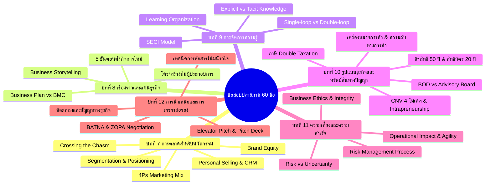

# 📝 สรุปแนวข้อสอบปลายภาคและระเบียบการสอบ: วิชาผู้ประกอบการนวัตกรรม (Innovative Technopreneurs)

> **รหัสวิชา:** 080203914 ผู้ประกอบการนวัตกรรม (Innovative Technopreneurs)  
> **ไฟล์เสียงต้นฉบับ:** `20261009_100816.aac`  
> **วันที่บันทึก:** 9 ตุลาคม 2569 เวลา 10:08 น.  
> **ความยาวคลิป:** 4 นาที 21 วินาที  
> **ประเภทการบรรยาย:** ชี้แจงแนวข้อสอบปลายภาค (Final Exam Briefing), ขอบเขตเนื้อหา, รูปแบบข้อสอบ, และสัดส่วนคะแนนตัดเกรด

---

## ⚡ สรุปสาระสำคัญด่วน (Executive Summary)

1. **ขอบเขตเนื้อหาที่ออกสอบ:** ออกสอบ **บทที่ 7 ถึง บทที่ 12** (ทั้งหมด 6 บท)
2. **รูปแบบข้อสอบ:** เป็น **ปรนัย (Multiple Choice / ชอยส์) ทั้งหมด 60 ข้อ**
3. **คะแนนสอบปลายภาค:** **30 คะแนน** (เฉลี่ยข้อละ 0.5 คะแนน)
4. **วันและเวลาสอบ:** **วันพุธที่ 28 ตุลาคม 2569 เวลา 09:00 – 12:00 น.** (ระยะเวลาสอบ 3 ชั่วโมงเต็ม)
5. **ระเบียบการเข้าสอบ:**
   - **ปิดตำรา (Closed-book):** ห้ามนำเอกสาร ชีท หรือสมุดจดใดๆ เข้าห้องสอบ
   - **ไม่ต้องนำเครื่องคิดเลขเข้าห้องสอบ:** **ไม่มีการคำนวณ** ข้อสอบเน้นความเข้าใจ นิยาม คอนเซปต์ และการประยุกต์ใช้
   - **ภาษาในข้อสอบ:** ข้อสอบเป็นภาษาไทยเป็นหลัก ศัพท์เทคนิคภาษาอังกฤษจะมีวงเล็บกำกับไว้ (เช่น ภาษาไทย (ภาษาอังกฤษ))
6. **สถานะการนำเสนอโปรเจกต์ (Presentation):** เดิมมีคิวพรีเซนต์ แต่วันนี้เนื่องจากมีถึง 18 กลุ่ม เวลาไม่เพียงพอจึงไม่ได้จัดพรีเซนต์ในคาบนี้

---

## 📊 สัดส่วนคะแนนและการตัดเกรด (Grading Breakdown)

อาจารย์เน้นย้ำให้นักศึกษาคำนวณคะแนนสะสมของตนเองเพื่อวางเป้าหมายเกรด A ในการสอบไฟนอล:

| ส่วนการประเมิน | คะแนนเต็ม | สถานะ | หมายเหตุ |
| :--- | :---: | :---: | :--- |
| **1. คะแนนเก็บระหว่างภาค (Classwork & Activities)** | **40 คะแนน** | เก็บครบแล้ว | การมีส่วนร่วมในชั้นเรียน, เวิร์กช็อป, รายงาน |
| **2. สอบกลางภาค (Midterm Exam)** | **30 คะแนน** | สอบไปแล้ว | สอบเนื้อหาบทที่ 1 – 6 |
| **3. สอบปลายภาค (Final Exam)** | **30 คะแนน** | **สอบ 28 ต.ค. 69** | **60 ข้อ ปรนัย (บทที่ 7 – 12)** |
| **รวมทั้งหมด** | **100 คะแนน** | | |

### 🎯 เกณฑ์การตัดเกรด (อิงเกณฑ์ตาม มจพ.)
- **A :** 80 คะแนนขึ้นไป *(ถ้าคะแนนเก็บ + มิดเทอมได้ดี ไฟนอลต้องการเพียง 15-20 คะแนน ก็มีโอกาสคว้า A ได้ทันที)*
- **B+ :** 75 – 79 คะแนน
- **B :** 70 – 74 คะแนน
- **C+ :** 65 – 69 คะแนน
- **C :** 60 – 64 คะแนน
- **D+ :** 55 – 59 คะแนน
- **D :** 50 – 54 คะแนน
- **F :** น้อยกว่า 50 คะแนน

---

## 🎯 เจาะลึกขอบเขตข้อสอบ บทที่ 7 ถึง บทที่ 12 (Comprehensive Exam Blueprint)

ข้อสอบปลายภาค 60 ข้อ ครอบคลุมเนื้อหา 6 บทหลัก เฉลี่ยออกบทละประมาณ 10 ข้อ ดังนี้:



### 1. บทที่ 7: การตลาดสำหรับธุรกิจนวัตกรรมและเทคโนโลยี (Marketing for Innovation)
- **กระบวนการตลาดนวัตกรรม:** การวิเคราะห์โอกาส, การระบุลูกค้าเป้าหมาย, และการเปลี่ยนไอเดียให้เป็นรายได้
- **STP Marketing:** 
  - Segmentation (การแบ่งส่วนตลาด), Targeting (การเลือกตลาดเป้าหมาย), Positioning (การวางตำแหน่งผลิตภัณฑ์ในใจผู้บริโภค)
- **Brand Equity (สินทรัพย์แบรนด์):** การสร้างความตระหนักรู้ในแบรนด์ (Brand Awareness) และคุณค่าของตราสินค้า
- **4Ps Marketing Mix สำหรับเทคโนโลยี:** Product, Price, Place, Promotion
- **Crossing the Chasm (การข้ามหุบเหวแห่งนวัตกรรม โดย Geoffrey Moore):**
  - กลุ่มผู้ยอมรับเทคโนโลยี: Innovators (ผู้คิดค้น), Early Adopters (ผู้ริเริ่มนำมาใช้), Early Majority (คนส่วนใหญ่กลุ่มแรก), Late Majority (คนส่วนใหญ่กลุ่มหลัง), Laggards (ผู้ล้าหลัง)
  - หุบเหว (Chasm) อยู่ระหว่าง Early Adopters กับ Early Majority ที่สตาร์ทอัพมักจะล้มเหลว
- **Customer Relationship Management (CRM) & Digital Technology:** การวิเคราะห์ Data และ Social Media ในการรักษาลูกค้า

### 2. บทที่ 8: การเล่าเรื่องราว แผนธุรกิจ และการจัดองค์กรธุรกิจนวัตกรรม (Storytelling & Business Plans)
- **กระบวนการ 5 ขั้นตอนจัดตั้งกิจการใหม่:**
  1. ระบุและคัดกรองโอกาส (Identify & Filter Opportunity)
  2. ขัดเกลาแนวคิดและพันธกิจ (Refine Concept & Mission)
  3. พัฒนาแผนธุรกิจและทดสอบตลาด (Develop Business Plan)
  4. ระดมทรัพยากรและตั้งทีมงาน (Mobilize Resources & Form Team)
  5. ดำเนินงานและขยายขนาดกิจการ (Execute & Scale)
- **Business Storytelling:** ศิลปะการเล่าเรื่องเพื่อสร้างแรงบันดาลใจ ดึงดูดนักลงทุนและลูกค้า
- **Business Plan vs Business Model Canvas (BMC):** ความแตกต่างระหว่างแผนธุรกิจเล่มเต็ม (รายละเอียดเชิงลึก การเงิน แผนปฏิบัติการ) กับกระดานแบบจำลองธุรกิจ 9 ช่องที่ยืดหยุ่นกว่า
- **การจัดทีมผู้ประกอบการ (Founding Team):** ทักษะความเชี่ยวชาญที่หลากหลาย (Hustler, Hacker, Hipster) และการแบ่งหน้าที่

### 3. บทที่ 9: ความรู้ การจัดการความรู้ และองค์กรแห่งการเรียนรู้ (Knowledge Management & Learning Organization)
- **นิยามและประเภทความรู้:**
  - **Explicit Knowledge (ความรู้ชัดแจ้ง):** บันทึกเป็นลายลักษณ์อักษรได้ เอกสาร ตำรา โค้ด
  - **Tacit Knowledge (ความรู้ฝังลึก/ความรู้ในตัวคน):** ทักษะ ประสบการณ์ สัญชาตญาณ ถ่ายทอดยาก
- **SECI Model (การแปลงความรู้ของ Nonaka & Takeuchi):**
  - Socialization (ถ่ายทอด Tacit สู่ Tacit ผ่านการสังเกต/ร่วมงาน)
  - Externalization (แปลง Tacit สู่ Explicit เป็นเอกสาร/คู่มือ)
  - Combination (รวบรวม Explicit สู่ Explicit จัดระบบองค์ความรู้)
  - Internalization (ซึมซับ Explicit สู่ Tacit เป็นทักษะตนเอง)
- **Learning Organization (องค์กรแห่งการเรียนรู้ โดย Peter Senge):** วินัย 5 ประการ (Personal Mastery, Mental Models, Shared Vision, Team Learning, Systems Thinking)
- **ระดับการเรียนรู้:** Single-loop Learning (แก้ปัญหาเฉพาะหน้าตามกรอบเดิม) vs Double-loop Learning (ตั้งคำถามและเปลี่ยนกรอบคิด/สมมติฐานเดิม)

### 4. บทที่ 10: รูปแบบธุรกิจ นวัตกรรมองค์กร และกฎหมายทรัพย์สินทางปัญญา (Business Models & IP Law)
- **มิติภาษีและรูปแบบองค์กร:**
  - **Taxable Entity (บริษัทจำกัด):** เกิด **Double Taxation** (ภาษีนิติบุคคล + ภาษีเงินได้บุคคลจากเงินปันผล) แต่ได้ประโยชน์จากการรับผิดจำกัด (Limited Liability)
  - **Pass-through Entity (เจ้าของคนเดียว/ห้างหุ้นส่วน):** กำไรเสียภาษีบุคคลโดยตรง ไม่ซ้ำซ้อน แต่ต้องรับผิดไม่จำกัด (Unlimited Liability)
- **5 รูปแบบธุรกิจ:** Small Business, Lifestyle/Niche, High Growth Startup, Non-profit, Social Enterprise (SE)
- **Corporate New Venture (CNV) 4 รูปแบบ:** Opportunist (ฉวยโอกาส), Enabler (เกื้อหนุน), Producer (ผู้สร้าง/ผู้ผลิต), Advocator (สนับสนุนเต็มตัว)
- **นวัตกรรมองค์กร (Intrapreneurship):** กรณีศึกษา 3M กฎ 15% Rule สู่ Post-it Note, ความท้าทายเรื่อง Cannibalization และ Innovator's Dilemma
- **คณะกรรมการ:** Board of Directors (BOD ผูกพันและรับผิดทางกฎหมาย) vs Advisory Board (ที่ปรึกษา ไม่ผูกพันกฎหมาย)
- **กฎหมายทรัพย์สินทางปัญญา (IP Law):**
  - **ลิขสิทธิ์ (Copyright):** คุ้มครองอัตโนมัติ ไม่ต้องจดทะเบียน คุ้มครองตลอดชีพผู้สร้างสรรค์ + **50 ปี**
  - **สิทธิบัตรการประดิษฐ์ (Invention Patent):** คุ้มครอง **20 ปี** (ต่ออายุไม่ได้) ต้องมี Inventive Step ขั้นสูง
  - **อนุสิทธิบัตร (Petty Patent):** ปรับปรุงเล็กน้อย คุ้มครอง **6 ปี** (ต่อได้ 2 ครั้ง ครั้งละ 2 ปี รวมสูงสุด **10 ปี**)
  - **สิทธิบัตรการออกแบบ (Design Patent):** คุ้มครองรูปร่างภายนอก **10 ปี**
  - **เครื่องหมายการค้า (Trademark):** คุ้มครอง **10 ปี** (ต่ออายุได้เรื่อยๆ ทุก 10 ปี ไม่จำกัด)
  - **ความลับทางการค้า (Trade Secret):** เช่น สูตร KFC, โค้ก คุ้มครองตลอดไปตราบเท่าที่ยังเป็นความลับ
  - **Reverse Engineering (วิศวกรรมย้อนกลับ):** การซื้อสินค้าตามท้องตลาดมาแกะศึกษา **ไม่ถือว่าละเมิดความลับทางการค้า**
  - **Compulsory Licensing (CL):** การบังคับใช้สิทธิตามกฎหมายเพื่อประโยชน์สาธารณสุข
  - **Exhaustion of Rights:** หลักการสิ้นสิทธิ นำไปสู่การนำเข้าซ้อน (Parallel Import / สินค้าหิ้วของแท้) ซึ่งถูกกฎหมาย

### 5. บทที่ 11: ความเสี่ยงและความสำเร็จของธุรกิจนวัตกรรม (Risk Management & Success)
- **Risk (ความเสี่ยง) vs Uncertainty (ความไม่แน่นอน):**
  - Risk = เหตุการณ์ที่สามารถประเมินความน่าจะเป็นและผลกระทบได้
  - Uncertainty = สภาวะที่ไม่สามารถคาดการณ์ผลลัพธ์หรือความน่าจะเป็นได้เลย
- **กระบวนการบริหารความเสี่ยง (Risk Management Framework):** การระบุความเสี่ยง (Identify), การประเมินผลกระทบและโอกาสเกิด (Assess), การวางแผนรับมือ/บรรเทา (Mitigate), และการติดตามผล (Monitor)
- **กลยุทธ์การรับมือความเสี่ยง:** Avoid (หลีกเลี่ยง), Reduce/Mitigate (ลดผลกระทบ), Transfer (ถ่ายโอน เช่น ซื้อประกัน), Accept (ยอมรับความเสี่ยง)
- **จริยธรรมและความซื่อสัตย์ในธุรกิจ (Business Ethics & Integrity):** ธรรมาภิบาลและความรับผิดชอบต่อผู้มีส่วนได้ส่วนเสีย

### 6. บทที่ 12: การนำเสนอและการเจรจาต่อรองข้อตกลงทางธุรกิจ (Pitching & Negotiation)
- **การนำเสนอและ Pitching:**
  - Elevator Pitch (การสรุปไอเดียภายใน 30-60 วินาที)
  - Investor Pitch Deck โครงสร้างสไลด์ 10-12 หน้า (Problem, Solution, Market Size, Business Model, Traction, Team, Financial Ask)
- **การเจรจาต่อรองทางธุรกิจ (Business Negotiation):**
  - **BATNA (Best Alternative to a Negotiated Agreement):** ทางเลือกที่ดีที่สุดหากการเจรจาล้มเหลว
  - **ZOPA (Zone of Possible Agreement):** พื้นที่หรือช่วงของข้อตกลงที่เป็นไปได้ระหว่างทั้งสองฝ่าย
  - **Win-Win Negotiation:** การเจรจาแบบบูรณาการที่ทุกฝ่ายได้ประโยชน์ร่วมกัน
- **เงื่อนไขข้อตกลงและสัญญาเบื้องต้น (Term Sheet):** สัดส่วนการถือหุ้น (Equity), สิทธิในการออกเสียง, และเงื่อนไขการถอนทุน

---

## 📅 ข้อมูลวัน-เวลา และสถานที่สอบ (Exam Logistics)

- **วันสอบ:** **วันพุธที่ 28 ตุลาคม 2569**
- **เวลาสอบ:** **09:00 – 12:00 น.** (เช้า)
- **ระยะเวลา:** 3 ชั่วโมงเต็ม
- **ข้อพึงระวัง:** อาจารย์เน้นย้ำให้ **"มาให้ทัน 9 โมงเช้าตรง"**
- **การตรวจสอบห้องสอบ:** อาจารย์เตือนให้นักศึกษาทุกคนไปตรวจสอบห้องสอบและรายชื่อผู้มีสิทธิ์สอบในระบบให้เรียบร้อย (มีกรณีนักศึกษาบางคนที่ยังไม่ปรากฏรายชื่อ ให้รีบดำเนินการติดต่อเจ้าหน้าที่)

---

## 🎙️ บทถอดความเสียงคำต่อคำ 100% (Verbatim Transcript)

**ไฟล์เสียง:** `20261009_100816.aac` (แปลงเป็น `.mp3` 64k)  
**เวลาบันทึก:** วันศุกร์ที่ 9 ตุลาคม 2569 เวลา 10:08 น.  

```text
[00:00] อาจารย์: ขออนุญาตต่อค่ะ ปิดตำรา ไม่ต้องเอาเครื่องคิดเลขเข้าไป ไม่มีคำนวณ
[00:15] อาจารย์: ภาษา ถ้าถ้าเกิดเป็นศัพท์ ก็ปกติต่างประเทศ ก็จะเป็นภาษาไทยแล้วก็วงเล็บภาษาอังกฤษให้ หรืออาจจะไม่มีวงเล็บภาษาอังกฤษให้ก็ได้ แต่ยังไงก็เป็นภาษาไทย นะคะ ไม่ ไม่แต่ศัพท์ง่ายๆ ไม่รู้ ไม่ไม่แน่ไม่แน่ใจเหมือนกัน แต่โดยส่วนใหญ่แล้วก็ ภาษาไทยแล้วก็วงเล็บภาษาอังกฤษ ถ้าไม่มีภาษาอังกฤษก็จะเป็นแค่ภาษาไทย
[00:45] อาจารย์: ท่องอ่าน นึกถึง มีเวลาเยอะ สอบน่าจะท้ายๆ ช่วงท้ายๆ
[01:05] อาจารย์: เราเช็กห้องสอบอะไรกันได้แล้วใช่ไหมคะ ก็ไปเช็กห้องสอบเช็กอะไร ให้เรียบร้อย วันนั้น มีใครที่ยังไม่มีชื่อคนนึง ใช่ไหม
[01:20] นักศึกษา: น่าจะใช่
[01:25] อาจารย์: มีคำถามไหมเอ่ย
[01:28] นักศึกษา: สอบกี่ข้อครับอาจารย์
[01:31] อาจารย์: อ๋อ มีคนมาทีหลัง ข้อสอบ บทที่ 7 ถึง 12, 60 ข้อ เป็น choice สอบวันที่ 28 วันพุธที่ 28 9:00 น. ช่วงเช้านะ มาให้ทันนะ 9:00 น. 9:00 น. ถึงเที่ยง 3 ชั่วโมง 60 ข้อ
[02:10] อาจารย์: ข้อสอบปลายภาค 30 คะแนน มิดเทอมเก็บไปแล้ว 30 คะแนน คะแนนเก็บ อีก 40 ไฟนอล เก็บอีก 30 ลองคำนวณดูว่าไฟนอลต้องทำเท่าไหร่ เอาให้ได้เกรด A กันเยอะๆ นะ มีเวลาเยอะ น่าจะทำได้ มีคำถามอีกไหมเอ่ย
[02:40] อาจารย์: เสียดายจริงๆ อยากให้พรีเซนต์ แต่ถ้ามาวันนี้ทั้ง 18 กลุ่ม ไม่ทันแน่
[02:50] อาจารย์: เราก็มาน้ำท่วมกันเนาะ บ้านใครน้ำท่วมบ้างเนี่ย เยอะมั้ย แล้วน้ำมันยังท่วมอยู่มั้ย ช่วง ช่วงน้ำลดก็ระวัง สัตว์ ระวังสัตว์เลื้อยคลานด้วยนะ ช่วงน้ำท่วมอะ มันก็หนี มันก็หนีน้ำไปหาที่ มันก็หนีน้ำขึ้นที่ดอน แต่บ้านใครไม่ท่วมเนี่ย ก็ระวัง อะไรนะ
[03:20] นักศึกษา: สัตว์เลื้อยคลานขึ้นไปบนสะพาน
[03:25] อาจารย์: สัตว์เลื้อยคลานขึ้นไปบนสะพาน ระวังงูอะไรพวกเนี้ย จริงๆ เมื่อ อาทิตย์ที่แล้วที่บ้านอาจารย์ก็ งูเข้า งูเห่า
[03:35] นักศึกษา: ตัวเหี้ยนี่เยอะเลยครับ เจอครับ
[03:40] อาจารย์: ตัวเหี้ยเหรอ
[03:42] นักศึกษา: ตัวเหี้ยนี่วิ่งไปกับสะพานครับ ตัวเหี้ยตัวใหญ่
[03:48] อาจารย์: ป้าข้างบ้านนี่ งูเข้า 3 วัน วันละตัว คนละตัวด้วย
[04:05] อาจารย์: งั้นเดี๋ยวเช็กชื่อเนาะ
```
