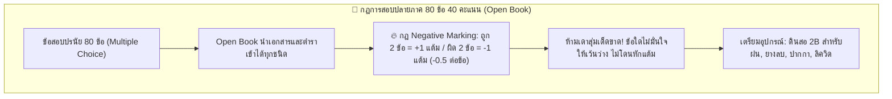

# สรุปภาพรวม: วิชาระบบฐานข้อมูล (Database System)
**กลุ่มโฟลเดอร์:** `02_Database_System`  
**วิชา:** ระบบฐานข้อมูล (Database System / Database Management Systems)  
**หัวข้อการสอนหลัก:** 
1. **Transaction Management & ACID Properties**
2. **Concurrency Control & Lock-based Concurrency Matrix (S/X Lock)**
3. **System Recovery & Crash Handling (Soft Crash vs Hard Crash / Log File Undo-Redo)**
4. **NoSQL Databases vs RDBMS, Big Data Architecture & CAP Theorem**
5. **MariaDB CLI Hands-on Lab: DDL/DML, Constraints & Foreign Key CASCADE vs RESTRICT**
6. **E-R Diagram Project Presentations & Conceptual Modeling Coaching**
7. **🔥 Final Examination Leaks & Negative Marking Rules (80 ข้อ ปรนัย Open Book)**

---

## 📋 รายการไฟล์เสียงในกลุ่มนี้

| ชื่อไฟล์ | วันที่-เวลาที่บันทึก | ความยาว | สาระสำคัญ / กิจกรรมในชั้นเรียน |
| :--- | :--- | :--- | :--- |
| [`20260908_130406.aac`](file:///C:/Project/voice-text/Success/20260908_130406.aac) | 08/09/2569 13:04 น. | 6 นาที 21 วินาที | **Part 1:** ชนิดของไฟล์ข้อมูล (Master/Transaction File), นิยามของ Transaction, คำสั่ง INSERT/UPDATE/DELETE/QUERY |
| [`20260908_131052.aac`](file:///C:/Project/voice-text/Success/20260908_131052.aac) | 08/09/2569 13:10 น. | 67 นาที 08 วินาที | **Part 2 (การบรรยายหลัก):** ACID Properties, Concurrency Control, Lock Matrix S/X, Two-Phase Locking, Deadlock |
| [`20260908_143913.aac`](file:///C:/Project/voice-text/Success/20260908_143913.aac) | 08/09/2569 14:39 น. | 17 นาที 15 วินาที | **Part 3 (Pop Quiz):** สอบเก็บคะแนนฉุกเฉินในห้อง A4 2 ข้อ (ACID & Lock Matrix Crash Recovery) |
| [`-.aac`](file:///C:/Project/voice-text/Success/-.aac) | 08/09/2569 14:39 น. | 17 นาที 15 วินาที | *ไฟล์สำเนา (Duplicate)* ขนาดและเนื้อหาตรงกับ `20260908_143913.aac` |
| [`20260915_130022.aac`](file:///C:/Project/voice-text/Success/20260915_130022.aac) | 15/09/2569 13:00 น. | 67 นาที 51 วินาที | **Part 4 (NoSQL & CAP Theorem):** ข้อจำกัด RDBMS, Big Data 5 Vs, NoSQL 4 โมเดล, CAP Theorem (CA vs CP vs AP) |
| [`20260922_131058.aac`](file:///C:/Project/voice-text/Success/20260922_131058.aac) | 22/09/2569 13:10 น. | 81 นาที 15 วินาที | **Part 5 (แล็บ DDL & MariaDB CLI):** XAMPP MariaDB CLI, `utf8mb4`, กำหนด Primary Key, Foreign Key และ `CASCADE` |
| [`20260922_150154.aac`](file:///C:/Project/voice-text/Success/20260922_150154.aac) | 22/09/2569 15:01 น. | 45 นาที 48 วินาที | **Part 6 (แล็บ DML & จุดตาย ERROR 1074):** แก้ไข `CHAR(500)` ล้น 255 ตัวอักษร ต้องใช้ `VARCHAR(500)` |
| [`database 29_9_2569 14.25.m4a`](file:///C:/Project/voice-text/Success/database%2029_9_2569%2014.25.m4a) | 29/09/2569 14:25 น. | 68 นาที 16 วินาที | **Part 7 (แล็บ 2 & เตรียมสอบ/พรีเซนต์):** Foreign Key CASCADE vs RESTRICT, การบ้าน SQL เขียนมือ, ผลสุ่มกงล้อพรีเซนต์ห้อง 307 |
| [`20261006_161408.aac`](file:///C:/Project/voice-text/Success/20261006_161408.aac) | 06/10/2569 16:14 น. | 7 นาที 33 วินาที | **🔥 Part 8 (กฎเหล็กสอบ Final & Negative Marking):** ข้อสอบปรนัย 80 ข้อ (40 คะแนน), **Open Book**, **กฎติดลบ: ถูก 2 ข้อได้ 1 แต้ม / ผิด 2 ข้อหัก 1 แต้ม**, ศัพท์เทคนิคอังกฤษ, เตรียมดินสอ 2B ฝน, ส่ง ER Diagram 2 ช่องใน Classroom (หลังมิดเทอม vs Final ฉบับแก้), เทคนิคพรีเซนต์ Total/Partial vs Cardinality |

---

## 🎯 กฎเหล็กและการเตรียมตัวสอบปลายภาค (Final Exam Strategy)

---

## 📅 กำหนดการและงานที่ต้องส่ง (Action Items & Schedule)

| กิจกรรม / รายการ | วันที่-เวลา | รายละเอียด |
| :--- | :--- | :--- |
| **อัปโหลด ER Diagram ช่องหลังมิดเทอม** | ทันที | อัปโหลดไฟล์ดราฟต์เดิมที่เคยพรีเซนต์หลังมิดเทอม ใน Google Classroom |
| **อัปโหลด ER Diagram ช่อง Final** | ทันที | อัปโหลดไฟล์ E-R Diagram ฉบับสมบูรณ์ที่ปรับปรุงแก้ไขแล้ว ใน Google Classroom |
| **ส่งการบ้านแบบฝึกหัด SQL (เขียนมือ)** | 06/10/2569 ท้ายคาบ | เขียนลำดับที่ตาม Classroom ส่งที่โต๊ะอาจารย์ |
| **วันสอบปลายภาค (Final Exam)** | ตามประกาศตารางสอบ | 80 ข้อ ปรนัย Open Book, เตรียมดินสอ 2B และเอกสารสรุปให้พร้อม |

---

## 📂 เอกสารและไฟล์ที่เกี่ยวข้อง
- [**คำถอดความทุกคำพูด 06/10/2569 (`20261006_161408.txt`)**](file:///C:/Project/voice-text/02_Database_System/20261006_161408.txt)
- [**บทวิเคราะห์กฎสอบปลายภาค 80 ข้อ & Negative Marking 06/10/2569 (`Transcript_20261006_DB_Final_Exam_Rules_Negative_Marking_ER_Presentation.md`)**](file:///C:/Project/voice-text/02_Database_System/Transcript_20261006_DB_Final_Exam_Rules_Negative_Marking_ER_Presentation.md)
- [**คำถอดความ 29/09/2569 (`20260929_142500.txt`)**](file:///C:/Project/voice-text/02_Database_System/20260929_142500.txt)
- [**บทวิเคราะห์แล็บ 2 CASCADE vs RESTRICT 29/09/2569 (`Transcript_20260929_DB_Lab_FK_Constraints_Cascade_Restrict_Exam_Presentation.md`)**](file:///C:/Project/voice-text/02_Database_System/Transcript_20260929_DB_Lab_FK_Constraints_Cascade_Restrict_Exam_Presentation.md)
- [**คำถอดความ 22/09/2569 (`20260922_131058.txt`)**](file:///C:/Project/voice-text/02_Database_System/20260922_131058.txt)
- [**บทวิเคราะห์เจาะลึก Lab DDL/DML, Constraints & จุดตาย ERROR 1074 (`Transcript_20260922_DB_Lab_DDL_DML_ERROR1074.md`)**](file:///C:/Project/voice-text/02_Database_System/Transcript_20260922_DB_Lab_DDL_DML_ERROR1074.md)
