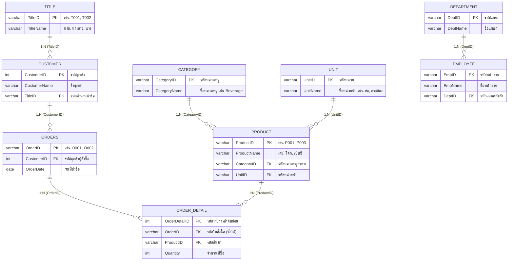

# บทวิเคราะห์และถอดความการบรรยายปฏิบัติการวิชา Database System (Week 2 Lab)
## กฎความคงสภาพ Foreign Key (CASCADE vs RESTRICT), สถาปัตยกรรม Normalization หลายตาราง, การบ้าน SQL ปฏิบัติการ, และกำหนดการนำเสนอโครงงานปลายภาค

- **วันที่บรรยาย:** วันอังคารที่ 29 กันยายน 2569
- **เวลา:** 14:25:00 - 15:33:16 น. (ความยาวรวม: 1 ชั่วโมง 8 นาที 16 วินาที)
- **ผู้สอน:** อาจารย์ผู้สอนภาคปฏิบัติการวิชาฐานข้อมูล (ดร.สวาท / Dr. Sawat)
- **ไฟล์เสียงต้นฉบับ:** [`database 29_9_2569 14.25.m4a`](file:///C:/Project/voice-text/Success/database%2029_9_2569%2014.25.m4a)
- **ไฟล์ถอดเสียงคำต่อคำ 100% (Verbatim):** [20260929_142500.txt](file:///C:/Project/voice-text/02_Database_System/20260929_142500.txt)
- **โครงการบูรณาการปลายทาง:** [`C:\Project\database-system\`](file:///C:/Project/database-system/)

---

## 📌 สรุปสาระสำคัญเชิงบริหาร (Executive Summary)

การบรรยายในคาบเรียนนี้เป็นการสรุปภาคปฏิบัติการสัปดาห์ที่ 2 ซึ่งเน้นย้ำแกนกลางสำคัญ 4 ประการของระบบฐานข้อมูลเชิงสัมพันธ์ (Relational Database Management Systems):
1. **การออกแบบความสัมพันธ์ระหว่างตารางตามหลัก Normalization:** ชี้แจงเหตุผลเชิงลึกว่าทำไมต้องแยกตารางข้อมูลรหัสและรายละเอียด (เช่น `Title` แยกจาก `Customer`, `Unit` และ `Category` แยกจาก `Product`, `Orders` แยกจาก `OrderDetail`) เพื่อป้องกันความซ้ำซ้อน (Redundancy) และความผิดปกติเมื่อแก้ไขข้อมูล (Update Anomaly)
2. **กลไก Foreign Key Constraints: เปรียบเทียบ `CASCADE` vs `RESTRICT`:**
   - **`CASCADE`:** เมื่อลบหรืออัปเดตข้อมูลแถวในตารางแม่ (Parent Table) แถวข้อมูลในตารางลูก (Child Table) ที่อ้างอิงอยู่จะถูกลบหรืออัปเดตตามไปทันทีแบบลูกโซ่
   - **`RESTRICT` (ค่าความปลอดภัยเริ่มต้น):** ห้ามลบหรือแก้ไขข้อมูลในตารางแม่เด็ดขาดหากยังมีข้อมูลในตารางลูกอ้างอิงอยู่ โดยระบบ MariaDB จะโยนข้อผิดพลาด `ERROR 1451 (23000): Cannot delete or update a parent row: a foreign key constraint fails` ทันที หากต้องการลบตารางแม่ ต้องลบข้อมูลในตารางลูกที่อ้างอิงให้หมดก่อน
3. **การบ้านภาคปฏิบัติการ (Lab Homework):** ให้นักศึกษาทำแบบฝึกหัดคำสั่งสืบค้น `SELECT` และ `SELECT DISTINCT` ตั้งแต่สไลด์หน้า 40 (P.40), หน้า 41 (P.41) เป็นต้นไปจนจบสไลด์ โดยมี **"กฎเหล็ก: ต้องเขียนด้วยมือลงบนกระดาษเท่านั้น ห้ามพิมพ์เด็ดขาด"** ทั้งในส่วนเขียนคำสั่ง SQL และการตีตารางผลลัพธ์
4. **กำหนดการนำเสนอโครงงานวิชาฐานข้อมูล (Database Project Presentation):**
   - สัปดาห์หน้าเป็นสัปดาห์สุดท้ายของการเรียนการสอน
   - จัดนำเสนอ ณ **ห้องทฤษฎี 307**:
     - **ตอนเรียนวันอังคาร (Section 2 - 15 กลุ่ม):** วันอังคารที่ 6 ตุลาคม 2569 เวลา 13:00 น.
     - **ตอนเรียนวันพฤหัสบดี (Section 1 - 12 กลุ่ม):** วันพฤหัสบดีที่ 8 ตุลาคม 2569 เวลา 09:00 น.
   - เวลาบรรยายกลุ่มละ 15 - 20 นาที สมาชิกทุกคนต้องมาครบ
   - ส่งเล่มรายงานโครงงานตัวจริง (Hard Copy) ให้อาจารย์ก่อนเริ่มนำเสนอ (แม็กเย็บมุม สันรูด หรือเข้าเล่มสันกาวก็ได้ เน้นความเรียบร้อยและคุณภาพเนื้อหา)
   - ผลการสุ่มกงล้อ (Wheel of Names) กำหนดลำดับการนำเสนอทุกกลุ่มอย่างเป็นทางการ

---

## 1. เจาะลึกสถาปัตยกรรมการออกแบบตารางและ Normalization (Database Schema Design)

ในการบรรยาย อาจารย์ได้อธิบายความเชื่อมโยงของฐานข้อมูลจำลองระบบสั่งซื้อสินค้าและพนักงาน เพื่อให้นักศึกษาเข้าใจเหตุผลเชิงลึกว่าทำไมต้องเชื่อมโยงผ่าน PK (Primary Key) และ FK (Foreign Key):



### 1.1 ทำไมต้องแยกตาราง `Title` ออกจากตาราง `Customer`?
- หากเราใส่คำนำหน้านามเป็นข้อความ `"นางสาว"` หรือ `"นาย"` ลงในตาราง `Customer` โดยตรง เมื่อมีข้อมูลลูกค้า 100,000 แถว ข้อความจะซ้ำซ้อนกันอย่างมหาศาล สิ้นเปลืองเนื้อที่จัดเก็บ
- หากธุรกิจต้องการเปลี่ยนมาตรฐานภาษา เช่น เปลี่ยนจาก `"นางสาว"` เป็นภาษาอังกฤษคำว่า `"Miss"` จะต้องสั่ง UPDATE ข้อมูลถึง 100,000 แถว ซึ่งมีความเสี่ยงสูงที่จะเกิดข้อผิดพลาดและความไม่คงสภาพ (Update Inconsistency)
- วิธีที่ถูกต้องตามกฎ Normalization: แยกตาราง `Title` เก็บเฉพาะ `TitleID` (`T001`, `T002`) เป็น Primary Key แล้วนำ `TitleID` มาเป็น Foreign Key ในตาราง `Customer` เมื่อต้องการเปลี่ยนข้อความให้แก้ที่ตาราง `Title` เพียงแถวเดียว ข้อมูลลูกค้าทุกคนจะแสดงผลถูกต้องทันทีผ่านการ `JOIN`

### 1.2 พฤติกรรมของ `OrderID` ในตาราง `Orders` vs `OrderDetail`
- ในตาราง **`Orders`**: คอลัมน์ `OrderID` ทำหน้าที่เป็น **Primary Key (PK)** จึง **ห้ามซ้ำโดยเด็ดขาด** (1 ใบสั่งซื้อต่อ 1 แถว)
- ในตาราง **`OrderDetail`**: คอลัมน์ `OrderID` ทำหน้าที่เป็น **Foreign Key (FK)** ซึ่ง **อนุญาตให้ซ้ำได้** เพราะในการสั่งซื้อ 1 ครั้ง (1 Order) ลูกค้าสามารถซื้อสินค้าได้หลายรายการ:
  - เช่น Order `O001` ซื้อสินค้า 2 ชนิด:
    - แถวที่ 1: `OrderDetailID = 1`, `OrderID = 'O001'`, `ProductID = 'P001'` (เลย์), `Quantity = 5`
    - แถวที่ 2: `OrderDetailID = 2`, `OrderID = 'O001'`, `ProductID = 'P003'` (เป๊ปซี่), `Quantity = 2`
  - คอลัมน์ที่ห้ามซ้ำในตารางลูกนี้คือ `OrderDetailID` ซึ่งทำหน้าที่เป็น PK ประจำตารางลูก

---

## 2. เจาะลึก Foreign Key Constraints: CASCADE vs RESTRICT

ในการควบคุมความคงสภาพของการอ้างอิง (Referential Integrity) MariaDB และระบบ RDBMS มีตัวเลือกการจัดการเมื่อข้อมูลตารางแม่อ้างอิงถูกลบ (`ON DELETE`) หรือถูกแก้ไข (`ON UPDATE`):

| คุณสมบัติ | `CASCADE` (ลบ/อัปเดตแบบลูกโซ่) | `RESTRICT` (จำกัด/ปฏิเสธการกระทำ) |
| :--- | :--- | :--- |
| **พฤติกรรมเมื่อสั่ง `ON DELETE`** | เมื่อลบข้อมูลใน Parent Table ข้อมูลแถวที่เกี่ยวข้องใน Child Table จะถูก **ลบทิ้งตามไปด้วยโดยอัตโนมัติ** | **ไม่อนุญาตให้ลบแถวในตารางแม่เด็ดขาด** หากยังมีตารางลูกอ้างอิงอยู่ ระบบจะแจ้ง ERROR ทันที |
| **พฤติกรรมเมื่อสั่ง `ON UPDATE`** | เมื่อเปลี่ยนค่า PK ใน Parent Table ค่า FK ใน Child Table จะถูก **อัปเดตให้เป็นค่าใหม่ทันที** | **ไม่อนุญาตให้แก้ไขค่า PK ในตารางแม่** หากมีตารางลูกอ้างอิงอยู่ |
| **ข้อความ Error ของ MariaDB** | ทำงานสำเร็จ (ไม่มี Error) | `ERROR 1451 (23000): Cannot delete or update a parent row: a foreign key constraint fails` |
| **เงื่อนไขที่จะลบตารางแม่ได้** | ลบได้ทันทีทุกกรณี | ต้องไปลบข้อมูลในตารางลูกที่อ้างอิงออกให้หมดสิ้นก่อน หรือค่าแม่นั้นต้อง **ไม่มีตารางลูกอ้างอิงอยู่เลย** |
| **กรณีการใช้งานที่เหมาะสม** | ตารางที่มีความผูกพันโดยตรง เช่น ลบ Order หัวบิล แล้วให้รายการสินค้าใน OrderDetail หายตาม | ตารางหลักที่สำคัญ เช่น ลบแผนก (Department) ต้องไม่ให้พนักงานในสังกัดหายไปหมด หรือลบคำนำหน้าชื่อ |

### 2.1 ตัวอย่างคำสั่ง SQL สร้าง Foreign Key Constraint ทั้ง 2 รูปแบบ

#### รูปแบบที่ 1: แบบ `CASCADE`
```sql
-- สร้าง Foreign Key ในตาราง Customer อ้างอิง Title แบบ CASCADE
ALTER TABLE Customer 
ADD CONSTRAINT fk_customer_title
FOREIGN KEY (TitleID) REFERENCES Title(TitleID)
ON DELETE CASCADE 
ON UPDATE CASCADE;
```
**ผลการทดสอบในห้องเรียน:**
- เมื่อสั่ง:
  ```sql
  DELETE FROM Title WHERE TitleID = 'T001';
  ```
- ผลลัพธ์: แถว `T001` (นาย) ในตาราง `Title` ถูกลบ และข้อมูลลูกค้าทุกคนที่มี `TitleID = 'T001'` (แถวที่ 2, 3, 6, 7 ในตาราง `Customer`) ถูกลบหายไปจากตารางทันที

#### รูปแบบที่ 2: แบบ `RESTRICT`
```sql
-- สร้าง Foreign Key ในตาราง Customer อ้างอิง Title แบบ RESTRICT
ALTER TABLE Customer 
ADD CONSTRAINT fk_customer_title_restrict
FOREIGN KEY (TitleID) REFERENCES Title(TitleID)
ON DELETE RESTRICT 
ON UPDATE RESTRICT;
```
**ผลการทดสอบในห้องเรียน:**
1. **กรณีทดสอบลบแถวที่มีการอ้างอิงอยู่ (`T001`):**
   ```sql
   DELETE FROM Title WHERE TitleID = 'T001';
   ```
   - **ผลลัพธ์:** MariaDB ปฏิเสธคำสั่งและแสดงข้อผิดพลาดทันที:
     ```text
     ERROR 1451 (23000): Cannot delete or update a parent row: a foreign key constraint fails (`mydb3`.`customer`, CONSTRAINT `fk_customer_title` FOREIGN KEY (`TitleID`) REFERENCES `title` (`TitleID`))
     ```
2. **กรณีทดสอบลบแถวที่ไม่มีข้อมูลลูกอ้างอิงอยู่ (`T003`):**
   - ในตาราง `Customer` ไม่มีลูกค้ารายใดที่มี `TitleID = 'T003'` (คำว่า "นาง")
   ```sql
   DELETE FROM Title WHERE TitleID = 'T003';
   ```
   - **ผลลัพธ์:** `Query OK, 1 row affected` สามารถลบได้สำเร็จทันทีเพราะไม่มีความเสี่ยงต่อ Referential Integrity

---

## 3. รายละเอียดการบ้านภาคปฏิบัติการ (Lab Homework)

> [!CAUTION]
> **กฎเหล็กการทำการบ้าน (Strict Submission Standards):**
> 1. **ต้องเขียนด้วยมือลงในกระดาษเท่านั้น (Handwritten Only):** อาจารย์ย้ำชัดเจน ห้ามพิมพ์เด็ดขาด!
> 2. **การวาดผลลัพธ์:** หากข้อใดผลลัพธ์เป็นตาราง **ต้องตีเส้นตารางให้เรียบร้อย (Draw Grid Tables)** พร้อมระบุชื่อคอลัมน์และข้อมูลทุกแถว
> 3. **การระบุหัวข้อ:** ต้องระบุหน้าสไลด์ชัดเจน เช่น `สไลด์หน้า 40 (P.40) ข้อที่ 1`, `สไลด์หน้า 41 (P.41) ข้อที่ 2`
> 4. **ข้อมูลระบุตัวตน:** เขียนรหัสนักศึกษา และชื่อ-นามสกุล ชัดเจนทุกแผ่น
> 5. **กำหนดส่ง:** ส่งในคาบเรียนสัปดาห์หน้าพร้อมกับการนำเสนอโครงงาน

### รูปแบบคำถามในการบ้าน 2 ประเภท
1. **Question Type 1 (ให้คำสั่ง SQL มา $\rightarrow$ หาผลลัพธ์):**
   - มีคำสั่ง SQL เช่น `SELECT ... FROM ... WHERE ...` กำหนดมาให้
   - สิ่งที่นักศึกษาต้องตอบ: ตีตารางผลลัพธ์ที่ได้จากการรันคำสั่งนั้นอย่างแม่นยำ
2. **Question Type 2 (ให้ผลลัพธ์หรือโจทย์สถานการณ์มา $\rightarrow$ เขียน SQL):**
   - กำหนดเงื่อนไข เช่น "จงสืบค้นรายการสินค้าที่มีราคามากกว่า... และอยู่ในหมวดหมู่..."
   - สิ่งที่นักศึกษาต้องตอบ: เขียนโค้ดคำสั่ง SQL Query ที่ถูกต้องเพื่อให้ได้ผลลัพธ์ตามที่โจทย์กำหนด

### คำสั่ง `SELECT DISTINCT`
- ใช้สำหรับคัดกรองข้อมูลซ้ำซ้อนออกจากการสืบค้น:
  ```sql
  SELECT DISTINCT CategoryID FROM Product;
  ```
- ผลลัพธ์: หากมีหมวดหมู่สินค้าเดียวกันปรากฏในหลายแถว ระบบจะดึงออกมาแสดงผลเพียงครั้งเดียวเท่านั้น

---

## 4. กำหนดการนำเสนอโครงงานและส่งเล่มรายงาน (Project Presentation & Report)

สัปดาห์หน้าเป็นสัปดาห์สุดท้ายของการเรียนการสอนในภาคเรียนนี้ กำหนดการนำเสนอโครงงานจัดขึ้น ณ **ห้องทฤษฎี 307**:

### 4.1 ตารางวันและเวลานำเสนอ
| ตอนเรียน | วันที่นำเสนอ | เวลาเริ่ม | สถานที่ | จำนวนกลุ่ม |
| :--- | :--- | :--- | :--- | :--- |
| **Section 2 (วันอังคาร)** | วันอังคารที่ 6 ตุลาคม 2569 | 13:00 น. เป็นต้นไป | ห้องทฤษฎี 307 | 15 กลุ่ม |
| **Section 1 (วันพฤหัสบดี)** | วันพฤหัสบดีที่ 8 ตุลาคม 2569 | 09:00 น. เป็นต้นไป | ห้องทฤษฎี 307 | 12 กลุ่ม |

### 4.2 กฎเกณฑ์และข้อปฏิบัติในการนำเสนอ
- **ระยะเวลานำเสนอ:** กลุ่มละ **15 - 20 นาที** (ห้ามเกิน 20 นาทีอย่างเด็ดขาดเพื่อไม่ให้กระทบกลุ่มถัดไป)
- **การเตรียมความพร้อม:** กลุ่มที่ 1 ต้องมาเซ็ตเครื่องคอมพิวเตอร์ ไมโครโฟน และโปรเจกเตอร์ให้เสร็จก่อนเวลาเริ่ม
- **การเข้าร่วมของสมาชิก:** สมาชิกทุกคนในกลุ่มต้องมานำเสนอให้ครบ หากสมาชิกไม่ครบจะไม่อนุญาตให้นำเสนอ
  - *กรณียื่นเรื่องลาออก:* หากยังไม่ได้ยื่นเรื่องลาออกอย่างเป็นทางการ ให้มานำเสนอก่อน แต่ถ้ายื่นเรื่องต่อมหาวิทยาลัยเรียบร้อยแล้ว ให้ตัวแทนกลุ่มแจ้งอาจารย์ทราบ
- **การส่งเล่มรายงานโครงงาน (Hard Copy):**
  - ต้องนำเล่มรายงานตัวจริงมาส่งให้อาจารย์ที่โต๊ะ **ก่อนเริ่มการนำเสนอ** หากไม่มีเล่มรายงานจะยังไม่ได้รับอนุญาตให้นำเสนอ
  - รูปแบบการเข้าเล่ม: แม็กเย็บมุม, เข้าเล่มสันรูด, สันกระดูกงู หรือสันกาวก็ได้ อาจารย์ไม่ได้กำหนดรูปแบบตายตัวและไม่จำเป็นต้องใช้เล่มราคาแพง แต่ต้องเรียบร้อย ไม่หลุดขาดกระจัดกระจาย โดยเน้นประเมินที่ **"คุณภาพของเนื้อหาภายในเล่ม"**
- **การอยู่ร่วมรับฟัง:** นักศึกษาทุกคนต้องนั่งฟังการนำเสนอจนจบคบทุกกลุ่ม ห้ามนำเสนอเสร็จแล้วหนีกลับก่อนเด็ดขาด

---

## 5. ผลการจับสลากกงล้อสุ่มลำดับการนำเสนอ (Wheel of Names Official Results)

ผลการหมุนกงล้อสุ่มลำดับการนำเสนอในชั้นเรียนโดยตัวแทนนักศึกษา (นายณัฐวัตร จิตอารี) ได้รับการบันทึกอย่างเป็นทางการดังนี้:

### ตอนเรียนที่ 1: วันพฤหัสบดี (Section 1 - 12 กลุ่ม)
| ลำดับการนำเสนอ | หมายเลขกลุ่ม | สถานะการส่งลิงก์ไฟล์ |
| :---: | :---: | :--- |
| **1** | **กลุ่มที่ 6** | (ต้องส่งไฟล์ลิงก์ให้เรียบร้อย) |
| **2** | **กลุ่มที่ 4** | เรียบร้อย |
| **3** | **กลุ่มที่ 5** | เรียบร้อย |
| **4** | **กลุ่มที่ 7** | เรียบร้อย |
| **5** | **กลุ่มที่ 9** | เรียบร้อย |
| **6** | **กลุ่มที่ 11** | (ต้องส่งไฟล์ลิงก์ให้เรียบร้อย) |
| **7** | **กลุ่มที่ 12** | เรียบร้อย |
| **8** | **กลุ่มที่ 10** | (ต้องส่งไฟล์ลิงก์ให้เรียบร้อย) |
| **9** | **กลุ่มที่ 3** | เรียบร้อย |
| **10** | **กลุ่มที่ 2** | เรียบร้อย |
| **11** | **กลุ่มที่ 8** | เรียบร้อย |
| **12** | **กลุ่มที่ 1** | เรียบร้อย (ลำดับสุดท้ายของตอนที่ 1) |

### ตอนเรียนที่ 2: วันอังคาร (Section 2 - 15 กลุ่ม)
| ลำดับการนำเสนอ | หมายเลขกลุ่ม | สถานะการส่งลิงก์ไฟล์ |
| :---: | :---: | :--- |
| **1** | **กลุ่มที่ 9** | เรียบร้อย (เปิดการนำเสนอช่วงบ่าย) |
| **2** | **กลุ่มที่ 7** | เรียบร้อย |
| **3** | **กลุ่มที่ 13** | เรียบร้อย |
| **4** | **กลุ่มที่ 3** | เรียบร้อย |
| **5** | **กลุ่มที่ 12** | เรียบร้อย |
| **6** | **กลุ่มที่ 2** | เรียบร้อย |
| **7** | **กลุ่มที่ 11** | เรียบร้อย |
| **8** | **กลุ่มที่ 15** | เรียบร้อย |
| **9** | **กลุ่มที่ 6** | เรียบร้อย |
| **10** | **กลุ่มที่ 4** | เรียบร้อย |
| **11** | **กลุ่มที่ 14** | เรียบร้อย |
| **12** | **กลุ่มที่ 8** | เรียบร้อย |
| **13** | **กลุ่มที่ 1** | เรียบร้อย |
| **14** | **กลุ่มที่ 5** | เรียบร้อย |
| **15** | **กลุ่มที่ 10** | เรียบร้อย (ลำดับสุดท้ายของตอนที่ 2) |

---

## 6. นัดหมายสำคัญ & ข้อมูลการสอบปลายภาค (Important Dates & Final Exam)

1. **นัดหมายตรวจ ER Diagram ก่อนนำเสนอ:**
   - **วันและเวลา:** วันพุธที่ 30 กันยายน 2569 เวลา 10:30 น.
   - **สถานที่:** ห้องพักอาจารย์ภาควิชาเทคโนโลยีสารสนเทศ (ชั้น 1 หรือ ชั้น 4)
   - **แนวปฏิบัติ:** หากโทรไปที่โต๊ะอาจารย์แล้วยังไม่รับสาย แสดงว่าอาจารย์ยังติดคุมสอบอยู่ ให้อาจารย์สอบเสร็จแล้วจะมาพบนักศึกษาที่ห้องพักตามเวลาดังกล่าว
2. **การเลื่อนกำหนดการสอบปลายภาค (Final Exam Postponement):**
   - เดิมตามปฏิทินการศึกษา การสอบปลายภาคจะเริ่มในวันที่ 12 ตุลาคม 2569
   - มีคำสั่งจากทางมหาวิทยาลัยให้เลื่อนสัปดาห์การสอบออกไป เนื่องจากมีภารกิจต้อนรับแขกบ้านแขกเมืองในกรุงเทพมหานคร
   - ในสัปดาห์ถัดจากสัปดาห์นำเสนอจะไม่มีการเรียนการสอน
   - รูปแบบข้อสอบปลายภาค (Open Book หรือไม่) จะทำการประชุมตกลงร่วมกันอย่างเป็นทางการในสัปดาห์หน้า ระหว่างการนำเสนอโครงงานที่ห้อง 307 เมื่อนักศึกษาทุกคนอยู่พร้อมหน้ากัน

---

## 📂 เอกสารและไฟล์ที่เกี่ยวข้อง
- [**คำถอดความคำต่อคำ 29/09/2569 ฉบับเต็ม (`20260929_142500.txt`)**](file:///C:/Project/voice-text/02_Database_System/20260929_142500.txt)
- [**คำถอดความปฏิบัติการสัปดาห์ที่ 1 DDL/DML (`20260922_131058.txt`)**](file:///C:/Project/voice-text/02_Database_System/20260922_131058.txt)
- [**บทวิเคราะห์ Lab 3 สัปดาห์ที่ 1 DDL & จุดตาย ERROR 1074 (`Transcript_20260922_DB_Lab_DDL_DML_ERROR1074.md`)**](file:///C:/Project/voice-text/02_Database_System/Transcript_20260922_DB_Lab_DDL_DML_ERROR1074.md)
- [**บทวิเคราะห์ NoSQL, Big Data & CAP Theorem (`Transcript_20260915_130022_NoSQL_BigData_CAP.md`)**](file:///C:/Project/voice-text/02_Database_System/Transcript_20260915_130022_NoSQL_BigData_CAP.md)
