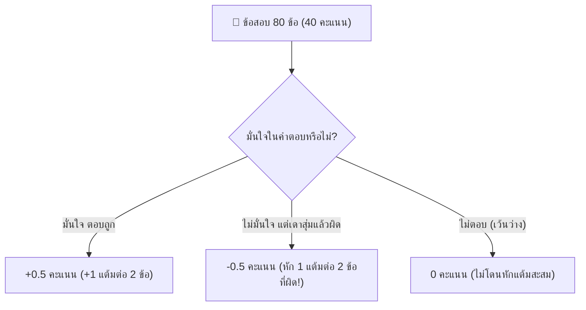

# 🎙️ บทวิเคราะห์เจาะลึกเสียงบรรยาย: กฎการสอบปลายภาค 80 ข้อ กฎติดลบ และสรุปผลพรีเซนต์ ER Diagram

**รหัสไฟล์เสียง:** `20261006_161408.aac`  
**วันที่บันทึก:** วันอังคารที่ 6 ตุลาคม 2569 เวลา 16:14:08 น. (ความยาว 7 นาที 33 วินาที)  
**วิชา:** ระบบฐานข้อมูล (Database System)  
**ผู้สอน:** อาจารย์ผู้บรรยายประจำวิชา (ดร.สวาท)  
**สถานะ:** ประมวลผลและถอดความสมบูรณ์ 100% (Verbatim & Strategic Analysis)

---

## 📌 สรุปสาระสำคัญของผู้บรรยาย (Executive Summary)

ในการบรรยายสรุปปิดท้ายคาบเรียนปฏิบัติการและพรีเซนต์โครงงาน ดร.สวาท ได้ประกาศกฎเกณฑ์สำคัญเกี่ยวกับการสอบปลายภาค (Final Examination) และการส่งมอบงานขั้นสุดท้าย ดังนี้:

1. **ลักษณะและกฎเหล็กการสอบปลายภาค (Final Exam Rules & Negative Marking):**
   - **รูปแบบข้อสอบ:** ข้อสอบเป็นแบบ **ปรนัย (Multiple Choice)** ทั้งหมด
   - **จำนวนข้อสอบและคะแนน:** มีทั้งหมด **80 ข้อ เก็บ 40 คะแนนเต็ม**
   - **🔥 กฎหักคะแนนติดลบ (Negative Marking Penalty):**
     - ทำถูก 2 ข้อ = ได้ $1$ แต้ม ($0.5$ คะแนน/ข้อ)
     - **ทำผิด 2 ข้อ = ถูกหัก $1$ แต้ม ($-0.5$ คะแนน/ข้อ!)**
     - *คำเตือนเชิงยุทธศาสตร์:* ข้อใดไม่มั่นใจอย่างยิ่ง ห้ามเดาสุ่มเด็ดขาด เพราะการเดาผิดจะไปลบแต้มของข้อที่ทำถูก!
   - **Open Book:** **อนุญาตให้นำเอกสารและตำราทุกชนิดเข้าห้องสอบได้!**
   - **ขอบเขตเนื้อหา:** ออกครอบคลุมเนื้อหาที่เรียนมา **แทบทั้งหมด 100%** (Relational Model, Relational Algebra, ER Diagram, Functional Dependencies, Normalization 1NF-5NF, SQL DDL/DML, Transactions & ACID, NoSQL & Big Data)
   - **คำศัพท์ภาษาอังกฤษ:** ข้อสอบมีคำศัพท์เชิงเทคนิคภาษาอังกฤษสอดแทรกจำนวนมาก
   - **อุปกรณ์ที่ต้องนำเข้าสอบ:** **ดินสอ 2B** สำหรับฝนกระดาษคำตอบ, **ยางลบดินสอ**, ปากกา และลิควิด
2. **การอัปโหลดส่งรายงานโครงงาน ER Diagram ใน Google Classroom:**
   - กำหนดให้อัปโหลดไฟล์ **2 ช่องคู่กัน:**
     1. **ช่องที่ 1 (หลังมิดเทอม):** ไฟล์เอกสารและไดอะแกรมเดิมที่เคยพรีเซนต์ในสัปดาห์แรกหลังมิดเทอม (ฉบับก่อนแก้ไข)
     2. **ช่องที่ 2 (Final):** ไฟล์เอกสารและไดอะแกรมฉบับสมบูรณ์ที่ปรับปรุงแก้ไขข้อบกพร่องเรียบร้อยแล้ว
   - ทุกกลุ่มต้องอัปโหลดให้ครบทั้ง 2 ช่อง มิฉะนั้นจะไม่ได้รับคะแนนในส่วนนี้
3. **ข้อเสนอแนะจากการพรีเซนต์โครงงาน E-R Diagram:**
   - อาจารย์ชื่นชมว่าภาพรวมของโครงสร้างตารางและ E-R Diagram ส่วนใหญ่ทำมาถูกต้อง
   - **จุดที่ต้องระวังในการอธิบายความสัมพันธ์ (Relationship Explanation):** อาจารย์สอนการอธิบายความสัมพันธ์ไป 3 รูปแบบ แต่เวลาพรีเซนต์ **ให้เลือกอธิบายเพียงรูปแบบเดียวที่กลุ่มถนัดและแม่นยำที่สุด** (เช่น การอธิบายแบบ **Total / Partial Participation** ซึ่งชัดเจนและผิดพลาดยากกว่า ไม่ควรพูดสลับกับ Cardinality Ratio จนเกิดความสับสนและตอบผิด)
4. **การส่งการบ้านแบบฝึกหัดท้ายคาบ:**
   - ให้นักศึกษาเขียน **ลำดับที่ (Index Number)** ของตนเองตามที่อาจารย์ประกาศใน Google Classroom ลงบนหัวกระดาษให้ชัดเจน ก่อนเดินนำมาส่งที่โต๊ะอาจารย์

---

## 🔥 ตารางเปรียบเทียบกลยุทธ์การทำข้อสอบปลายภาค (Exam Strategy & Penalty Analysis)

| ผลการตอบข้อสอบ | จำนวนข้อ | คะแนนสุทธิ | ผลกระทบต่อเกรด |
| :--- | :---: | :---: | :--- |
| **ตอบถูก 2 ข้อ** | 2 | **$+1.0$ แต้ม** ($+0.5$ คะแนน) | สะสมคะแนนสู่เกรด A |
| **ตอบผิด 2 ข้อ** | 2 | **$-1.0$ แต้ม** ($-0.5$ คะแนน) | **ล้างคะแนนข้อที่ตอบถูกทิ้งทันที!** |
| **ตอบถูก 1 ข้อ + ผิด 1 ข้อ** | 2 | **$0.0$ แต้ม** ($0$ คะแนน) | เสียเวลาเปล่า ไม่ได้คะแนนสุทธิ |
| **ไม่ตอบ (เว้นว่าง)** | 1 | **$0.0$ แต้ม** ($0$ คะแนน) | **ปลอดภัย ไม่โดนหักคะแนน** |

---

## 📐 คำแนะนำเรื่องการนำเสนอ E-R Diagram (Total / Partial vs Cardinality Ratio)

อาจารย์เน้นย้ำว่า ในการออกแบบเชิงแนวคิด (Conceptual Design):
1. **Total Participation (การมีส่วนร่วมทั้งหมด - เส้นคู่หรือเส้นทึบ):**
   - ทุกเอนทิตีในเซตนั้น *ต้อง* มีความสัมพันธ์กับเอนทิตีอื่นอย่างน้อย 1 รายการ (เช่น นักศึกษาทุกคนต้องสังกัดภาควิชาอย่างแน่นอน)
2. **Partial Participation (การมีส่วนร่วมบางส่วน - เส้นเดี่ยว):**
   - เอนทิตีบางรายการอาจจะไม่มีความสัมพันธ์ก็ได้ (เช่น อาจารย์บางท่านอาจไม่ได้เป็นหัวหน้าภาควิชา)
3. **Cardinality Ratio ($1:1$, $1:N$, $M:N$):**
   - อัตราส่วนจำนวนสูงสุดของเอนทิตีที่สัมพันธ์กัน
   - **กฎเหล็กของอาจารย์:** "ในการนำเสนอ ให้อธิบายแบบเดียวให้แม่นยำ ไม่ต้องพูดทั้งสองแบบถ้ายังไม่แม่นยำจนทำให้ตีความขัดแย้งกันเอง"

---

## 📅 กำหนดการและสิ่งที่ต้องปฏิบัติทันที (Action Items & Deadlines)

1. **อัปโหลดไฟล์ใน Google Classroom ทันที:**
   - ตรวจสอบช่องส่งงานหลังมิดเทอม (ไฟล์เดิม)
   - อัปโหลดไฟล์ Final E-R Diagram (ฉบับแก้ไข) ในช่อง Final
2. **จัดเตรียมเอกสาร Open Book เข้าห้องสอบ:**
   - ปริ้นต์สรุปทฤษฎี Ch1 - Ch9, แผ่นสรุปสูตร Relational Algebra, ตาราง Tracing Normalization (1NF-5NF), คำสั่ง SQL DDL/DML, ตาราง Lock Matrix S/X, และข้อสอบเก่า
3. **เตรียมอุปกรณ์สอบ:**
   - ดินสอ 2B เหลาพร้อมใช้ 2 แท่งขึ้นไป
   - ยางลบดินสอคุณภาพดี
   - ปากกาน้ำเงิน และน้ำยาลบคำผิด (ลิควิด)

---
*เอกสารนี้ถูกจัดทำขึ้นจากไฟล์เสียงการบรรยายจริงเพื่อใช้เป็นฐานข้อมูลความรู้และกลยุทธ์การทำข้อสอบปลายภาคอย่างเป็นทางการ*
