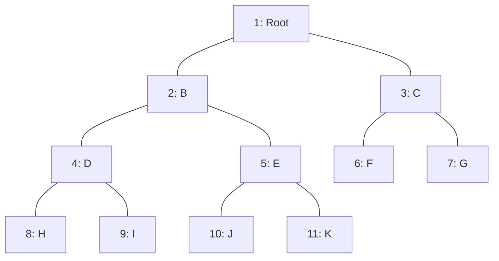

# ถอดความและเจาะลึกจุดออกสอบ: การคำนวณจำนวนโหนดและการแปลง Tree เป็น 1D Array (Exam Focus)

**ไฟล์เสียงต้นฉบับ:** `20260902_112628.aac`, `20260902_113741.aac`, `dsa20260909_092220.aac`  
**ไฟล์ภาพประกอบที่เกี่ยวข้องจาก `DSA-pic/`:**
- [IMG_20260902_112442_392@2130616190.jpg](file:///C:/Project/Voice/DSA-pic/IMG_20260902_112442_392@2130616190.jpg) (สไลด์สูตรช่วงจำนวนโหนด Complete Binary Tree ที่ความสูง $H$)
- [IMG_20260902_112504_139@-140540400.jpg](file:///C:/Project/Voice/DSA-pic/IMG_20260902_112504_139@-140540400.jpg) และ [IMG_20260902_112525_396@-397010168.jpg](file:///C:/Project/Voice/DSA-pic/IMG_20260902_112525_396@-397010168.jpg) (สไลด์เฉลยข้อสอบความสูง $H=10 \rightarrow \text{Min}=1024, \text{Max}=2047$)
- [IMG_20260902_113705_690@-811833240.jpg](file:///C:/Project/Voice/DSA-pic/IMG_20260902_113705_690@-811833240.jpg) และ [IMG_20260902_113705_690@-811833240 (1).jpg](file:///C:/Project/Voice/DSA-pic/IMG_20260902_113705_690@-811833240 (1).jpg) (สไลด์สูตรการแปลง Complete Binary Tree เป็น 1D Array)
- [IMG_20260907_153633_628.jpg](file:///C:/Project/Voice/DSA-pic/IMG_20260907_153633_628.jpg) (ภาพกระดานสรุปสูตรความสัมพันธ์ $2i, 2i+1, \lfloor i/2 \rfloor$)  
**วิชา:** โครงสร้างข้อมูลและขั้นตอนวิธี (Data Structures and Algorithms - วท.บ. คอมพิวเตอร์)  
**วันที่บรรยาย:** 2 กันยายน 2569 เวลา 11:26 - 11:45 น. และ 9 กันยายน 2569 เวลา 09:22 น.  
**ผู้บรรยาย:** อาจารย์ประจำวิชา (ดร.ประดิษฐ์ พิทักษ์เสถียรกุล)  

---

## 1. คำถอดความและบทบรรยายสำคัญ (Core Lecture Transcripts)

### 1.1 การคำนวณจำนวนโหนดของ Complete Binary Tree (ไฟล์ `20260902_112628.aac`)
**ภาพประกอบสไลด์:** [IMG_20260902_112442_392@2130616190.jpg](file:///C:/Project/Voice/DSA-pic/IMG_20260902_112442_392@2130616190.jpg) และ [IMG_20260902_112525_396@-397010168.jpg](file:///C:/Project/Voice/DSA-pic/IMG_20260902_112525_396@-397010168.jpg)

> *"คุณสมบัติที่สำคัญและก็ **ออกสอบเสมอเลยครับ!**  
> Heap ที่ความสูงเท่ากับ H จะมีจำนวนโหนด (Number of nodes) อยู่ระหว่าง...  
> $$2^H \quad \text{ถึง} \quad 2^{H+1} - 1 \text{ โหนด}$$  
> อ่านสูตรไม่รู้เรื่อง ผมจะคำนวณให้คุณดู...  
> ถ้า $H = 1$ จำนวนโหนดอย่างน้อยคือ $2^H = 2^1 = 2$ โหนด... อย่างมาก $2^{1+1} - 1 = 4 - 1 = 3$ โหนด แปลว่าจะมีจำนวนโหนดอย่างมากไม่เกิน 3 โหนด...  
> ถ้า $H = 2$ จำนวนโหนดอย่างน้อยคือ $2^2 = 4$ โหนด... อย่างมาก $2^{2+1} - 1 = 8 - 1 = 7$ โหนด...  
>  
> **แล้วเวลาออกสอบเป็นยังไง อ่า โจทก์มาเลยครับ เวลาสอบนะครับ ทรงนี้นะครับ:**  
> **'How many minimum number of nodes of complete binary tree at the height 10?'**  
> แปลเป็นไทยว่า จำนวนโหนดอย่างน้อยของ Complete Binary Tree ที่ความสูงเท่ากับ 10 ใช่ไหมครับ ไฮอะ...  
> ใครจะมาถามคุณนิดๆ หน่อยๆ เขาถามคุณเยอะๆ เลย!  
> นิสิตจะมานั่งวาดรูปไหมครับ ไม่ไหวหรอก ตายแน่!  
> ก็ใส่สูตรเลย!  
> **จำนวนโหนดอย่างน้อย ความสูงเท่ากับ 10 ก็คือ:**  
> $$2^H = 2^{10} = \mathbf{1,024 \text{ โหนด}}$$  
> ง่ายไหมครับ ไม่ถึงนาที คนที่ไม่รู้ไปวาดรูป ตาย นับก็นับไม่ถูก... 1,024 โหนด...  
> อย่าเดี๋ยวนิสิตจะบอกว่า ไม่เคยเห็นเลยนะโจทย์ภาษาอังกฤษยังไง นี่ไง เขียนให้ดูแล้ว และบอกด้วยว่าออกสอบ!  
> คราวนี้ถ้าไปทำข้อสอบไม่ได้ ก็ไม่จดอะ...  
>  
> แล้วนอกจากนี้ ถ้าเทอมโน้นถามอย่างน้อย เทอมนี้อาจจะถาม **'อย่างมาก' (Maximum)**  
> ความสูงเท่ากับ 10:  
> $$2^{H+1} - 1 = 2^{10+1} - 1 = 2^{11} - 1 = 2048 - 1 = \mathbf{2,047 \text{ โหนด}}$$  
> **เวลาตอบ อย่าติดในรูปเลขยกกำลังนะครับ! คุณจะต้องตอบเป็นตัวเลขจำนวนเต็มของโหนด ถ้าตอบมาเป็นเลขยกกำลังอย่างนี้ ไม่ได้คะแนน!**  
> เพราะไอ้เลขยกกำลังสองยกกำลังอะไรมันคำนวณไม่ยากเลยนะนิสิต คุณเรียนสายไอทีเนี่ย ไอ้ $2^{10} = 1024, 2^{11} = 2048$ ลบหนึ่งก็เหลือ 2047 โหนด...  
> **แล้วคุณเชื่อไหมว่า ไอ้โจทย์ข้อนี้เนี่ย มันออกสอบถึงระดับปริญญาโทเลยนะ! ไปสอบเข้า IT ปริญญาโท เป็นคำถามข้อนึงเลยในข้อสอบ ถามงี้เลย!**"*

---

### 1.2 การแปลง Complete Binary Tree เป็น 1D Array (ไฟล์ `20260902_113741.aac` และ `dsa20260909_092220.aac`)
**ภาพประกอบสไลด์:** [IMG_20260902_113705_690@-811833240.jpg](file:///C:/Project/Voice/DSA-pic/IMG_20260902_113705_690@-811833240.jpg)

> *"โครงสร้าง Complete Binary Tree มีความพิเศษตรงที่ มันสามารถเขียนแทนด้วย Array 1 มิติได้...  
> แปลงรูป Binary Tree ที่เป็น Tree อย่างนี้นะครับ แปลงมาเป็น Array ได้...  
> **ซึ่งโปรแกรมนะครับ แล้วก็ข้อสอบ ออกเป็น Array ทั้งนั้น!**  
> ข้อสอบออกเป็น Array นะครับ ในข้อเนี้ย ออกเป็นข้อใหญ่ ข้อที่ 2 เอ่อ... เป็น Array ครับ แต่คุณต้องแทนค่ามันออกมาเป็น Tree ก็ได้เอง...  
> **สูตร 3 สูตรที่ต้องท่อง:**  
> **เงื่อนไขสำคัญ: Root ต้องเริ่มที่ตำแหน่ง Index 1 (Index 0 เว้นว่างไว้เสมอ)**  
> 1. $\mathbf{\text{Left Child ของโหนด } i = 2i}$  
> 2. $\mathbf{\text{Right Child ของโหนด } i = 2i + 1}$  
> 3. $\mathbf{\text{Parent ของโหนด } i = \lfloor i / 2 \rfloor}$ (หรือ `i // 2` ในภาษา Python)  
>  
> ดูตัวอย่าง D-Dog นะครับ:  
> D-Dog อยู่ที่ Index 4...  
> ลูกซ้ายของ D-Dog คือ $2i = 2 \times 4 = 8$ (ตรงกับโหนด H)  
> ลูกขวาของ D-Dog คือ $2i + 1 = 2 \times 4 + 1 = 9$ (ตรงกับโหนด I)  
> พ่อแม่ (Parent) ของโหนด J ที่ตำแหน่ง 10:  
> $\text{Parent} = 10 / 2 = 5$ (ตรงกับโหนด E)  
> **ระวังตรงนี้ให้ดี:**  
> สมมุติหา Parent ของโหนดตำแหน่งที่ 7:  
> $7 / 2 = 3.5$ ไม่มีตำแหน่ง 3.5 **ให้ตัดเศษทิ้ง!** ได้ตำแหน่ง 3 คือโหนด C  
> **ไม่ใช่ปัดเศษขึ้นนะ! นี่คือวิธีที่หลายคนเข้าใจผิด 7 หาร 2 ได้ 3.5 ปัดเป็น 4 ผิดทันที! ต้องตัดเศษทิ้งเอาเลขจำนวนเต็มหน้าจุดทศนิยมมาใช้ คือตำแหน่งที่ 3** ในภาษา Python ใช้เครื่องหมาย double slash `//`"*

---

## 2. การวิเคราะห์ทางคณิตศาสตร์และตารางสรุปสูตร (Mathematical Formulation)

### 2.1 พิสูจน์สูตรจำนวนโหนดของ Complete Binary Tree
ให้ $H$ แทนความสูงของทรี (โดยนิยามโหนดรากเดี่ยวๆ มีความสูง $H = 0$):
1. **จำนวนโหนดน้อยที่สุด ($\text{Min Nodes}$):**  
   เกิดขึ้นเมื่อทรีบรรจุเต็มจนถึงระดับความลึก $H-1$ แล้วที่ระดับล่างสุด $H$ มีเพียง **1 โหนดเดี่ยวๆ ทางซ้ายสุด**:
   $$\text{Min}(H) = \left( \sum_{k=0}^{H-1} 2^k \right) + 1 = (2^H - 1) + 1 = \mathbf{2^H}$$
2. **จำนวนโหนดมากที่สุด ($\text{Max Nodes}$):**  
   เกิดขึ้นเมื่อทรีบรรจุเต็มทุกระดับชั้นจนถึงระดับ $H$ (เป็น Perfect Binary Tree):
   $$\text{Max}(H) = \sum_{k=0}^{H} 2^k = \mathbf{2^{H+1} - 1}$$

### 2.2 ตารางคำนวณจำนวนโหนดเปรียบเทียบในแต่ละระดับความสูง

| ความสูง ($H$) | ความสูงระดับชั้น | จำนวนโหนดอย่างน้อย ($\text{Min} = 2^H$) | จำนวนโหนดอย่างมาก ($\text{Max} = 2^{H+1} - 1$) | บันทึกข้อสอบ |
| :---: | :---: | :---: | :---: | :--- |
| **0** | รากโหนดเดียว | $2^0 = 1$ | $2^1 - 1 = 1$ | ทรีมีเฉพาะโหนด Root |
| **1** | 2 ชั้น | $2^1 = 2$ | $2^2 - 1 = 3$ | รากมีลูกซ้าย 1 ตัว |
| **2** | 3 ชั้น | $2^2 = 4$ | $2^3 - 1 = 7$ | |
| **3** | 4 ชั้น | $2^3 = 8$ | $2^4 - 1 = 15$ | |
| **4** | 5 ชั้น | $2^4 = 16$ | $2^5 - 1 = 31$ | |
| **5** | 6 ชั้น | $2^5 = 32$ | $2^6 - 1 = 63$ | |
| $\dots$ | $\dots$ | $\dots$ | $\dots$ | |
| **10** | 11 ชั้น | $2^{10} = \mathbf{1,024}$ | $2^{11} - 1 = 2048 - 1 = \mathbf{2,047}$ | **โจทย์ตรงข้อสอบปลายภาค & สอบเข้า ป.โท! ห้ามตอบเลขยกกำลัง** |

---

## 3. สถาปัตยกรรมการแปลง Tree เป็น Array 1 มิติ (Array Mapping Architecture)

**ภาพประกอบสไลด์:** [IMG_20260902_113705_690@-811833240.jpg](file:///C:/Project/Voice/DSA-pic/IMG_20260902_113705_690@-811833240.jpg)

```
ดัชนี Array:  [ 0 ]   [ 1 ]   [ 2 ]   [ 3 ]   [ 4 ]   [ 5 ]   [ 6 ]   [ 7 ]   [ 8 ]   [ 9 ]  [ 10 ]  [ 11 ]
ข้อมูลโหนด:    -      Root      B       C       D       E       F       G       H       I       J       K
```



### กฎความสัมพันธ์ 3 ข้อ:
1. **Left Child ของโหนด $i$:** อยู่ที่ดัชนี $\mathbf{2i}$
   - เช่น โหนด $i=2$ (B) $\rightarrow$ ลูกซ้ายคือ $2(2) = 4$ (โหนด D)
   - เช่น โหนด $i=4$ (D) $\rightarrow$ ลูกซ้ายคือ $2(4) = 8$ (โหนด H)
2. **Right Child ของโหนด $i$:** อยู่ที่ดัชนี $\mathbf{2i + 1}$
   - เช่น โหนด $i=2$ (B) $\rightarrow$ ลูกขวาคือ $2(2) + 1 = 5$ (โหนด E)
   - เช่น โหนด $i=4$ (D) $\rightarrow$ ลูกขวาคือ $2(4) + 1 = 9$ (โหนด I)
3. **Parent ของโหนด $i$:** อยู่ที่ดัชนี $\mathbf{\lfloor i / 2 \rfloor}$ (หรือ `i // 2` ใน Python)
   - เช่น โหนด $i=10$ (J) $\rightarrow$ พ่อแม่คือ $10 // 2 = 5$ (โหนด E)
   - เช่น โหนด $i=9$ (I) $\rightarrow$ พ่อแม่คือ $9 // 2 = 4$ (โหนด D)
   - เช่น โหนด $i=7$ (G) $\rightarrow$ พ่อแม่คือ $7 // 2 = 3$ (โหนด C) **(ปัดเศษทิ้ง ห้ามปัดขึ้นเป็น 4)**

> [!CAUTION]
> **ทำไมต้องเว้น Index 0:**  
> หากใส่ Root ที่ Index 0 สูตรจะพังทันที เพราะ $2 \times 0 = 0$ (ลูกซ้ายจะวนกลับมาที่ตัวเอง) ดังนั้นในทุกโปรแกรมและในกระดาษคำตอบข้อสอบปลายภาค **ช่อง Index 0 ต้องเว้นว่างไว้เสมอ!**
