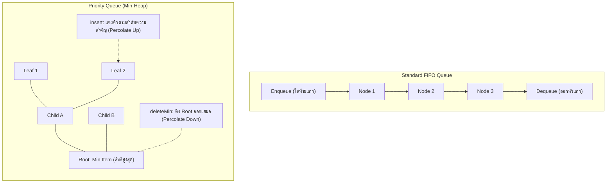

# ถอดความและสรุปบทเรียนอย่างละเอียด: บทที่ 8 คิวลำดับความสำคัญและโครงสร้างฮีป (Priority Queue & Binary Heap Properties)

**ไฟล์เสียงต้นฉบับ:** `20260902_110748.aac`, `20260902_111515.aac`, `20260902_112213.aac`  
**ไฟล์ภาพประกอบที่เกี่ยวข้องจาก `DSA-pic/`:**
- [IMG_20260902_112203_525@1985525037.jpg](file:///C:/Project/Voice/DSA-pic/IMG_20260902_112203_525@1985525037.jpg) (สไลด์หน้าแรก บทที่ 8 Priority Queue & Binary Heap)
- [IMG_20260902_113121_541@-1402929343.jpg](file:///C:/Project/Voice/DSA-pic/IMG_20260902_113121_541@-1402929343.jpg) (คุณสมบัติ Heap-Order Property: Min-Heap Parent $\le$ Children)
- [IMG_20260902_113308_947@-815528554.jpg](file:///C:/Project/Voice/DSA-pic/IMG_20260902_113308_947@-815528554.jpg) (คุณสมบัติ Structure Property: Complete Binary Tree และกฎซ้าย-ขวา)  
**วิชา:** โครงสร้างข้อมูลและขั้นตอนวิธี (Data Structures and Algorithms - วท.บ. คอมพิวเตอร์)  
**วันที่บรรยาย:** 2 กันยายน 2569 เวลา 11:07 - 11:26 น.  
**ผู้บรรยาย:** อาจารย์ประจำวิชา (ดร.ประดิษฐ์ พิทักษ์เสถียรกุล)  

---

## 1. คำถอดความและบทบรรยายสำคัญ (Core Lecture Transcripts)

### 1.1 นิยามของ Queue ปกติ vs Priority Queue (ไฟล์ `20260902_110748.aac`)
> *"เปิดอยู่ใน Google Classroom แล้วนะครับ Priority Queue Lecture Note บทที่ 8...  
> บทที่ 8 Priority Queue นะครับ ภาษาอังกฤษเรียกสั้นๆ ว่า PQ...  
> ก่อนที่จะอธิบายภาษาอังกฤษ อธิบายภาษาไทยก่อน... คิว คืออะไร  
> คิว ภาษาอังกฤษเขียนว่า Q-U-E-U-E อย่างนี้นะครับ มี U-E สองที... ส่วนใหญ่ก็เรียกทับศัพท์ว่า คิว  
> คำว่าคิว ภาษาไทยแปลว่า **'แถวคอย'** เปิดพจนานุกรม Dictionary ก็แปลว่า คิว คือ แถวคอย  
> แล้วแถวอะไร คอยอะไร... หลักการของคิวก็คือ จะมีผู้ให้บริการและผู้มาขอใช้บริการ เช่น ร้านข้าวในโรงอาหาร... ผู้ให้บริการมีน้อย ผู้มาขอใช้บริการเยอะ ก็ต้องเข้าแถวรอคอยการให้บริการ... ใครมาก่อนก็ได้รับบริการก่อน ใครมาทีหลังก็ต้องไปต่อท้ายแถว ตามหลักการ FIFO ที่เราเรียนในบทที่ 3...  
> **แต่ มันมีคิวอยู่ประเภทหนึ่ง ที่เรากำลังจะเรียนในบทที่ 8 นี้ครับ: Priority Queue**  
> Priority แปลเป็นไทยว่า **มีสิทธิพิเศษอะไรบางอย่าง เช่น มาทีหลัง แต่ไม่ต้องไปต่อท้ายแถว แซงคิวได้!**  
> ยกตัวอย่างเช่น นักศึกษาเข้าแถวรอซื้อข้าว คณบดีเดินมา... 'อ้าว เชิญท่านคณบดีก่อนเลยครับ' แซงคิวได้... เขาเรียก Priority มีสิทธิพิเศษหรือเงื่อนไขอะไรบางอย่าง แซงคิวได้ ทำให้ไม่เป็นไปตามหลักการคิวปกติแล้ว..."*

---

### 1.2 การประยุกต์ใช้งานและที่มาของคำว่า "Heap" (ไฟล์ `20260902_111515.aac`)
> *"ปกติไปถ่ายเอกสารที่ร้านถ่ายเอกสาร มาก่อนถ่ายก่อน มาทีหลังก็ต้องรอคอย ปรากฏว่านักศึกษาจะไปถ่ายบัตรประชาชนใบเดียว จะไปแนบคำร้อง ถ่ายแป๊บเดียวไม่ถึงนาที แต่คนข้างหน้าเอาหนังสือ Text Book มาถ่าย 700 หน้า... เจ๊บอกว่าถ้าตามคิวก็อีก 2 วัน คุณจะรอไหมล่ะ... เจ๊ก็แซงคิวให้คุณ...  
> ในระบบปฏิบัติการคอมพิวเตอร์ก็เหมือนกัน งานอะไรที่ใช้เวลาน้อย เช่น การคลิกเมาส์ การกดคีย์บอร์ด ระบบจะลัดคิวทำให้เราก่อน ไม่ให้เครื่องค้าง... นี่คือแนวคิดของ Priority Queue...  
> Priority Queue มี 2 โอเปอเรชันสำคัญที่สุด คือ:  
> 1. **Insert (การแทรก):** เทียบเท่ากับ Enqueue ในคิวปกติ  
> 2. **DeleteMin (การลบค่าที่น้อยที่สุด):** เทียบเท่ากับ Dequeue แต่จะค้นหาและส่งค่าที่น้อยที่สุดออกมา...  
>  
> **Heap Structure คืออะไร:**  
> คำว่า 'Heap' เปิด Dictionary แปลว่า **'กองดิน กองทราย'**... เวลาสิบล้อเทดินเททรายลงมาที่พื้น มันจะไหลลงมากองเป็นทรงสามเหลี่ยมเหมือน **'พีระมิด'** ข้างล่างจะกว้าง ข้างบนจะเป็นยอดแหลม... ซึ่งรูปทรงนี้ตรงกับโครงสร้างข้อมูล Priority Queue พอดี ฝรั่งจึงเรียกว่า Heap...  
> ชนิดที่เราเรียนในวิชานี้คือ **Binary Heap (ฮีปทวิภาค)** เป็นชนิดที่ง่ายและใช้งานแพร่หลายที่สุด...  
> Heap จะมีคุณสมบัติสำคัญ 2 ประการ:  
> 1. **Structure Property (คุณสมบัติเชิงโครงสร้าง)**  
> 2. **Heap-Order Property (คุณสมบัติเชิงอันดับ)"***

---

### 1.3 กฎเกณฑ์เชิงโครงสร้างและการเติม/ลบโหนด (ไฟล์ `20260902_112213.aac`)
> *"Structure Property ของ Heap ระบุว่า: **Binary Heap ต้องเป็น Complete Binary Tree**  
> Complete Binary Tree แปลว่าอะไร...  
> จดนะครับ: **คือ Binary Tree ที่เต็มหมดทุกชั้น ยกเว้นชั้นล่างสุด ที่เต็มหรือไม่เต็มก็ได้!**  
> **กฎการใส่และการลบข้อมูล (สำคัญมาก ต้องจด!):**  
> - **เวลาใส่ข้อมูล:** เราจะใส่ที่ชั้นล่างสุด ไล่จาก **'ซ้ายไปหาขวา'**  
> - **เวลาลบข้อมูล:** เราจะลบที่ชั้นล่างสุด ไล่จาก **'ขวาไปหาซ้าย'**  
> นี่คือหลักการสำคัญเลยนะครับ ท่านต้องจดนะครับ..."*

---

## 2. การวิเคราะห์เชิงทฤษฎี (Theoretical Deep Dive)

### 2.1 เปรียบเทียบ FIFO Queue vs Priority Queue

| คุณสมบัติ (Property) | Standard FIFO Queue | Priority Queue (Min-Heap) |
| :--- | :--- | :--- |
| **หลักการจัดคิว** | First-In, First-Out (มาก่อนได้ก่อน) | Priority Order (ค่าน้อยได้สิทธิบริการก่อน) |
| **โอเปอเรชันการแทรก** | `enqueue(x)` ต่อท้ายแถว ($O(1)$) | `insert(x)` แทรกแล้วลอยตัวขึ้นสู่ผิวน้ำ ($O(\log N)$) |
| **โอเปอเรชันการนำออก** | `dequeue()` ดึงตัวหน้าสุด ($O(1)$) | `deleteMin()` ดึงตัวที่น้อยที่สุดที่ Root ($O(\log N)$) |
| **โครงสร้างข้อมูลเบื้องหลัง** | Circular Array หรือ Singly Linked List | Complete Binary Tree บน 1D Array |

---

### 2.2 สองคุณสมบัติหลักของ Binary Heap (The Two Invariants)

**ภาพประกอบสไลด์:** [IMG_20260902_113121_541@-1402929343.jpg](file:///C:/Project/Voice/DSA-pic/IMG_20260902_113121_541@-1402929343.jpg) และ [IMG_20260902_113308_947@-815528554.jpg](file:///C:/Project/Voice/DSA-pic/IMG_20260902_113308_947@-815528554.jpg)

#### 1. คุณสมบัติเชิงโครงสร้าง (Structure Property): Complete Binary Tree
- ต้องเป็น Binary Tree ที่มีสมาชิกบรรจุเต็ม ($2^{\text{level}}$) ในทุกระดับชั้นความลึก $0, 1, \dots, h-1$
- ระดับชั้นล่างสุด (Level $h$) อาจไม่เต็มก็ได้ แต่จะต้องถูกบรรจุชิดซ้ายเรียงติดต่อกันจาก **ซ้ายไปขวา (Left to Right)** โดยไม่มีช่องว่างคั่น
- **กฎเหล็กการเปลี่ยนแปลงโหนด:**
  - เมื่อทำการ **Insert:** ตำแหน่งว่างใหม่ (Hole) จะต้องถูกสร้างที่ชั้นล่างสุดไล่จาก **ซ้ายไปขวา** เสมอ
  - เมื่อทำการ **Delete:** ตำแหน่งโหนดที่ต้องยุบหายไป จะต้องเป็นโหนดที่ชั้นล่างสุดไล่จาก **ขวาไปซ้าย** เสมอ

#### 2. คุณสมบัติเชิงอันดับ (Heap-Order Property): Min-Heap
- สำหรับทุกโหนด $X$ ในทรี (ยกเว้นโหนดราก):
  $$\text{Key}(\text{Parent}(X)) \le \text{Key}(X)$$
- ค่าของ Parent จะต้องมีค่าน้อยกว่าหรือเท่ากับค่าของลูกๆ เสมอ
- **ผลลัพธ์สำคัญ:** โหนดที่มีค่าน้อยที่สุดในทั้งทรี จะต้องอยู่ที่ **โหนดราก (Root Node)** เสมอ ทำให้การเรียกดูค่าน้อยสุด (`findMin`) มีความเร็วสูงสุดเป็น $O(1)$
- **การตรวจสอบความถูกต้อง (Validity Check):**
  - ในสไลด์ [IMG_20260902_113121_541@-1402929343.jpg](file:///C:/Project/Voice/DSA-pic/IMG_20260902_113121_541@-1402929343.jpg) อาจารย์ได้แสดงภาพทรี 2 ภาพเพื่อเปรียบเทียบ โดยภาพด้านขวาผิดกฎ Heap-Order Property เนื่องจากโหนดพ่อแม่มีค่า 21 แต่มีโหนดลูกมีค่า 6 ซึ่ง $21 \not\le 6$ จึง **ไม่เป็น Binary Heap**

---

## 3. สรุปจุดสำคัญเตรียมสอบ (Key Takeaways)
1. **ชื่อย่อ:** Priority Queue มักเรียกว่า PQ
2. **ความหมายรูปทรง Heap:** ทรงกองดินกองทราย/พีระมิด ข้างล่างกว้าง ยอดแหลม
3. **ทิศทางการแทรก/ลบ:**
   - แทรก: ชั้นล่างสุด จาก **ซ้าย $\rightarrow$ ขวา**
   - ลบ: ชั้นล่างสุด จาก **ขวา $\rightarrow$ ซ้าย**
4. **โหนดราก (Root):** มีค่าน้อยที่สุดเสมอใน Min-Heap
