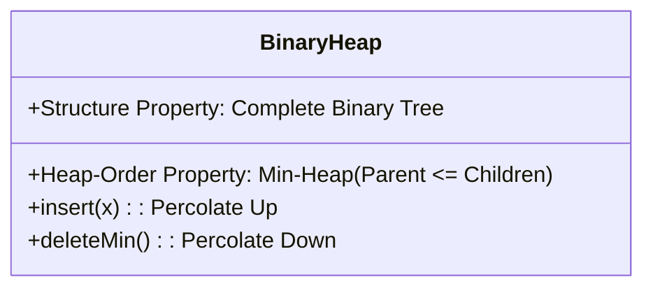

# ถอดความและสรุปบทเรียน: คิวลำดับความสำคัญและโครงสร้างฮีป (Priority Queue & Binary Heap)
**ไฟล์เสียงต้นฉบับ:** `20260902_110748.aac`, `20260902_111515.aac`, `20260902_112213.aac`  
**วิชา:** โครงสร้างข้อมูลและขั้นตอนวิธี (Data Structures and Algorithms)  
**วันที่บันทึก:** 2 กันยายน 2569 เวลา 11:07 - 11:26 น. (ความยาวรวมประมาณ 18 นาที)  
**ผู้บรรยาย:** อาจารย์ประจำวิชา  

---

## 1. คำถอดความแบบละเอียดทุกคำพูด (Verbatim Transcript)

### 1.1 ที่มาและนิยามของ Priority Queue (ไฟล์ `20260902_110748.aac`)
> "เปิดอยู่ใน Google Classroom แล้วนะครับ Priority Queue Lecture Note บทที่ 8...  
> บทที่ 8 Priority Queue นะครับ ภาษาอังกฤษเรียกสั้นๆ ว่า PQ...  
> ก่อนที่จะอธิบายภาษาอังกฤษ อธิบายภาษาไทยก่อน... คิว คืออะไร  
> คิว ภาษาอังกฤษเขียนว่า Q-U-E-U-E อย่างนี้นะครับ มี U-E สองที... ส่วนใหญ่ก็เรียกทับศัพท์ว่า คิว  
> คำว่าคิว ภาษาไทยแปลว่า **'แถวคอย'** เปิดพจนานุกรม Dictionary ก็แปลว่า คิว คือ แถวคอย  
> แล้วแถวอะไร คอยอะไร... หลักการของคิวก็คือ จะมีผู้ให้บริการและผู้มาขอใช้บริการ เช่น ร้านข้าวในโรงอาหาร... ผู้ให้บริการมีน้อย ผู้มาขอใช้บริการเยอะ ก็ต้องเข้าแถวรอคอยการให้บริการ... ใครมาก่อนก็ได้รับบริการก่อน ใครมาทีหลังก็ต้องไปต่อท้ายแถว ตามหลักการ FIFO ที่เราเรียนในบทที่ 3...  
> แต่ มันมีคิวอยู่ประเภทหนึ่ง ที่เรากำลังจะเรียนในบทที่ 8 นี้ครับ: **Priority Queue**  
> Priority แปลเป็นไทยว่า **มีสิทธิพิเศษอะไรบางอย่าง เช่น มาทีหลัง แต่ไม่ต้องไปต่อท้ายแถว แซงคิวได้!**  
> ยกตัวอย่างเช่น นักศึกษาเข้าแถวรอซื้อข้าว คณบดีเดินมา... 'อ้าว เชิญท่านคณบดีก่อนเลยครับ' แซงคิวได้... เขาเรียก Priority มีสิทธิพิเศษหรือเงื่อนไขอะไรบางอย่าง แซงคิวได้ ทำให้ไม่เป็นไปตามหลักการคิวปกติแล้ว..."

---

### 1.2 การประยุกต์ใช้งานและนิยามของ Heap (ไฟล์ `20260902_111515.aac`)
> "ปกติไปถ่ายเอกสารที่ร้านถ่ายเอกสาร มาก่อนถ่ายก่อน มาทีหลังก็ต้องรอคอย ปรากฏว่านักศึกษาจะไปถ่ายบัตรประชาชนใบเดียว จะไปแนบคำร้อง ถ่ายแป๊บเดียวไม่ถึงนาที แต่คนข้างหน้าเอาหนังสือ Text Book มาถ่าย 700 หน้า... เจ๊บอกว่าถ้าตามคิวก็อีก 2 วัน คุณจะรอไหมล่ะ... เจ๊ก็แซงคิวให้คุณ...  
> ในระบบปฏิบัติการคอมพิวเตอร์ก็เหมือนกัน งานอะไรที่ใช้เวลาน้อย เช่น การคลิกเมาส์ การกดคีย์บอร์ด ระบบจะลัดคิวทำให้เราก่อน... นี่คือแนวคิดของ Priority Queue...  
> Priority Queue มี 2 โอเปอเรชันสำคัญที่สุด คือ:  
> 1. **Insert (การแทรก):** เทียบเท่ากับ Enqueue ในคิวปกติ  
> 2. **DeleteMin (การลบค่าที่น้อยที่สุด):** เทียบเท่ากับ Dequeue แต่จะค้นหาและส่งค่าที่น้อยที่สุดออกมา...  
> **Heap Structure คืออะไร:**  
> คำว่า 'Heap' เปิด Dictionary แปลว่า **'กองดิน กองทราย'**... เวลาสิบล้อเทดินเททรายลงมาที่พื้น มันจะไหลลงมากองเป็นทรงสามเหลี่ยมเหมือน **'พีระมิด'** ข้างล่างจะกว้าง ข้างบนจะเป็นยอดแหลม... ซึ่งรูปทรงนี้ตรงกับโครงสร้างข้อมูล Priority Queue พอดี ฝรั่งจึงเรียกว่า Heap...  
> ชนิดที่เราเรียนในวิชานี้คือ **Binary Heap (ฮีปทวิภาค)** เป็นชนิดที่ง่ายและใช้งานแพร่หลายที่สุด...  
> Heap จะมีคุณสมบัติสำคัญ 2 ประการ:  
> 1. **Structure Property (คุณสมบัติเชิงโครงสร้าง)**  
> 2. **Heap-Order Property (คุณสมบัติเชิงอันดับ)"**

---

### 1.3 กฎเกณฑ์ของ Complete Binary Tree (ไฟล์ `20260902_112213.aac`)
> "Structure Property ของ Heap ระบุว่า: **Binary Heap ต้องเป็น Complete Binary Tree**  
> Complete Binary Tree แปลว่าอะไร...  
> จดนะครับ: **คือ Binary Tree ที่เต็มหมดทุกชั้น ยกเว้นชั้นล่างสุด ที่เต็มหรือไม่เต็มก็ได้!**  
> **กฎการใส่และการลบข้อมูล (สำคัญมาก ต้องจด!):**  
> - **เวลาใส่ข้อมูล:** เราจะใส่ที่ชั้นล่างสุด ไล่จาก **'ซ้ายไปหาขวา'**  
> - **เวลาลบข้อมูล:** เราจะลบที่ชั้นล่างสุด ไล่จาก **'ขวาไปหาซ้าย'**  
> นี่คือหลักการสำคัญเลยนะครับ ท่านต้องจดนะครับ..."

---

## 2. สรุปคุณสมบัติหลักของ Binary Heap (Key Properties Summary)

1. **Structure Property (คุณสมบัติเชิงโครงสร้าง):**
   - ต้องเป็น **Complete Binary Tree** เท่านั้น
   - ทุกระดับชั้น (Level) ตั้งแต่รากลงมาต้องมีโหนดบรรจุเต็ม ($2^{\text{level}}$) ยกเว้นระดับชั้นสุดท้าย
   - ระดับชั้นสุดท้าย โหนดต้องถูกเติมชิดซ้ายเรียงจากซ้ายไปขวาอย่างต่อเนื่อง ห้ามมีช่องโหว่เด็ดขาด

2. **Heap-Order Property (คุณสมบัติเชิงอันดับ - Min-Heap):**
   - สำหรับทุกโหนด $X$ ใดๆ ค่าของโหนดพ่อแม่ (Parent) จะต้อง **น้อยกว่าหรือเท่ากับ** ค่าของโหนดลูก (Children) เสมอ:
     $$\text{Key}(\text{Parent}(X)) \le \text{Key}(X)$$
   - ส่งผลให้ **โหนดที่มีค่าน้อยที่สุดในระบบ จะอยู่ที่โหนดราก (Root) เสมอ** ซึ่งทำให้การเข้าถึงค่าน้อยที่สุดมี Time Complexity เป็น $O(1)$
