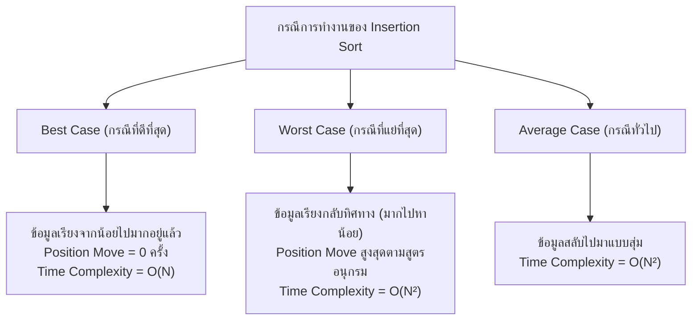

# ถอดความและวิเคราะห์การสอนสด: การเรียงลำดับข้อมูล (Sorting Algorithms), Insertion Sort, Selection Sort, Bubble Sort, และเฉลยแนวข้อสอบ / แบบฝึกหัดในห้องเรียน (In-Class Quiz Trace)

**ไฟล์เสียงต้นฉบับ:** [`20260916_092007.aac`](file:///C:/Project/Voice/Success/20260916_092007.aac), [`20260916_102037.aac`](file:///C:/Project/Voice/Success/20260916_102037.aac)  
**ไฟล์ข้อความถอดเสียงคำต่อคำ (Verbatim 100%):** [`20260916_092007.txt`](file:///C:/Project/Voice/03_Data_Structures_and_Algorithms/20260916_092007.txt), [`20260916_102037.txt`](file:///C:/Project/Voice/03_Data_Structures_and_Algorithms/20260916_102037.txt)  
**ไฟล์ภาพประกอบที่เกี่ยวข้องจาก `DSA-pic/`:**
- [IMG_20260916_092114_638@166919381.jpg](file:///C:/Project/Voice/DSA-pic/IMG_20260916_092114_638@166919381.jpg) (สไลด์เปิดบทที่ 9: Comparison-based sorting, สัญนิยมการเรียงจากน้อยไปหามาก)
- [IMG_20260916_094820_819@893369530.jpg](file:///C:/Project/Voice/DSA-pic/IMG_20260916_094820_819@893369530.jpg) (สไลด์ตาราง Insertion Sort Trace: Original 34, 8, 64, 51, 32, 21 และค่า P. Moved แต่ละรอบ p=1 ถึง 5)
- [IMG_20260916_095318_496@1010269358.jpg](file:///C:/Project/Voice/DSA-pic/IMG_20260916_095318_496@1010269358.jpg) (กระดานโน้ต Best Case 8, 21, 32, 34, 51, 64, Worst Case, Average Case)
- [IMG_20260916_095816_275@-1897800400.jpg](file:///C:/Project/Voice/DSA-pic/IMG_20260916_095816_275@-1897800400.jpg) (กระดานโน้ตโจทย์ Worst Case 64, 51, 34, 32, 21, 8 เกิด Position Move รวมทั้งสิ้นกี่ครั้ง = 15 ครั้ง)
- [IMG_20260916_112712_580@-1614993214.jpg](file:///C:/Project/Voice/DSA-pic/IMG_20260916_112712_580@-1614993214.jpg) (ใบงาน In-Class Assignment ข้อสอบ Bubble Sort อาร์เรย์ [64, 34, 25, 12, 22, 11, 90] ของนักศึกษา ภาภวินท์ ฐิติชยานันท์ รหัส 6806021612037)  
**วิชา:** โครงสร้างข้อมูลและอัลกอริทึม (Data Structures and Algorithms - คณะวิทยาศาสตร์/เทคโนโลยีสารสนเทศ)  
**วันที่บรรยาย:** 16 กันยายน 2569 เวลา 09:20 - 11:29 น. (ความยาวรวมประมาณ 113 นาที)  
**ผู้บรรยาย:** ดร.ประดิษฐ์ พิทักษ์เสถียรกุล  

---

## 📌 บทสรุปผู้บริหาร (Executive Summary)

ในคาบเรียนนี้ อาจารย์ประดิษฐ์ได้บรรยาย **บทที่ 9: Sorting Algorithms (การเรียงลำดับข้อมูลแบบเปรียบเทียบ - Comparison-based Sorting)** โดยเจาะลึก 3 อัลกอริทึมหลักที่ออกสอบปลายภาค ได้แก่:
1. **Insertion Sort (การเรียงลำดับแบบแทรก):** ท่องจำหัวใจสำคัญ "หา temp ให้เจอ แล้วจับ temp เปรียบเทียบถอยหลังมาทางซ้ายจนสุด" และการนับ **Position Move**
2. **Selection Sort (การเรียงลำดับแบบเลือก):** การแบ่งอะเรย์ออกเป็นสองส่วน (Sorted Part และ Unsorted Part) การวนลูปหาค่าน้อยที่สุด (`min_idx`) ในส่วนที่ยังไม่เรียง แล้วทำการ Swap กับตัวแรกของ Unsorted Part พร้อมทั้งเจาะลึกฟังก์ชัน `range()` ในภาษา Python และโครงสร้างหน่วยความจำ
3. **Bubble Sort (การเรียงลำดับแบบฟองสบู่):** การเปรียบเทียบตัวเลขทีละคู่ที่ติดกัน (Adjacent pairs) จากซ้ายไปขวา ค่าที่มากที่สุดจะลอยขึ้นไปอยู่ทางขวาสุดในแต่ละรอบ พร้อมเปิดเผย **"สูตรลัด Inversion Counting"** ในการหาจำนวนครั้งการสลับที่ (Total Swaps) ทั้งหมดโดยไม่ต้องไล่ลูป
4. **ใบงานแบบฝึกหัดในห้องเรียน (In-Class Assignment / Quiz):** โจทย์ไล่การทำงานของ Bubble Sort บนอาร์เรย์ `[64, 34, 25, 12, 22, 11, 90]` ส่งก่อนเวลา 12:00 น. บน Google Classroom

---

## 🏛️ สัญนิยมและข้อกำหนดพื้นฐาน (Foundational Concepts)

**ภาพประกอบสไลด์:** [IMG_20260916_092114_638@166919381.jpg](file:///C:/Project/Voice/DSA-pic/IMG_20260916_092114_638@166919381.jpg)

1. **Comparison-based Sorting:**
   - ข้อมูลทุกตัวส่งเข้ามาในรูปของอาร์เรย์ (Array/List)
   - สมาชิกสามารถสลับที่กันได้ (Exchangeable)
   - มีตัวดำเนินการเปรียบเทียบ `<` และ `>` รองรับ
2. **สัญนิยมทิศทางการเรียงลำดับ (Sorting Convention):**
   - หากโจทย์ไม่ระบุทิศทาง **ให้หมายถึงเรียงจาก "น้อยไปหามาก" (Ascending Order) เสมอ** เช่น 0 ไปหา 9 หรือ A ไปหา Z
   - หากต้องการให้เรียงจากมากไปหาน้อย โจทย์จะระบุไว้อย่างชัดเจน (อาจารย์เน้นย้ำว่าเคยมีรุ่นพี่ปีก่อนๆ เรียงกลับทิศทางทำให้เสียคะแนนฟรี)
3. **ขอบเขตเนื้อหาข้อสอบปลายภาค:** มีเพียง 3 อัลกอริทึมเท่านั้น คือ **Insertion Sort, Selection Sort, และ Bubble Sort**

---

## 1. เจาะลึก Insertion Sort (การเรียงลำดับแบบแทรก)

**ภาพประกอบสไลด์:** [IMG_20260916_094820_819@893369530.jpg](file:///C:/Project/Voice/DSA-pic/IMG_20260916_094820_819@893369530.jpg)

### 1.1 ซอร์สโค้ดมาตรฐานในภาษา Python
```python
def insertion_sort(a):
    for p in range(1, len(a)):
        temp = a[p]
        j = p
        while j > 0 and temp < a[j - 1]:
            a[j] = a[j - 1]
            j -= 1
        a[j] = temp
```

### 1.2 กฎและกลไกการทำงาน
1. **รอบการทำงาน ($p$):** เริ่มต้นที่ $p = 1$ สิ้นสุดที่ $p = N - 1$ (สำหรับข้อมูล $N$ ตัว จะวนลูป $N - 1$ รอบ ไม่เริ่มที่ 0)
2. **การกำหนด `temp`:** ค่าที่จะนำมาแทรกในแต่ละรอบคือ `temp = a[p]`
3. **การเลื่อนตำแหน่ง (Position Move):**
   - จับค่า `temp` เอาไว้ให้มั่น
   - เปรียบเทียบย้อนหลังไปทางซ้ายมือ ($j - 1$)
   - หากตัวทางซ้ายมากกว่า `temp` ให้เลื่อนตัวทางซ้ายมาทางขวา 1 ช่อง ($a[j] = a[j-1]$) นับเป็น Position Move 1 ครั้ง
   - ทำซ้ำจนกว่าจะเจอตัวที่น้อยกว่าหรือเท่ากับ `temp` หรือหมดขอบเขตซ้ายมือ ($j = 0$)
   - นำ `temp` ใส่ลงในช่องว่างที่เกิดขึ้น ($a[j] = temp$)

### 1.3 ตาราง Tracing ละเอียดของโจทย์ในห้องเรียน
**ข้อมูลเริ่มต้น (Original):** `[34, 8, 64, 51, 32, 21]` ($N = 6$)

| รอบลูป ($p$) | ค่า `temp` | การเปรียบเทียบย้อนไปทางซ้ายมือ | การเลื่อนตำแหน่ง (Moves) | จำนวน Position Move ในรอบนี้ | สถานะ Array หลังจบรอบ (After $p$) |
| :---: | :---: | :--- | :--- | :---: | :--- |
| **Original** | - | - | - | - | `[34, 8, 64, 51, 32, 21]` |
| **After $p = 1$** | **8** | เปรียบเทียบกับ 34 ($8 < 34 \implies$ จริง) | ย้าย 34 ไปแทนที่ 8, นำ 8 ใส่แทนที่ 34 | **1** | `[8, 34, 64, 51, 32, 21]` |
| **After $p = 2$** | **64** | เปรียบเทียบกับ 34 ($64 < 34 \implies$ เท็จ)<br>เปรียบเทียบกับ 8 ($64 < 8 \implies$ เท็จ) | ไม่มีการย้ายตำแหน่ง | **0** | `[8, 34, 64, 51, 32, 21]` |
| **After $p = 3$** | **51** | เปรียบเทียบกับ 64 ($51 < 64 \implies$ จริง)<br>เปรียบเทียบกับ 34 ($51 < 34 \implies$ เท็จ) | ย้าย 64 ไปแทนที่ 51, นำ 51 ใส่แทนที่ 64 | **1** | `[8, 34, 51, 64, 32, 21]` |
| **After $p = 4$** | **32** | เปรียบเทียบกับ 64 ($32 < 64 \implies$ จริง)<br>เปรียบเทียบกับ 51 ($32 < 51 \implies$ จริง)<br>เปรียบเทียบกับ 34 ($32 < 34 \implies$ จริง)<br>เปรียบเทียบกับ 8 ($32 < 8 \implies$ เท็จ) | ย้าย 64 $\to$ ย้าย 51 $\to$ ย้าย 34,<br>นำ 32 ใส่แทนที่ 34 เดิม | **3** | `[8, 32, 34, 51, 64, 21]` |
| **After $p = 5$** | **21** | เปรียบเทียบกับ 64 ($21 < 64 \implies$ จริง)<br>เปรียบเทียบกับ 51 ($21 < 51 \implies$ จริง)<br>เปรียบเทียบกับ 34 ($21 < 34 \implies$ จริง)<br>เปรียบเทียบกับ 32 ($21 < 32 \implies$ จริง)<br>เปรียบเทียบกับ 8 ($21 < 8 \implies$ เท็จ) | ย้าย 64 $\to$ ย้าย 51 $\to$ ย้าย 34 $\to$ ย้าย 32,<br>นำ 21 ใส่แทนที่ 32 เดิม | **4** | `[8, 21, 32, 34, 51, 64]` |

> [!IMPORTANT]
> **รวมจำนวน Position Move ตลอดทั้งการทำงาน:**
> $$\text{Total Position Moves} = 1 + 0 + 1 + 3 + 4 = \mathbf{9} \text{ ครั้ง}$$

---

### 1.4 การวิเคราะห์ความซับซ้อน 3 กรณี (3 Cases Analysis)

**ภาพประกอบสไลด์:** [IMG_20260916_095318_496@1010269358.jpg](file:///C:/Project/Voice/DSA-pic/IMG_20260916_095318_496@1010269358.jpg) และ [IMG_20260916_095816_275@-1897800400.jpg](file:///C:/Project/Voice/DSA-pic/IMG_20260916_095816_275@-1897800400.jpg)



#### 1. Best Case (กรณีที่ดีที่สุด)
- **ลักษณะข้อมูล:** ข้อมูล Input บังเอิญเรียงลำดับจากน้อยไปหามากอยู่แล้ว เช่น `[8, 21, 32, 34, 51, 64]`
- **พฤติกรรม:** ในทุกรอบ $p$ เมื่อนำ `temp` เปรียบเทียบกับ $a[p-1]$ จะพบว่า $\text{temp} > a[p-1]$ เสมอ ทำให้ลูป While ไม่ทำงาน
- **จำนวน Position Move:** **0 ครั้ง**
- **ความซับซ้อน (Time Complexity):** $O(N)$ (เร็วที่สุด)

#### 2. Worst Case (กรณีที่แย่ที่สุด)
- **ลักษณะข้อมูล:** ข้อมูล Input เรียงลำดับจากมากไปหาน้อย (Reverse Order) เช่น `[64, 51, 34, 32, 21, 8]`
- **พฤติกรรม:** ในแต่ละรอบ $p$ ค่า `temp` จะต้องถูกเปรียบเทียบและเลื่อนผ่านสมาชิกทางซ้ายมือทั้งหมดจนถึงตำแหน่งแรก ($j=0$) เสมอ
- **จำนวน Position Move:** เป็นผลรวมของลำดับเลขคณิต (Arithmetic Progression):
  $$1 + 2 + 3 + \dots + (N - 1) = \frac{N(N - 1)}{2}$$
- **ตัวอย่างการคำนวณตามที่อาจารย์สอน:**
  - ถ้ามีข้อมูล 6 ตัว ($N = 6$):
    $$\text{Position Move} = 1 + 2 + 3 + 4 + 5 = \frac{6 \times 5}{2} = \mathbf{15} \text{ ครั้ง}$$
  - ถ้าข้อสอบออก 8 ตัว ($N = 8$):
    $$\frac{8 \times 7}{2} = \mathbf{28} \text{ ครั้ง}$$
  - ถ้าข้อสอบออก 10 ตัว ($N = 10$):
    $$\frac{10 \times 9}{2} = \mathbf{45} \text{ ครั้ง}$$
- **ความซับซ้อน (Time Complexity):** $O(N^2)$

> [!TIP]
> **เคล็ดลับห้องเรียนอาจารย์ประดิษฐ์:** "คนที่มองอนุกรมออก จะใช้เวลาทำข้อสอบข้อนี้เพียง 1 นาที แต่คนที่ไม่รู้นั่งไล่โปรแกรมทีละรอบจะเสียเวลาไปเกือบ 1 ชั่วโมงเต็ม!"

---

## 2. เจาะลึก Selection Sort (การเรียงลำดับแบบเลือก)

### 2.1 แนวคิดการแบ่งส่วน (Dividing Mechanism)
Selection Sort แบ่งอะเรย์ออกเป็น 2 ส่วนอย่างชัดเจน:
1. **Sorted Part (ส่วนที่เรียงแล้ว):** อยู่ทางด้านซ้าย เริ่มต้นไม่มีสมาชิก และจะเพิ่มขึ้นทีละ 1 ตัวในแต่ละรอบ
2. **Unsorted Part (ส่วนที่ยังไม่ได้เรียง):** อยู่ทางด้านขวา เริ่มต้นคือสมาชิกทั้งหมด และจะลดลงทีละ 1 ตัวในแต่ละรอบ

### 2.2 ซอร์สโค้ดมาตรฐานในภาษา Python
```python
def selection_sort(a):
    n = len(a)
    for i in range(n - 1):
        min_idx = i
        for j in range(i + 1, n):
            if a[j] < a[min_idx]:
                min_idx = j
        # สลับค่าน้อยสุดกับตัวแรกของ Unsorted Part
        a[i], a[min_idx] = a[min_idx], a[i]
```

### 2.3 ขั้นตอนการทำงานในแต่ละรอบ
1. กำหนด `min_idx = i` (สมมติให้สมาชิกตัวแรกของส่วนที่ยังไม่เรียงเป็นค่าน้อยที่สุด)
2. วิ่งลูป $j$ ตั้งแต่ $i + 1$ ถึง $n - 1$ เพื่อค้นหาตำแหน่งของตัวเลขที่มีค่าน้อยที่สุดจริงใน Unsorted Part
3. ทำการ **Swap** ค่าที่ตำแหน่ง `min_idx` กับตำแหน่ง `i`
4. สมาชิกตัวแรกของ Unsorted Part จะกลายเป็นสมาชิกของ Sorted Part ทันที

### 2.4 ตาราง Tracing โจทย์ในห้องเรียน: `[64, 25, 12, 22, 11]` ($N = 5$)

| รอบ ($i$) | ช่วง Unsorted Part | `min_idx` ก่อนลูป $j$ | การเปรียบเทียบในลูป $j$ | ค่าและตำแหน่งที่น้อยที่สุด (`min_idx`) | คู่ที่ทำการ Swap | สถานะ Array หลังจบรอบ |
| :---: | :--- | :---: | :--- | :---: | :---: | :--- |
| **0** | `[64, 25, 12, 22, 11]` | 0 (64) | $25<64 \implies$ min=1<br>$12<25 \implies$ min=2<br>$22>12 \implies$ no change<br>$11<12 \implies$ min=4 | ค่า **11** (Index 4) | Swap(a[0], a[4])<br>(สลับ 64 กับ 11) | `[11, 25, 12, 22, 64]`<br>Sorted: `[11]` |
| **1** | `[25, 12, 22, 64]` | 1 (25) | $12<25 \implies$ min=2<br>$22>12 \implies$ no change<br>$64>12 \implies$ no change | ค่า **12** (Index 2) | Swap(a[1], a[2])<br>(สลับ 25 กับ 12) | `[11, 12, 25, 22, 64]`<br>Sorted: `[11, 12]` |
| **2** | `[25, 22, 64]` | 2 (25) | $22<25 \implies$ min=3<br>$64>22 \implies$ no change | ค่า **22** (Index 3) | Swap(a[2], a[3])<br>(สลับ 25 กับ 22) | `[11, 12, 22, 25, 64]`<br>Sorted: `[11, 12, 22]` |
| **3** | `[25, 64]` | 3 (25) | $64>25 \implies$ no change | ค่า **25** (Index 3) | Swap(a[3], a[3])<br>(สลับกับตัวเอง) | `[11, 12, 22, 25, 64]`<br>Sorted: `[11, 12, 22, 25]` |

> ตัวสุดท้ายคือ 64 จะอยู่ในตำแหน่งที่ถูกต้องโดยอัตโนมัติ สิ้นสุดที่รอบ $i = 3$ ($N - 1$ รอบ)

---

### 2.5 เจาะลึกความแตกต่างเชิงสถาปัตยกรรม: `range(0)` vs `[]` (Exam Trap!)
อาจารย์ได้อธิบายอย่างละเอียดเกี่ยวกับคำถามข้อสอบที่มักมีนักศึกษาตอบผิด:
- **ถาม:** `range(0)` มีค่าเป็น `None` หรือ `[0]` ใช่หรือไม่?
  - **ตอบ:** **ไม่ใช่ทั้งคู่!** `range(0)` คือ **ลำดับว่างเปล่า (Empty Sequence)**
- **ความแตกต่างเชิงโครงสร้างข้อมูล (Memory & Data Structure):**
  - **`[]` (Empty List):** มีการจัดสรรหน่วยความจำ (Memory Allocation) สำหรับ List Object ในฮีป แม้ไม่มีสมาชิก
  - **`range(0)`:** ไม่มีการจองพื้นที่จัดเก็บตัวเลข แต่เป็น Range Object ที่บันทึกเพียง Metadata 3 ค่า คือ `start = 0, stop = 0, step = 1`

---

## 3. เจาะลึก Bubble Sort & เคล็ดลับการคำนวณ Inversion

### 3.1 แนวคิดการลอยตัว (Bubbling Mechanism)
- วิ่งเปรียบเทียบทีละคู่ที่ติดกัน ($a[j], a[j+1]$) จากซ้ายไปขวา
- ถ้า $a[j] > a[j+1]$ ให้ทำการสลับที่ (Swap)
- ในแต่ละรอบ สมาชิกตัวที่ **มากที่สุด** ในรอบนั้นจะถูกดันไปอยู่ขวาสุดเสมอ
- จำนวนรอบการทำงาน (Outer loop passes) $= N - 1$ รอบ

### 3.2 เคล็ดลับขั้นเทพ: การคำนวณ Total Swaps ด้วยทฤษฎี Inversion
> [!IMPORTANT]
> **ทฤษฎีการสลับที่ใน Bubble Sort:**
> **"การ Swap ใน Bubble Sort 1 ครั้ง จะลดจำนวน Inversion ลงได้อย่างแม่นยำ 1 คู่เสมอ"**  
> ดังนั้น **จำนวนครั้งที่ต้อง Swap ทั้งหมดตั้งแต่เริ่มจนจบ จะเท่ากับจำนวน Inversion ทั้งหมดในอาร์เรย์เริ่มต้นอย่างแน่นอน 100%!**

#### วิธีการนับ Inversion อย่างรวดเร็ว:
1. พิจารณาตัวเลขแต่ละตัวตั้งแต่ตัวแรกไปจนถึงตัวก่อนสุดท้าย
2. นับว่า **มีตัวเลขทางขวามือที่มีค่าน้อยกว่าตัวมันเองกี่ตัว**
3. นำจำนวนที่นับได้ของทุกตัวมาบวกกัน จะได้คำตอบ Total Swaps ทันที!

---

## 4. เฉลยแบบฝึกหัดในห้องเรียน (In-Class Assignment / Quiz Solution)

**ภาพประกอบสไลด์และใบงานจริง:** [IMG_20260916_112712_580@-1614993214.jpg](file:///C:/Project/Voice/DSA-pic/IMG_20260916_112712_580@-1614993214.jpg)  
*(อ้างอิงใบงานนักศึกษา: ภาภวินท์ ฐิติชยานันท์ รหัส 6806021612037)*

### โจทย์:
> Given the array `[64, 34, 25, 12, 22, 11, 90]`, trace the execution of the Bubble Sort program that we learned in class to sort the array in ascending order.

---

### ข้อ 1: How many passes (outer loop iterations) will the algorithm make?
- **วิธีคิด:** ใช้สูตรจำนวนรอบของ Bubble Sort:
  $$\text{Passes} = N - 1$$
  โดยที่ $N = 7$ (สมาชิก 7 ตัว: 64, 34, 25, 12, 22, 11, 90)
- **คำตอบ:**
  $$7 - 1 = \mathbf{6} \text{ passes}$$

---

### ข้อ 2: How many total swaps from start to finish?
- **วิธีคิดโดยใช้สูตรลัด Inversion:**
  นับจำนวนตัวเลขทางขวามือที่น้อยกว่าตัวมันเอง:
  - **64:** มีตัวน้อยกว่าคือ 34, 25, 12, 22, 11 $\implies \mathbf{5}$ ตัว
  - **34:** มีตัวน้อยกว่าคือ 25, 12, 22, 11 $\implies \mathbf{4}$ ตัว
  - **25:** มีตัวน้อยกว่าคือ 12, 22, 11 $\implies \mathbf{3}$ ตัว
  - **12:** มีตัวน้อยกว่าคือ 11 $\implies \mathbf{1}$ ตัว
  - **22:** มีตัวน้อยกว่าคือ 11 $\implies \mathbf{1}$ ตัว
  - **11:** ไม่มีตัวน้อยกว่าทางขวา $\implies \mathbf{0}$ ตัว
  - **90:** ไม่มีตัวน้อยกว่าทางขวา $\implies \mathbf{0}$ ตัว
- **รวมจำนวน Swaps ทั้งสิ้น:**
  $$\text{Total Swaps} = 5 + 4 + 3 + 1 + 1 + 0 + 0 = \mathbf{14} \text{ ครั้ง}$$
- **คำตอบ:** **14**

---

### ข้อ 3: Complete the step-by-step trace of Pass 1:
- **สถานะเริ่มต้น (Initial):** `[64, 34, 25, 12, 22, 11, 90]`
- **Step 1:** Compare (64, 34) $\to 64 > 34 \implies$ Swap $\to `[34, 64, 25, 12, 22, 11, 90]`
- **Step 2:** Compare (64, 25) $\to 64 > 25 \implies$ Swap $\to `[34, 25, 64, 12, 22, 11, 90]`
- **Step 3:** Compare (64, 12) $\to 64 > 12 \implies$ Swap $\to `[34, 25, 12, 64, 22, 11, 90]`
- **Step 4: Compare (64, 22)** $\to 64 > 22 \implies$ Swap $\to \mathbf{[34, 25, 12, 22, 64, 11, 90]}$
- **Step 5:** Compare (64, 11) $\to 64 > 11 \implies$ Swap $\to `[34, 25, 12, 22, 11, 64, 90]`
- **Step 6:** Compare (64, 90) $\to 64 < 90 \implies$ No Swap $\to `[34, 25, 12, 22, 11, 64, 90]`

---

### ข้อ 4: Show the array state after Pass 1:
- **Initial Array:** `[64, 34, 25, 12, 22, 11, 90]`
- **Pass 1 Result:**
  $$\mathbf{[34, 25, 12, 22, 11, 64, 90]}$$

---

### ข้อ 5: How many total swaps after Pass 1?
- มีการสลับใน Step 1, Step 2, Step 3, Step 4, และ Step 5 (Step 6 ไม่สลับ)
- **คำตอบ:** **5** ครั้ง

---

## 🎯 จุดเน้นย้ำและกับดักข้อสอบปลายภาค (Exam Secrets & Traps)

1. **ห้ามตอบเฉพาะผลลัพธ์สุดท้าย:**
   อาจารย์ย้ำในห้องว่า การเรียงตัวเลขสุดท้ายเด็กประถมก็เรียงได้ ข้อสอบจะไม่ให้คะแนนหากตอบแค่อะเรย์ที่เรียงเสร็จแล้ว โจทย์จะถามเจาะจงเฉพาะรอบ เช่น "After $p = 3$", "After Pass 1", "ค่า `temp` ในรอบที่ 4", หรือ "Position Move เกิดขึ้นกี่ครั้ง"
2. **ตัวแปร Index ใน Python:**
   การนับตำแหน่ง Index ในภาษา Python เริ่มต้นที่ 0 เสมอ หากโจทย์ถาม `a[1]` คือตัวที่สอง ไม่ใช่ตัวแรก
3. **กำหนดการส่งงาน:**
   งานในห้องเรียนทุกชิ้น อาจารย์กำหนดส่งตรงเวลา (โดยปกติก่อน 12:00 น. ของวันเรียน) ผู้ที่ไม่เข้าห้องเรียนจะไม่ทราบเทคนิคลัดและอาจทำไม่ทันเวลา
