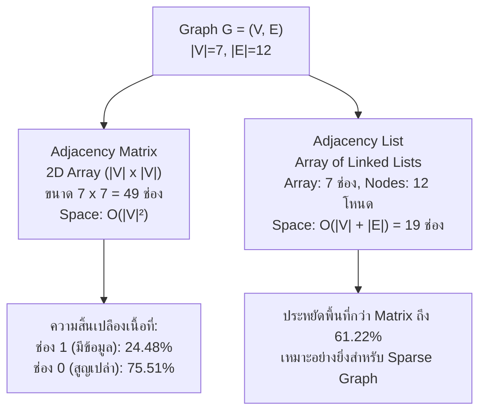

# บทวิเคราะห์และถอดความการบรรยายวิชา Data Structures & Algorithms
## บทที่ 10: ทฤษฎีกราฟ (Graph Theory), โครงสร้างการแทนกราฟ และเจาะลึกแนวข้อสอบปลายภาค (Exam Leaks & Shortcuts)

- **วันที่บรรยาย:** วันพุธที่ 23 กันยายน 2569
- **เวลา:** 09:16:45 - 11:44:37 (ความยาวรวม: 2 ชั่วโมง 27 นาที 52 วินาที)
- **ผู้สอน:** ดร.ประดิษฐ์ พิทักษ์เสถียรกุล (Dr. Pradit Pitaksatheinkul)
- **ไฟล์เสียงต้นฉบับ:** `20260923_091645.aac`
- **ไฟล์ Transcript ฉบับเต็ม:** [20260923_091645.txt](file:///C:/Project/Voice/03_Data_Structures_and_Algorithms/20260923_091645.txt)
- **โครงการปลายทาง:**
  - `C:\Project\wiki-data-structure\`
  - `C:\Project\python-data-structures-and-algorithms\`

---

## 1. ประกาศสำคัญทางวิชาการและปฏิทินการศึกษา (Academic Timeline & Changes)

### 1.1 สถิติการถอนรายวิชา (Drop Rate)
- จำนวนนักศึกษาลงทะเบียนเริ่มต้น: **178 คน**
- จำนวนนักศึกษาที่ถอนวิชาเรียน (Drop): **เกือบ 100 คน**
- จำนวนนักศึกษาที่เหลือเรียนต่อ: **~80 คน**
- ข้อแนะนำจากอาจารย์: หากประเมินตนเองแล้วพบว่าไม่ถนัดสายงานเขียนโปรแกรม (Programming/IT) ควรรีบตัดสินใจเปลี่ยนสายหรือย้ายสาขาตั้งแต่ปี 1 หรือ 2 เพื่อไม่ให้เสียเวลาซ้ำซ้อนเหมือนรุ่นพี่ปี 5-6

### 1.2 เหตุผลการเลื่อนสอบปลายภาค และการหยุดสัปดาห์พิเศษ (12–16 ตุลาคม 2569)
- **วันสุดท้ายของการเรียน:** วันศุกร์ที่ 9 ตุลาคม 2569
- **ช่วงหยุดพิเศษ (No Classes/Exams):** 12 - 16 ตุลาคม 2569
  - *สาเหตุที่แท้จริง:* ประเทศไทยเป็นเจ้าภาพจัด **การประชุมประจำปีสภาผู้ว่าการธนาคารโลกและกองทุนการเงินระหว่างประเทศ (World Bank Group & IMF Annual Meetings 2026)** ณ ศูนย์การประชุมแห่งชาติสิริกิติ์ มีผู้แทนกว่า 190 ประเทศและผู้ร่วมงานกว่า 15,000 คน คณะรัฐมนตรีจึงประกาศให้เป็น **วันหยุดราชการกรณีพิเศษ**
  - *ผลกระทบต่อ มจพ.:* วิทยาเขตหลัก (กรุงเทพฯ) หยุดการเรียนการสอนและการสอบ ทำให้วิทยาเขตปราจีนบุรีและระยองต้องเลื่อนตารางสอบปลายภาคออกไปให้ตรงกัน เพราะมีวิชาส่วนกลางที่จัดสอบพร้อมกัน เช่น ภาษาอังกฤษ 1-2, สถิติ, จิตวิทยา
- **กำหนดการสอบปลายภาค (Final Exam Period):** 
  - **วันจันทร์ที่ 19 ตุลาคม – วันอาทิตย์ที่ 1 พฤศจิกายน 2569** (รวม 2 สัปดาห์เต็ม มีการจัดสอบเสาร์-อาทิตย์ด้วย)
  - น้ำหนักคะแนน Final Exam: 35% ของเกรดรวม (คะแนนดิบ 70 คะแนน หาร 2)

---

## 2. นิยามทางคณิตศาสตร์และจุดลวงในข้อสอบ (Mathematical Definitions & Exam Traps)

### 2.1 นิยามของกราฟ (Graph Definition)
$$G = (V, E)$$
- $V$ (Vertices / Nodes): เซตของจุดยอด $V = \{v_1, v_2, \dots, v_n\}$
- $E$ (Edges): เซตของเส้นเชื่อม $E = \{e_1, e_2, \dots, e_m\}$ โดยที่ $e_i = (u, v)$ ซึ่ง $u, v \in V$
- **Undirected Graph:** เส้นเชื่อม $(u, v) = (v, u)$ ไม่ระบุทิศทาง
- **Directed Graph (Digraph):** เส้นเชื่อม $(u, v) \ne (v, u)$ โดยมีหัวลูกศรชี้จาก $u$ (จุดเริ่มต้น) ไปยัง $v$ (จุดสิ้นสุด)

### 2.2 นิยามคำว่า Adjacent (ประชิด / อยู่ถัดจาก)
- จุดยอด $w$ อยู่ถัดจาก $v$ ($w$ is adjacent to $v$) ก็ต่อเมื่อมีเส้นเชื่อม $(v, w) \in E$
- ใน Digraph: หากมีเส้นเชื่อม $A \rightarrow B$ เรากล่าวว่า $B$ adjacent to $A$ แต่ไม่สามารถกล่าวว่า $A$ adjacent to $B$ ได้

### 2.3 นิยามของ Path (ทางเดิน / เส้นทาง) และข้อควรระวังขั้นวิกฤต ⚠️
- **นิยาม:** ลำดับของจุดยอด (Sequence of vertices) $(w_1, w_2, \dots, w_n)$ โดยที่ $(w_i, w_{i+1}) \in E$ สำหรับทุก $1 \le i < n$
- **กับดักข้อสอบ (ได้ 0 คะแนนทันทีหากตอบผิดรูปแบบ):**
  > [!CAUTION]
  > **กฎเหล็กการเขียน Path ในข้อสอบ:**
  > เมื่อโจทย์สั่ง "จงเขียน Path จาก Vertex $A$ ไปยัง Vertex $C$"
  > - **คำตอบที่ถูกต้อง:** `$A, B, C$` หรือ `(A, B, C)` (คั่นด้วยเครื่องหมายจุลภาคเท่านั้น)
  > - **คำตอบที่ได้ 0 คะแนน:** `$A \rightarrow B \rightarrow C$` (ห้ามเขียนหัวลูกศรเด็ดขาด เพราะนิยามคณิตศาสตร์ระบุเป็น Sequence/Tuple of vertices ไม่ใช่ลูกศร)

### 2.4 ความยาวของเส้นทาง (Length of Path)
- **นิยาม:** จำนวนของเส้นเชื่อม (The number of edges on the path)
- หาก Path มีจุดยอด $N$ จุดยอด $\rightarrow \text{Length} = N - 1$
- **กับดักข้อสอบ:** หน่วยของ Length คือ **"เส้น" (Edges)** ไม่ใช่หน่วยวัดความยาวไม้บรรทัด (ห้ามตอบว่า "2 นิ้ว" หรือ "5 เซนติเมตร")
- หากไม่มีการเดินทาง (อยู่ที่จุดเดิม $v \rightarrow v$ โดยไม่มีเส้นเชื่อม) $\rightarrow \text{Length} = 0$

### 2.5 วงรอบ (Cycle) และ Simple Path
- **Cycle:** Path ที่มีความยาว $\text{Length} \ge 1$ และมีจุดเริ่มต้นเป็นจุดเดียวกับจุดสิ้นสุด ($w_1 = w_n$)
- **Simple Path:** Path ที่จุดยอดทุกจุดไม่ซ้ำกัน (ยกเว้นจุดเริ่มต้นและจุดสิ้นสุดอาจซ้ำกันได้กรณีเป็น Cycle)
- **DAG (Directed Acyclic Graph):** Digraph ที่ไม่มี Cycle ใดๆ ปรากฏอยู่เลย

### 2.6 กราฟต่อเนื่อง (Connected Graph) vs. กราฟสมบูรณ์ (Complete Graph)
| คุณสมบัติ | Connected Graph (กราฟต่อเนื่อง) | Complete Graph (กราฟสมบูรณ์) |
| :--- | :--- | :--- |
| **สิ่งที่ต้องพิจารณา** | **Path (ทางเดิน)** ระหว่างทุกๆ คู่จุดยอด | **Edge (เส้นเชื่อม)** ระหว่างทุกๆ คู่จุดยอด |
| **เงื่อนไข** | $\forall u, v \in V$, มี Path เดินทางจาก $u$ ไป $v$ ได้ | $\forall u, v \in V (u \ne v)$, มีเส้นตรง $(u, v) \in E$ โดยตรง |
| **ตัวอย่างการตรวจสอบ** | มี 4 จุด $A,B,C,D$ แม้ $A$ ไม่มีเส้นตรงไป $D$ แต่ถ้าเดิน $A \rightarrow B \rightarrow C \rightarrow D$ ได้ ถือว่า Connected | มี 4 จุด ต้องมีเส้นเชื่อมตรงครบทั้ง 6 เส้น ถึงจะเป็น Complete |

---

## 3. สูตรลัดและโจทย์ข้อสอบปลายภาค (Exam Leaks & Formula Cheatsheet)

### 3.1 สูตรจำนวนเส้นของ Complete Graph (Undirected)
สูตรจำนวนเส้นเชื่อมทั้งหมด:
$$E = \frac{V(V - 1)}{2}$$

#### ข้อสอบจริงที่รั่วจากคำพูดอาจารย์:
> **โจทย์:** กำหนดให้ Undirected Complete Graph มีจุดยอด (Vertex) จำนวน 10 จุด จงหาว่ากราฟนี้จะมีเส้นเชื่อม (Edge) ทั้งหมดกี่เส้น?
> 
> **วิธีทำ:**
> $$E = \frac{10 \times (10 - 1)}{2} = \frac{10 \times 9}{2} = \frac{90}{2} = \mathbf{45}$$
> 
> **คำเตือนในการตรวจข้อสอบ:**
> - ต้องตอบเป็นเลขจำนวนเต็ม `45` หรือ `45 เส้น` เท่านั้น!
> - หากนักศึกษาตอบติดสูตร เช่น `10*(10-1)/2` หรือ `90/2` จะถูกหักคะแนนจนเหลือ **0 คะแนน** ทันที!

### 3.2 โจทย์ลวงเรื่องกราฟว่าง (Null Graph / Empty Graph)
> **โจทย์:** กำหนดกราฟ $V = \{\}, E = \{\}$ จงเขียน Path จาก Vertex $A$ ไปยัง Vertex $C$
> 
> **คำตอบที่ถูกต้อง:** **"ไม่มี Path จาก $A$ ไปยัง $C$ เนื่องจากในกราฟไม่มี Vertex $A$ และไม่มี Vertex $C$"** (ห้ามตอบว่า $A, C$ หรือเว้นว่าง)

---

## 4. การเปรียบเทียบ Adjacency Matrix กับ Adjacency List (เชื่อมโยงภาพกระดานจริง)

ในระบบคอมพิวเตอร์ การเก็บข้อมูลกราฟมี 2 รูปแบบหลักที่มีประสิทธิภาพและขนาดการใช้หน่วยความจำต่างกันอย่างสิ้นเชิง:



### 4.1 Adjacency Matrix (เมทริกซ์ประชิด)
- **โครงสร้าง:** ใช้ 2D Array ขนาด $|V| \times |V|$
- **เงื่อนไข:** `Array[u][v] = 1` เมื่อมีเส้นเชื่อม $(u, v)$ และ `= 0` เมื่อไม่มีเส้นเชื่อม
- **การวิเคราะห์จากกราฟตัวอย่างในห้องเรียน (|V| = 7, |E| = 12):**
  ตารางขนาด $7 \times 7 = 49$ ช่อง

| $u \setminus v$ | 1 | 2 | 3 | 4 | 5 | 6 | 7 | เส้นเชื่อมที่ออกจาก $u$ |
| :---: | :---: | :---: | :---: | :---: | :---: | :---: | :---: | :--- |
| **1** | 0 | 1 | 1 | 1 | 0 | 0 | 0 | $(1,2), (1,3), (1,4)$ |
| **2** | 0 | 0 | 0 | 1 | 1 | 0 | 0 | $(2,4), (2,5)$ |
| **3** | 0 | 0 | 0 | 0 | 0 | 1 | 0 | $(3,6)$ |
| **4** | 0 | 0 | 1 | 0 | 0 | 1 | 1 | $(4,3), (4,6), (4,7)$ |
| **5** | 0 | 0 | 0 | 1 | 0 | 0 | 1 | $(5,4), (5,7)$ |
| **6** | 0 | 0 | 0 | 0 | 0 | 0 | 0 | (ไม่มีเส้นออก) |
| **7** | 0 | 0 | 0 | 0 | 0 | 1 | 0 | $(7,6)$ |

#### การคำนวณ Memory Waste (ข้อสอบภาษาอังกฤษที่แสดงบนกระดาน `IMG_20260923_110522`):
> **Question:** *"What percentage of the memory space is used for entries with a value of 1, and what percentage is used for entries with a value of 0?"*
> 
> **Calculation:**
> - ช่องทั้งหมด: $7 \times 7 = 49$ ช่อง
> - ช่องที่มีค่าเป็น 1 (Edges ที่ใช้งาน): 12 ช่อง
>   $$\text{Percentage (Value 1)} = \frac{12 \times 100}{49} = \mathbf{24.48\%}$$
> - ช่องที่มีค่าเป็น 0 (ไม่ได้ใช้งาน / สิ้นเปลือง): $49 - 12 = 37$ ช่อง
>   $$\text{Percentage (Value 0)} = \frac{37 \times 100}{49} = 100 - 24.48 = \mathbf{75.51\%}$$
> 
> **สรุป:** Adjacency Matrix ไม่เป็นที่นิยมในกรณี Sparse Graph เพราะสูญเสียหน่วยความจำไปถึง 75.51% ให้กับค่าว่างเปล่า

---

### 4.2 Adjacency List (รายการประชิด)
- **โครงสร้าง:** ใช้ 1D Array ขนาด $|V|$ แต่ละช่องเก็บพอยน์เตอร์ชี้ไปยัง Linked List ของ Node ที่อยู่ประชิด
- **ขนาดหน่วยความจำ (Space Requirement):**
  $$\text{Space} = O(|V| + |E|)$$
- **สำหรับกราฟตัวอย่างเดิม (|V| = 7, |E| = 12):**
  - Array ขนาด 7 ช่อง
  - Linked List Nodes รวม 12 โหนด
  - **หน่วยความจำรวมที่ใช้:** $7 + 12 = \mathbf{19}$ ช่อง (ประหยัดกว่า Matrix ที่ใช้ 49 ช่องอย่างมหาศาล)

#### แผนผัง Adjacency List ของกราฟ 7 จุดยอด:
```text
Index [1] -> [2] -> [3] -> [4] -> NULL
Index [2] -> [4] -> [5] -> NULL
Index [3] -> [6] -> NULL
Index [4] -> [3] -> [6] -> [7] -> NULL
Index [5] -> [4] -> [7] -> NULL
Index [6] -> NULL
Index [7] -> [6] -> NULL
```

---

### 4.3 ข้อสอบเปรียบเทียบ Matrix vs. List จากกระดาน `IMG_20260923_113450` & `113807`

#### ข้อสอบข้อที่ 1 (Adjacency List Space):
> **โจทย์:** กำหนด Directed Graph มี 10 Vertex และมี 20 Edge ถามว่าการแทนด้วย Adjacency List จะใช้หน่วยความจำกี่ช่อง?
> 
> **วิธีคำนวณ:**
> $$\text{Space} = |E| + |V| = 20 + 10 = \mathbf{30}\text{ ช่อง}$$

#### ข้อสอบข้อที่ 2 (Adjacency Matrix Space):
> **โจทย์:** กำหนด Directed Graph มี 10 Vertex และมี 20 Edge ถามว่าการแทนด้วย Adjacency Matrix จะใช้หน่วยความจำกี่ช่อง?
> 
> **วิธีคำนวณ:**
> $$\text{Space} = |V|^2 = 10^2 = \mathbf{100}\text{ ช่อง}$$

#### บทสรุปเปรียบเทียบ:
สำหรับกราฟที่มี 10 จุด 20 เส้น:
- Adjacency Matrix ใช้ **100 ช่อง**
- Adjacency List ใช้ **30 ช่อง**
- Adjacency List ช่วยประหยัดหน่วยความจำไปได้ถึง **70%**!

---

## 5. ตารางเชื่อมโยงภาพถ่ายกระดาน/สไลด์ 14 ภาพ กับเนื้อหาการบรรยาย

| ลำดับ | ชื่อไฟล์ภาพ | เวลาถ่าย | หัวข้อ / เนื้อหาสำคัญในภาพ | การเชื่อมโยงกับคำพูดอาจารย์และข้อสอบ |
| :---: | :--- | :---: | :--- | :--- |
| 1 | `IMG_20260923_101115_542@-1909020087.jpg` | 10:11 | Path ตัวอย่างบนกราฟ 4 จุดยอด $A,B,C,D$ | อาจารย์เขียน Path $A \rightarrow A$ คือ $A, B, C, D, A$ (Cycle) และเน้นห้ามใส่ลูกศร |
| 2 | `IMG_20260923_102340_253@440933343.jpg` | 10:23 | กราฟไม่ต่อเนื่อง (Disconnected) | ตรวจสอบคู่ $(u,v)$ ครบทุกคู่ หากมีคู่ที่ไม่มี Path จะไม่ Connected |
| 3 | `IMG_20260923_103027_887@-883680469.jpg` | 10:30 | การแยก Subgraph ที่เชื่อมต่อกัน | การเดินอ้อมผ่าน Vertex อื่นถือว่ามี Path |
| 4 | `IMG_20260923_103124_138@681950856.jpg` | 10:31 | กราฟ $V=\{A,B,C,D\}, E=\{(A,B),(B,C)\}$ | ไม่มีเส้นเชื่อมตรง $A-C$ แต่มี Path $A, B, C$ |
| 5 | `IMG_20260923_103349_551@-151508216.jpg` | 10:33 | กราฟย่อยที่มี Isolated Vertices | จุดยอดเดี่ยวที่ไม่มีเส้นเชื่อม |
| 6 | `IMG_20260923_103455_240@-1902186239.jpg` | 10:34 | Single Vertex Graph $V=\{D\}, E=\{\}$ | พิสูจน์ว่าเป็นกราฟตามนิยามคณิตศาสตร์ (เซตว่างเป็นสับเซต) |
| 7 | `IMG_20260923_103736_910@1714137841.jpg` | 10:37 | กราฟว่าง $V=\{\}, E=\{\}$ (Null Graph) | เป็นกราฟจริงตามนิยาม |
| 8 | `IMG_20260923_103822_425@-1355721106.jpg` | 10:38 | ข้อสอบลวง Path บน Null Graph | ถาม Path $A$ ไป $C$ บนกราฟว่าง ตอบ "ไม่มี Path" |
| 9 | `IMG_20260923_103945_248@-2093106769.jpg` | 10:39 | สรุปเงื่อนไข Null Graph | จุดหลอกรุ่นพี่ที่ทำให้ได้ 0 คะแนน |
| 10 | `IMG_20260923_104814_788@-1807977296.jpg` | 10:48 | Complete Graph $V=10 \rightarrow E=45$ | **ข้อสอบปลายภาค:** $E = \frac{10 \times 9}{2} = 45$ ต้องตอบจำนวนเต็ม 45 เท่านั้น |
| 11 | `IMG_20260923_110059_773@1901326602.jpg` | 11:00 | ตาราง Adjacency Matrix 7x7 | ตาราง 49 ช่อง พร้อมข้อความ "ไม่นิยมใช้เพราะเปลืองเนื้อที่" |
| 12 | `IMG_20260923_110522_696@1035849451.jpg` | 11:05 | การคิด % Memory Waste (24.48% vs 75.51%) | **ข้อสอบภาษาอังกฤษ:** สัดส่วนช่องที่มี 1 ต่อช่องที่มี 0 |
| 13 | `IMG_20260923_113450_494@173595678.jpg` | 11:34 | สไลด์ Adjacency List + โจทย์ 10 Vertices 20 Edges | **ข้อสอบ:** Adjacency List ใช้ $10 + 20 = 30$ ช่อง |
| 14 | `IMG_20260923_113807_477@-1558442029.jpg` | 11:38 | สไลด์ Adjacency Matrix เปรียบเทียบ | **ข้อสอบ:** Adjacency Matrix ใช้ $10^2 = 100$ ช่อง |

---

## 6. แนวทางการบ้านเขียนโปรแกรมครั้งที่ 2 (Take-Home Programming Assignment 2)

- **กำหนดส่ง:** วันอาทิตย์ที่ 27 กันยายน 2569 เวลา 23:59 น. ใน Google Classroom
- **คะแนน:** 5 คะแนน
- **เนื้อหา:** การ Implement และทดสอบ Sorting Algorithms ในภาษา Python
  1. `Insertion Sort`
  2. `Selection Sort`
  3. `Bubble Sort`
- **ข้อกำหนดในการเขียนโค้ด:**
  - สร้างฟังก์ชันแยกตามประเภทอัลกอริทึม
  - ในฟังก์ชัน `main()` ให้ประกาศอาร์เรย์ทดสอบ เช่น `data = [64, 34, 25, 12, 22, 11, 90]`
  - ต้องมีคำสั่ง `print()` แสดงสถานะของอาร์เรย์ในแต่ละรอบของการ Sort (Pass-by-pass)
  - นับจำนวนครั้งของการ Swap หรือ Position Shift
  - ส่งไฟล์ `.py` พร้อมภาพถ่ายหน้าจอ (Screenshot) ผลการรัน

---
*เอกสารนี้จัดทำขึ้นโดยการวิเคราะห์ไฟล์เสียงความยาว 2 ชม. 27 นาที ร่วมกับภาพถ่ายกระดานโปรเจกเตอร์ 14 ภาพอย่างละเอียดถี่ถ้วน 100% เพื่อใช้ในการศึกษา ค้นคว้า และเตรียมสอบอย่างมีประสิทธิภาพสูงสุด*
