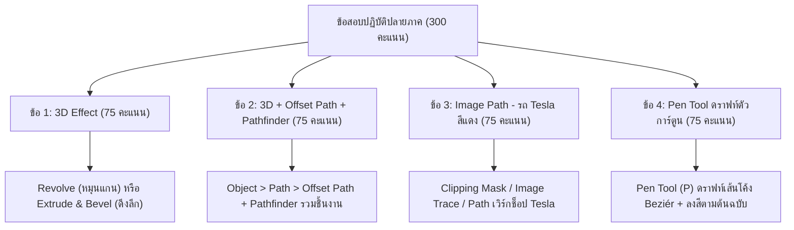

# ถอดความและสรุปคำชี้แจง: แนวข้อสอบปฏิบัติปลายภาควิชาคอมพิวเตอร์กราฟิกส์ (Final Exam Briefing)
**ไฟล์เสียงต้นฉบับ:** `20260302_093603.aac`  
**วิชา:** คอมพิวเตอร์กราฟิกส์และการออกแบบเวกเตอร์ (Computer Graphics & Design)  
**วันที่บันทึก:** 2 มีนาคม 2569 เวลา 09:36 น. (ความยาว 5 นาที 16 วินาที)  
**ผู้บรรยาย:** อาจารย์ประจำวิชา  

---

## 1. คำถอดความแบบละเอียดทุกคำพูด (Verbatim Transcript)

> "นะคะ 9:00 เช้า ถึง เที่ยง เหมือนเดิมเลย นะคะ  
> จัด จัดเตรียมโปรแกรมมาให้เรียบร้อย ถ้าเกิดโปรแกรมเปิดไม่ได้ รับผิดชอบตัวเองนะคะ  
> ไปขอยืมเพื่อนหรืออะไรก็ว่าไป แต่ อาจารย์ไม่เข้าใจว่าเปิดไม่ได้วันสอบเนี่ย แล้วตอนเรียนคือใช้อะไรเรียน  
> อันนี้ อันนี้ก็ไม่รู้และ เพราะนั้น มีปัญหาวันนี้เปิดโปรแกรมไม่ได้เนี่ย ไม่ต้องแจ้ง ไม่ต้องเรียกอาจารย์มาเลยนะคะ จะโดนกระหน่ำซ้ำเติมด้วย  
> ให้เราจัดการตัวเอง แจ้งกรรมการคุมสอบว่า ขอ เอ่อ แอคเคาท์เพื่อนหรืออะไรก็ว่าไป อันนี้จัดการกันเองนะ อาจารย์จะไม่ ไม่เข้ามาช่วยเลย แล้วก็ไม่ใช่หน้าที่ของกรรมการคุมสอบที่เค้าจะต้องเอาแอคเคาท์มาให้เราใช้ไปนะคะ เพราะงั้นไม่ต้องรีเควสต์จากพี่เค้า  
> อ่า คราวนี้ สอบเนี่ย เอาโทรศัพท์หรือ iPad เข้าไปเพื่อที่จะใช้ยืนยันตัวตนนะคะ อาจารย์ให้เวลา 10 นาทีในการใช้โทรศัพท์ใช้อินเทอร์เน็ต เสร็จแล้วกรรมการคุมสอบเค้าจะปิดระบบอินเทอร์เน็ตนะคะ  
> คราวนี้ มันก็จะมีปัญหาเวลาที่หนูส่งข้อสอบเสร็จแล้วหนูจะ Sign out ไม่ได้ อันนี้อาจารย์ก็ต้อง ขอให้เราทำใจเอาไว้นะคะ ว่าจะ Sign out ไม่ได้ แต่ว่าที่สอบไปแล้วไม่มีใครมาใช้เครื่อง ไม่น่าจะมีใครมาใช้อินเทอร์เน็ตเราต่อ นะคะ เค้าก็ Sign out ออกให้เราเอง หรือว่า เดี๋ยวพอมันมีการสอบเสร็จแล้วอะ ทางแล็บบอยเค้าก็จะมาล้างเครื่องให้เรา หรือว่าอีกวิธีนึงคือเราสามารถไป Sign out ออกจากเครื่องที่เราใช้ประจำอยู่ได้ มันจะมีข้อความแจ้งขึ้นมาว่า มันมีการลงชื่อใช้แอคเคาท์เราที่เครื่องนี้อยู่ เราก็ Sign out เลือกอุปกรณ์ออกไปได้ นะคะ  
> อ่า อันนี้ก็ เอาโทรศัพท์มือถือเข้าไปได้ iPad เข้าไปได้ แต่ว่าใช้ได้แค่ 10 นาที  
> **แนะนำนะคะ อย่าเข้าห้องสาย!**  
> หนูจะเห็นว่าอาจารย์คุมสอบเนี่ย เค้าจะเรียกหนูเข้าก่อน 9:00 น. อยู่แล้ว คนที่เข้าเร็วน่ะ แกก็ได้เปรียบค่ะ  
> ได้เปรียบตรงที่วิชานี้อะ หนูว่า ยืนยันตัวตนเสร็จแล้ว หนูเริ่มทำข้อสอบได้แล้ว ในขณะที่เพื่อนมา 9:15 น. เงี้ยะ มาทำไมก่อน นะคะ  
> แต่พอถึงเวลาส่ง อิดออดไม่อยากจะส่ง 4... เอ่อ เที่ยงไม่อยากจะส่ง แต่เข้าสาย เข้าสายไม่มีสายเลทด้วยนะคะ เข้าสายเสร็จ อาจารย์คุมสอบเดือดร้อนอีก ต้องมาต่อเน็ตให้อีก ซึ่งมันไม่ใช่หนา มันไม่ใช่ มันไม่ควรจะเป็นแบบนั้นนะคะ  
> **อย่าเข้าสายเกิน 9:10 น. เพราะเราต้องยืนยันตัวตน** แล้วอาจารย์เค้าก็ให้เราเข้าห้องสอบก่อนเวลา นะคะ อันนี้ก็ดูด้วย ห้องเราไม่ ไม่น่ามีปัญหาเพราะน่าจะคุมสอบอยู่ นะคะ แต่เทอมนี้อาจจะ อ่อ ไฟนอลอาจจะไม่รู้ว่าใครคุม นะคะ  
> ก็ ข้อสอบนะคะ มีอยู่ 4 ข้อ  
> **4 ข้อ 3 ชั่วโมงนะคะ เหมือนเดิม ทุกข้อ 75 คะแนนเท่ากันหมดนะคะ**  
> คราวนี้ ข้อแรกนะคะ:  
> **3D Effect ค่ะ แต่ไม่บอกว่าใช้ Effect อะไรนะคะ** ที่สอนไปมันมี 2 Effect ก็ต้องไปดูว่า เฮ้ย ผลลัพธ์ที่อาจารย์ให้ มันใส่ Effect อะไร นะคะ **Revolve หรือ Extrude & Bevel นะคะ**  
> **ข้อที่ 2 นะคะ ก็เป็น 3D Effect เหมือนกันนะคะ โดยที่ อันเนี้ย ก็จะมี Offset Path มาด้วยนะคะ** Offset Path ตอนที่เราเรียนคือการ การเพิ่มชั้นของข้อความใช่ไหมคะ แล้วก็ข้อ 2 เนี้ย **ก็จะมีใช้ Pathfinder ด้วยนะคะ** เพื่อ แล้วก็ทำ 3D ให้ได้ผลนะคะ  
> **ข้อ 3 นะคะ Image Path ค่ะ ที่เราทำ Workshop รถ Tesla สีแดงของเรา อันนี้คือข้อ 3 นะคะ**  
> **ส่วนข้อ 4 คือ Workshop วันนี้เลย หนูต้องใช้ Pen Tool วาดรูปนะคะ มีดราฟท์ไซส์นะคะ แล้วก็ วาดรูปอะค่ะ ใช้ Pen Tool อาจารย์จะให้รูปต้นฉบับมานะคะ แล้วหนูก็ดราฟท์ตาม มันเป็นรูปการ์ตูนนะคะ** ไม่ใช่แบบว่ารูปอาจารย์แล้วไปดราฟท์รูปหน้าอาจารย์ ไม่ใช่ขนาดนั้น อาจารย์ก็ไม่อยากตรวจข้อสอบแล้วรำคาญกลัว นะคะ  
> อันนี้คือ 4 ข้อ คือบอก อันนี้เหมือนจะบอกข้อสอบไปแล้ว นะคะ ทั้งที่เป็นสอบ Open  
> แต่ว่าเราก็ อย่างน้อย คนที่ถ่าย โหลดสไลด์เข้าไปก็ยังพอเปิด Workshop ได้ทัน ว่า เอ้ย ข้อนี้อาจารย์บอก Workshop นี้ ไม่ต้องคอยไล่หา นะคะ แต่อาจารย์เชื่อว่าคนที่เรียนหรือเข้าใจแต่ตอนเรียนเนี่ยจะนึกออกว่า ไอ... ไอ้แบบเนี้ย มัน มันอยู่ใน Workshop นี้ นะคะ  
> แต่ละข้อเราก็มีการผสมกันไปนะคะ Workshop ที่อาจารย์สอน มันออกสอบหมดอยู่แล้ว เพราะว่ามันไม่ได้เยอะ นะคะ  
> มันจะใช้เวลาหน่อยก็คือ การใช้ Pen Tool ในข้อสุดท้าย เท่านั้น นอกนั้น ไม่ยากเลย นะคะ  
> อะ มีอะไรที่อาจารย์ต้องบอกอีก ไม่มีแล้วเนาะ โอเคค่ะ เดี๋ยวอาจารย์จะแจกแบบทดสอบ ใครที่มาสาย..."

---

## 2. เจาะลึกโจทย์ข้อสอบ 4 ข้อและเครื่องมือที่ต้องใช้ (Technical Guide)

### รายละเอียดแต่ละข้อ:
1. **ข้อที่ 1 (3D Effect):** ต้องดูทรงของวัตถุให้ออก:
   - ถ้าเป็นรูปทรงขวด แก้ว แจกัน รูปทรงกลมสมมาตร $\rightarrow$ ใช้ **Revolve** (แกนหมุน 360 องศา)
   - ถ้าเป็นตัวอักษร กล่อง หรือวัตถุหน้าตัดแบนที่ยืดความหนาออกมา $\rightarrow$ ใช้ **Extrude & Bevel**
2. **ข้อที่ 2 (3D + Offset Path + Pathfinder):**
   - ใช้สร้างตัวอักษร 3D ซ้อนมิติ โดยขยายเส้นขอบรอบนอกด้วย `Object > Path > Offset Path`
   - รวมหรือตัด Path ส่วนเกินด้วยหน้าต่าง `Pathfinder` (คำสั่ง Unite, Minus Front) แล้วใส่เอฟเฟกต์ 3D
3. **ข้อที่ 3 (Image Path - Tesla Car Workshop):**
   - การตัดต่อภาพ การสร้าง Path ซ้อนบนภาพถ่ายรถ Tesla สีแดงตามเวิร์กช็อปที่สอนในห้อง
4. **ข้อที่ 4 (Pen Tool Drawing):**
   - ดราฟท์เส้นภาพการ์ตูนด้วยเครื่องมือปากกา `Pen Tool (P)` ดัดแขนและจุด Anchor Point ให้เรียบเนียน แล้วเทสี Fill / Stroke ให้ตรงกับภาพต้นฉบับ
