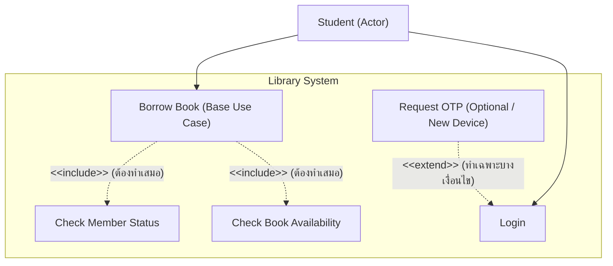

# สรุปภาพรวม: วิชาวิศวกรรมซอฟต์แวร์ (Software Engineering)
**กลุ่มโฟลเดอร์:** `07_Software_Engineering`  
**วิชา:** วิศวกรรมซอฟต์แวร์ (Software Engineering)  
**หัวข้อการสอนหลัก:**
1. **Introduction to System Modeling & Use Case Diagram**
2. **Use Case Elements:** Actor (Human & System Actor), Use Case, System Boundary
3. **Relationships in Use Case:** Association, Generalization, Include (`<<include>>`), Extend (`<<extend>>`)
4. **Requirements Traceability Matrix (RTM):** Requirement ID $\rightarrow$ User Story $\rightarrow$ Design $\rightarrow$ Code $\rightarrow$ Test Case
5. **Case Study:** ระบบยืมคืนหนังสือห้องสมุด (Library Borrowing & Returning System)

---

## 📋 รายการไฟล์เสียงในกลุ่มนี้

| ชื่อไฟล์ | วันที่-เวลาที่บันทึก | ความยาว | สาระสำคัญ / กิจกรรมในชั้นเรียน |
| :--- | :--- | :--- | :--- |
| [`SE20260915_092638.aac`](file:///C:/Project/Voice/Success/SE20260915_092638.aac) | 15/09/2569 09:26 น. | 60 นาที 27 วินาที | **การบรรยายเรื่อง Use Case Diagram:** นิยามและเป้าหมาย, บทบาท Actor (Stickman / Role), สัญลักษณ์ Use Case (วงรี + Verb), ขอบเขต System Boundary, เส้นความสัมพันธ์ (Association, Generalization, Include, Extend), กรณีศึกษาตู้ ATM / ระบบ REG / ระบบห้องสมุด และการบ้านใน Classroom |
| [`20260922_093313.aac`](file:///C:/Project/Voice/Success/20260922_093313.aac) | 22/09/2569 09:33 น. | 40 นาที 52 วินาที | **🔥 Part 1 (กรณีศึกษาระบบยืมคืนอุปกรณ์ห้องปฏิบัติการ):** ออกแบบ Use Case สมบูรณ์, Actor Generalization (`Student`/`Staff` $\to$ `Member`), `Lab Officer`, `Administrator`, ความสัมพันธ์ Include/Extend, เผยออกข้อสอบ Final 1 ข้อใหญ่ |
| [`20260922_102855.aac`](file:///C:/Project/Voice/Success/20260922_102855.aac) | 22/09/2569 10:28 น. | 28 นาที 36 วินาที | **🔥 Part 2 (การบรรยาย Activity Diagram พื้นฐาน):** นิยาม Workflow ของระบบ, Initial State ($\bullet$), Final State ($\odot$), Action State, Control Flow, Decision & Merge Nodes พร้อม Guard Condition `[...]` |
| [`20260922_105854.aac`](file:///C:/Project/Voice/Success/20260922_105854.aac) | 22/09/2569 10:58 น. | 23 นาที 33 วินาที | **🔥 Part 3 (Activity Diagram ขั้นสูง & Concurrency):** Fork & Join แถบหนาสีดำสำหรับการทำงานคู่ขนาน, Swimlanes แบ่งความรับผิดชอบ, ตัวอย่างกระบวนการ Login และตรวจเช็คอุปกรณ์แล็บ |

---

## 🎯 สรุปสาระสำคัญประจำวิชา (Core Concepts)

### 1. กฎและมาตรฐานการเขียน Use Case Diagram
- **Use Case:** ใช้สัญลักษณ์ **วงรี** เท่านั้น ตั้งชื่อด้วย **Verb + Object** (เช่น `Place Order`, `Borrow Book`) มองภาพระบบจากมุมมองภายนอก ไม่ลงลึกถึง UI/โค้ด
- **Actor:** ใช้สัญลักษณ์ **Stickman** แทน **บทบาท (Role)** ไม่ใช่บุคคลเจาะจง อยู่นอกกรอบ System Boundary เสมอ และห้ามนำ Database หรือ Server ภายในมาเป็น Actor
- **System Boundary:** กรอบสี่เหลี่ยมระบุชื่อระบบ ล้อมรอบ Use Cases ทั้งหมด

### 2. ความแตกต่างระหว่าง Include และ Extend

### 3. มาตรฐานการเขียน Activity Diagram (มุมมองระบบ System Workflow)
- **Initial & Final State:** เริ่มต้นด้วยวงกลมทึบ $\bullet$ และสิ้นสุดด้วยวงกลมมีวงแหวน $\odot$
- **Actions:** ใช้สี่เหลี่ยมมุมมนระบุกิจกรรมที่ระบบกระทำ
- **Decision & Merge Nodes:** สี่เหลี่ยมข้าวหลามตัด ($\diamond$) มี Guard Conditions ระบุในวงเล็บก้ามปู `[...]`
- **Fork & Join Nodes:** แถบหนาสีดำทึบ สำหรับแยกการทำงานคู่ขนาน (Fork) และรอรวมทุกเส้นทางให้ครบก่อนเดินหน้าต่อ (Join)
- **Swimlanes (Partitions):** แบ่งคอลัมน์ตามบทบาทของ Actor หรือ System Component

---

## 📅 กำหนดการและงานที่ได้รับมอบหมาย (Assignments & Deadlines)

| งาน / กิจกรรม | กำหนดส่ง / วันที่ | ช่องทาง | รายละเอียด |
| :--- | :--- | :--- | :--- |
| **การบ้าน Use Case Diagram ระบบยืมคืนอุปกรณ์แล็บ** | **22/09/2569 เวลา 23:59 น.** | Google Classroom | ส่งภาพ Use Case Diagram ระบบยืมคืนอุปกรณ์แล็บ (ระบุ Actor Generalization, Include, Extend ครบถ้วน) |
| **โครงการ IAESTE** | 15/09/2569 10.00 น. | ห้อง Spark ชั้น 1 | บรรยายประชาสัมพันธ์โครงการฝึกงานต่างประเทศ |

---

## 🎯 แนวข้อสอบปลายภาค (Final Exam Insights)
- **Confirm ออก 1 ข้อใหญ่:** โจทย์ Case Study จำลองระบบงานจริง ให้ระบุ Actors, Use Cases, ความสัมพันธ์ Generalization/Include/Extend, วาด Use Case Diagram และเขียน Activity Diagram ขยายกระบวนการทำงาน
- **จุดระวัง:** ลูกศร Generalization ต้องเป็นหัวโปร่งชี้เข้าหาคลาสแม่ (`Student`/`Staff` $\to$ `Member`), ลูกศร `<<include>>` ชี้ออกจาก Use Case หลัก, ลูกศร `<<extend>>` ชี้เข้าหา Use Case หลัก

---

## 📂 เอกสารและไฟล์ที่เกี่ยวข้อง
- [**คำถอดความทุกคำพูดฉบับเต็ม 15/09/2569 (`SE20260915_092638.txt`)**](file:///C:/Project/Voice/07_Software_Engineering/SE20260915_092638.txt)
- [**บทวิเคราะห์และสรุปเชิงลึก 15/09/2569 (`Transcript_20260915_092638_UseCase_Diagram.md`)**](file:///C:/Project/Voice/07_Software_Engineering/Transcript_20260915_092638_UseCase_Diagram.md)
- [**คำถอดความทุกคำพูดฉบับเต็ม 22/09/2569 (`20260922_093313.txt`)**](file:///C:/Project/Voice/07_Software_Engineering/20260922_093313.txt)
- [**บทวิเคราะห์เจาะลึก 22/09/2569 Case Study ยืมคืนอุปกรณ์แล็บ & Activity Diagram (`Transcript_20260922_SE_UseCase_Activity_Diagram_Exam_Secrets.md`)**](file:///C:/Project/Voice/07_Software_Engineering/Transcript_20260922_SE_UseCase_Activity_Diagram_Exam_Secrets.md)
