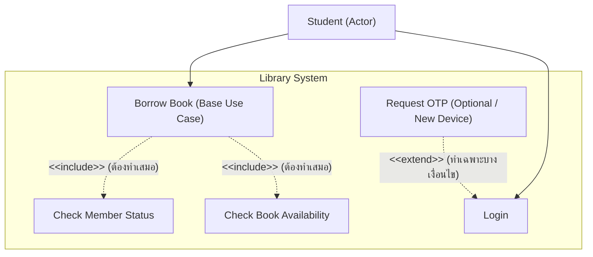

# สรุปภาพรวม: วิชาวิศวกรรมซอฟต์แวร์ (Software Engineering)
**กลุ่มโฟลเดอร์:** `07_Software_Engineering`  
**วิชา:** วิศวกรรมซอฟต์แวร์ (Software Engineering)  
**หัวข้อการสอนหลัก:**
1. **Introduction to System Modeling & Use Case Diagram**
2. **Use Case Elements:** Actor (Human & System Actor), Use Case, System Boundary
3. **Relationships in Use Case:** Association, Generalization, Include (`<<include>>`), Extend (`<<extend>>`)
4. **Requirements Traceability Matrix (RTM):** Requirement ID $\rightarrow$ User Story $\rightarrow$ Design $\rightarrow$ Code $\rightarrow$ Test Case
5. **Case Study:** ระบบยืมคืนหนังสือห้องสมุด (Library Borrowing & Returning System)

---

## 📋 รายการไฟล์เสียงในกลุ่มนี้

| ชื่อไฟล์ | วันที่-เวลาที่บันทึก | ความยาว | สาระสำคัญ / กิจกรรมในชั้นเรียน |
| :--- | :--- | :--- | :--- |
| [`SE20260915_092638.aac`](file:///C:/Project/Voice/Success/SE20260915_092638.aac) | 15/09/2569 09:26 น. | 60 นาที 27 วินาที | **การบรรยายเรื่อง Use Case Diagram:** นิยามและเป้าหมาย, บทบาท Actor (Stickman / Role), สัญลักษณ์ Use Case (วงรี + Verb), ขอบเขต System Boundary, เส้นความสัมพันธ์ (Association, Generalization, Include, Extend), กรณีศึกษาตู้ ATM / ระบบ REG / ระบบห้องสมุด และการบ้านใน Classroom |

---

## 🎯 สรุปสาระสำคัญประจำวิชา (Core Concepts)

### 1. กฎและมาตรฐานการเขียน Use Case Diagram
- **Use Case:** ใช้สัญลักษณ์ **วงรี** เท่านั้น ตั้งชื่อด้วย **Verb + Object** (เช่น `Place Order`, `Borrow Book`) มองภาพระบบจากมุมมองภายนอก ไม่ลงลึกถึง UI/โค้ด
- **Actor:** ใช้สัญลักษณ์ **Stickman** แทน **บทบาท (Role)** ไม่ใช่บุคคลเจาะจง อยู่นอกกรอบ System Boundary เสมอ และห้ามนำ Database หรือ Server ภายในมาเป็น Actor
- **System Boundary:** กรอบสี่เหลี่ยมระบุชื่อระบบ ล้อมรอบ Use Cases ทั้งหมด

### 2. ความแตกต่างระหว่าง Include และ Extend

---

## 📅 กำหนดการและงานที่ได้รับมอบหมาย (Assignments & Deadlines)

| งาน / กิจกรรม | กำหนดส่ง / วันที่ | ช่องทาง | รายละเอียด |
| :--- | :--- | :--- | :--- |
| **การบ้าน Use Case Diagram** | สัปดาห์นี้ | Google Classroom | อาจารย์จะสั่งการบ้านผ่าน Google Classroom ให้เขียน Use Case Diagram ตามโจทย์ที่กำหนด |
| **โครงการ IAESTE** | 15/09/2569 10.00 น. | ห้อง Spark ชั้น 1 | บรรยายประชาสัมพันธ์โครงการฝึกงานต่างประเทศ |

---

## 📂 เอกสารและไฟล์ที่เกี่ยวข้อง
- [**คำถอดความทุกคำพูดฉบับเต็ม (`SE20260915_092638.txt`)**](file:///C:/Project/Voice/07_Software_Engineering/SE20260915_092638.txt)
- [**บทวิเคราะห์และสรุปเชิงลึก (`Transcript_20260915_092638_UseCase_Diagram.md`)**](file:///C:/Project/Voice/07_Software_Engineering/Transcript_20260915_092638_UseCase_Diagram.md)
