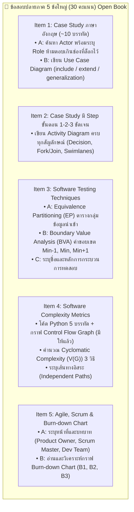

# สรุปภาพรวม: วิชาวิศวกรรมซอฟต์แวร์ (Software Engineering)
**กลุ่มโฟลเดอร์:** `07_Software_Engineering`  
**วิชา:** วิศวกรรมซอฟต์แวร์ (Software Engineering)  
**หัวข้อการสอนหลัก:**
1. **Introduction to System Modeling & Use Case Diagram**
2. **Use Case Elements:** Actor (Human & System Actor), Use Case, System Boundary
3. **Relationships in Use Case:** Association, Generalization, Include (`<<include>>`), Extend (`<<extend>>`)
4. **Activity Diagram & Concurrency:** Start/End, Action, Decision, Fork/Join, Swimlanes
5. **Software Testing Techniques:** Equivalence Partitioning (EP), Boundary Value Analysis (BVA)
6. **Software Complexity Metrics:** Cyclomatic Complexity $V(G) = E - N + 2P$, Independent Paths
7. **Agile & Scrum Framework:** Product Owner, Scrum Master, Development Team, Burn-down Chart Interpretation
8. **🔥 Final Examination Leaks (5 Items Master Scope)**

---

## 📋 รายการไฟล์เสียงในกลุ่มนี้

| ชื่อไฟล์ | วันที่-เวลาที่บันทึก | ความยาว | สาระสำคัญ / กิจกรรมในชั้นเรียน |
| :--- | :--- | :--- | :--- |
| [`SE20260915_092638.aac`](file:///C:/Project/voice-text/Success/SE20260915_092638.aac) | 15/09/2569 09:26 น. | 60 นาที 27 วินาที | **การบรรยายเรื่อง Use Case Diagram:** นิยามและเป้าหมาย, บทบาท Actor, สัญลักษณ์ Use Case, ขอบเขต System Boundary, เส้นความสัมพันธ์ และกรณีศึกษา |
| [`20260922_093313.aac`](file:///C:/Project/voice-text/Success/20260922_093313.aac) | 22/09/2569 09:33 น. | 40 นาที 52 วินาที | **🔥 Part 1 (กรณีศึกษาระบบยืมคืนอุปกรณ์แล็บ):** ออกแบบ Use Case สมบูรณ์, Actor Generalization (`Student`/`Staff` $\to$ `Member`), `Lab Officer`, `Admin`, Include/Extend |
| [`20260922_102855.aac`](file:///C:/Project/voice-text/Success/20260922_102855.aac) | 22/09/2569 10:28 น. | 28 นาที 36 วินาที | **🔥 Part 2 (Activity Diagram พื้นฐาน):** Initial State ($\bullet$), Final State ($\odot$), Action State, Control Flow, Decision & Merge Nodes พร้อม Guard Condition `[...]` |
| [`20260922_105854.aac`](file:///C:/Project/voice-text/Success/20260922_105854.aac) | 22/09/2569 10:58 น. | 23 นาที 33 วินาที | **🔥 Part 3 (Activity Diagram ขั้นสูง & Concurrency):** Fork & Join แถบหนาสีดำสำหรับการทำงานคู่ขนาน, Swimlanes แบ่งความรับผิดชอบ |
| [`20261006_094018.aac`](file:///C:/Project/voice-text/Success/20261006_094018.aac) | 06/10/2569 09:40 น. | 45 นาที 59 วินาที | **🔥 ชี้แจงข้อสอบปลายภาค 5 ข้อใหญ่ 100% EXPLICIT LEAKS:** Open Book + Dictionary, Case Study ภาษาอังกฤษวิเคราะห์ Actor & Role, วาด Use Case Diagram + include/extend, Case Study วาด Activity Diagram, Software Testing (EP & BVA), Cyclomatic Complexity ($V(G)$ 3 วิธี) & Independent Paths, Agile/Scrum Roles, Burn-down Chart, เฉลยการบ้านระบบแล็บ และเกณฑ์ตัดเกรดอิงเกณฑ์ (A=80) |

---

## 🎯 สรุปสาระสำคัญประจำวิชา (Core Concepts & Final Exam Structure)

```mermaid
flowchart TD
    subgraph FinalExamStructure["📝 ข้อสอบปลายภาค 5 ข้อใหญ่ (30 คะแนน) Open Book"]
        Q1["Item 1: Case Study ภาษาอังกฤษ (~10 บรรทัด)<br/>• A: ค้นหา Actor พร้อมระบุ Role ห้ามตอบเกินช่องที่ล็อกไว้<br/>• B: เขียน Use Case Diagram (include / extend / generalization)"]
        Q2["Item 2: Case Study มี Step ขั้นตอน 1-2-3 ชัดเจน<br/>• เขียน Activity Diagram ครบทุกสัญลักษณ์ (Decision, Fork/Join, Swimlanes)"]
        Q3["Item 3: Software Testing Techniques<br/>• A: Equivalence Partitioning (EP) ตารางกลุ่มข้อมูลนำเข้า<br/>• B: Boundary Value Analysis (BVA) ค่าขอบเขต Min-1, Min, Min+1<br/>• C: ระบุชื่อและหลักการกระบวนการทดสอบ"]
        Q4["Item 4: Software Complexity Metrics<br/>• โค้ด Python 5 บรรทัด + กราฟ Control Flow Graph (มีให้แล้ว)<br/>• คำนวณ Cyclomatic Complexity (V(G)) 3 วิธี<br/>• ระบุเส้นทางอิสระ (Independent Paths)"]
        Q5["Item 5: Agile, Scrum & Burn-down Chart<br/>• A: ระบุหน้าที่และบทบาท (Product Owner, Scrum Master, Dev Team)<br/>• B: อ่านและวิเคราะห์กราฟ Burn-down Chart (B1, B2, B3)"]
    end
```

---

## 📅 กำหนดการและการประเมินผล (Grading & Schedule)

| หมวดการประเมิน | คะแนนเต็ม | เกณฑ์และรายละเอียด |
| :--- | :---: | :--- |
| **สอบกลางภาค (Midterm)** | 20 | สอบเสร็จสิ้นแล้ว |
| **สอบปลายภาค (Final)** | 30 | 5 ข้อใหญ่ 3 ชั่วโมง, Open Book, พจนานุกรมได้ |
| **การเช็คชื่อและการมีส่วนร่วม** | 20 | บันทึกการเข้าเรียนในชั้นเรียน |
| **การบ้านและแบบฝึกหัด (Homework)** | 30 | ส่งครบใน Google Classroom (ส่งช้าโดนหักคะแนน) |
| **รวมทั้งสิ้น** | **100** | **ตัดเกรดอิงเกณฑ์:** A $\ge$ 80, B+ $\ge$ 75, B $\ge$ 70, C+ $\ge$ 65, C $\ge$ 60, D+ $\ge$ 55, D $\ge$ 50, F < 50 |

---

## 📂 เอกสารและไฟล์ที่เกี่ยวข้อง
- [**คำถอดความทุกคำพูดฉบับเต็ม 06/10/2569 (`20261006_094018.txt`)**](file:///C:/Project/voice-text/07_Software_Engineering/20261006_094018.txt)
- [**บทวิเคราะห์และแนวข้อสอบรั่ว 5 ข้อใหญ่ 06/10/2569 (`Transcript_20261006_SE_Final_Exam_5_Items_Leak_Scrum_Testing_Complexity.md`)**](file:///C:/Project/voice-text/07_Software_Engineering/Transcript_20261006_SE_Final_Exam_5_Items_Leak_Scrum_Testing_Complexity.md)
- 📸 [**ภาพถ่ายกระดาน/จอแท็บเล็ตสด 10:02 น. (`IMG_20261006_100254_624@1909396080.jpg`)**](file:///C:/Project/voice-text/07_Software_Engineering/images/IMG_20261006_100254_624@1909396080.jpg)
- 📢 [**ภาพแคปประกาศทางการ Google Classroom (`Screenshot_2026-10-07_083942.png`)**](file:///C:/Project/voice-text/07_Software_Engineering/images/Screenshot_2026-10-07_083942.png)
- [**คำถอดความทุกคำพูด 22/09/2569 (`20260922_093313.txt`)**](file:///C:/Project/voice-text/07_Software_Engineering/20260922_093313.txt)
- [**บทวิเคราะห์เจาะลึก 22/09/2569 (`Transcript_20260922_SE_UseCase_Activity_Diagram_Exam_Secrets.md`)**](file:///C:/Project/voice-text/07_Software_Engineering/Transcript_20260922_SE_UseCase_Activity_Diagram_Exam_Secrets.md)
- [**คำถอดความทุกคำพูด 15/09/2569 (`SE20260915_092638.txt`)**](file:///C:/Project/voice-text/07_Software_Engineering/SE20260915_092638.txt)
- [**บทวิเคราะห์ 15/09/2569 (`Transcript_20260915_092638_UseCase_Diagram.md`)**](file:///C:/Project/voice-text/07_Software_Engineering/Transcript_20260915_092638_UseCase_Diagram.md)
