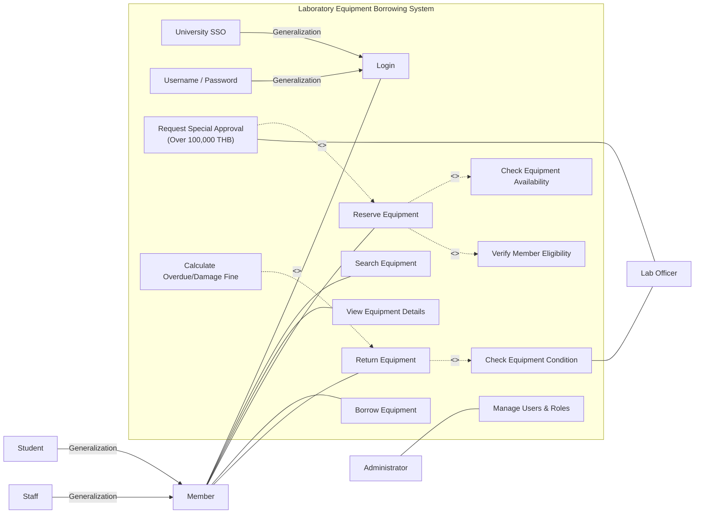
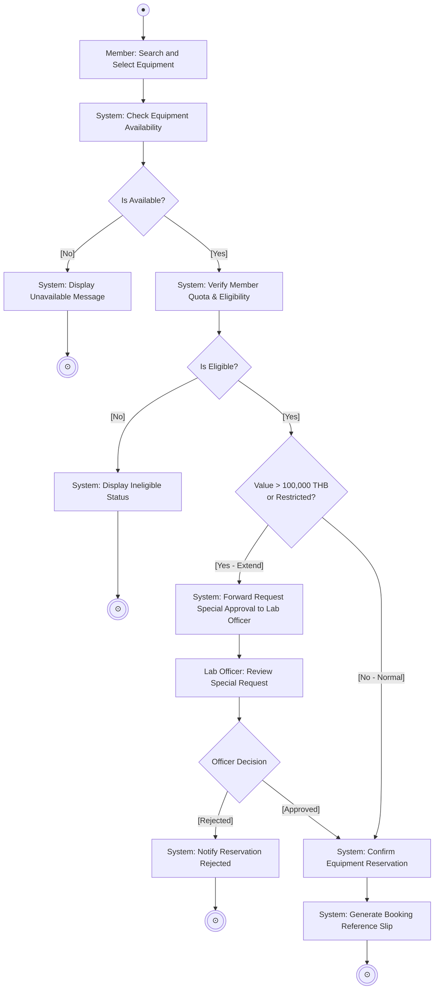

# บทวิเคราะห์และถอดความการบรรยายวิชา Software Engineering
## Case Study: Laboratory Equipment Borrowing System, การออกแบบ Use Case Diagram & Activity Diagram, และแนวข้อสอบปลายภาค (Final Exam Leaks)

- **วันที่บรรยาย:** วันอังคารที่ 22 กันยายน 2569
- **เวลา:** 09:33:13 - 11:22:27 (ความยาวรวม: ~1 ชั่วโมง 49 นาที)
- **ผู้สอน:** อาจารย์ผู้สอนวิชาวิศวกรรมซอฟต์แวร์
- **ไฟล์เสียงต้นฉบับ:** `20260922_093313.aac`, `20260922_102855.aac`, `20260922_105854.aac`
- **ไฟล์ Transcript ฉบับเต็ม:** [20260922_093313.txt](file:///C:/Project/Voice/07_Software_Engineering/20260922_093313.txt)
- **โครงการปลายทาง:** `C:\Project\software-engineering\`

---

## 1. จุดเน้นและข้อสอบปลายภาคที่ได้รับการยืนยัน (Final Exam Confirmed Leaks)

> [!IMPORTANT]
> **การยืนยันข้อสอบปลายภาคจากคำพูดผู้สอนโดยตรง:**
> *"Use Case Diagram เนี่ย Confirm ครับ ออกใน Final แน่ๆ 1 ข้อนะครับ ทุกปี ยังไงก็ต้องมี... แล้วก็วันนี้จะต่อเรื่อง Activity Diagram ก็จะเป็นอีก 1 ประเด็นที่จะปรากฏอยู่ใน Final เหมือนกัน... จาก Case Study เดียวกัน คุณจะได้เขียนทั้ง Use Case Diagram แล้วก็เขียน Activity Diagram ใน Final..."*

### รูปแบบข้อสอบปลายภาค:
โจทย์จะให้คำบรรยายระบบ (Case Study บรรยายความต้องการยาว 1-2 หน้ากระดาษ) และกำหนดให้ตอบ 4 ส่วน:
1. **List of Actors:** ระบุผู้กระทำทั้งหมดในระบบ พร้อมจำแนกความสัมพันธ์แบบ Generalization (ถ้ามี)
2. **List of Use Cases:** ระบุฟังก์ชันการทำงานทั้งหมดของระบบ
3. **Complete Use Case Diagram:** วาดไดอะแกรมพร้อม System Boundary, ความสัมพันธ์แบบ Association, `<<include>>`, `<<extend>>`, และ `Generalization`
4. **Activity Diagram:** วาดผังกิจกรรมขยายการทำงานภายในของ Use Case หลักที่โจทย์กำหนด (เช่น การจอง, การอนุมัติ, หรือการคืนอุปกรณ์)

---

## 2. เฉลยสมบูรณ์: Case Study ระบบยืม-คืนอุปกรณ์ห้องปฏิบัติการ (Laboratory Equipment Borrowing System)

### 2.1 รายชื่อ Actors (ผู้กระทำ)
1. **Member (สมาชิก):** คลาสแม่ (General Actor)
   - **Student (นักศึกษา):** ผู้ใช้บริการยืมอุปกรณ์ (Specialized Actor สืบทอดจาก Member)
   - **Staff (บุคลากร/อาจารย์):** ผู้ใช้บริการยืมอุปกรณ์ (Specialized Actor สืบทอดจาก Member)
2. **Lab Officer (เจ้าหน้าที่ห้องปฏิบัติการ):** ตรวจสอบสิทธิ์, อนุมัติคำขอยืมอุปกรณ์มูลค่าสูง, ตรวจรับอุปกรณ์คืน
3. **Administrator (ผู้ดูแลระบบ):** จัดการสิทธิ์และบัญชีผู้ใช้งาน

### 2.2 กฎความสัมพันธ์ทาง UML ที่ต้องใช้ในข้อสอบ
| ความสัมพันธ์ | สัญลักษณ์ใน UML | นิยามและการนำไปใช้ใน Case Study นี้ |
| :--- | :--- | :--- |
| **Generalization** | เส้นตรงหัวลูกศรสามเหลี่ยมโปร่ง $\triangle$ | ใช้แสดงความเป็นประเภทย่อย (Inheritance) เช่น `Student` และ `Staff` สืบทอดจาก `Member` |
| **<<include>>** | เส้นประหัวลูกศรเปิด $\dashrightarrow$ ชี้จาก Base $\to$ Included | การกระทำบังคับที่ต้องทำเสมอ เช่น `Reserve Equipment` **ต้อง** include `Check Availability` และ `Verify Eligibility` |
| **<<extend>>** | เส้นประหัวลูกศรเปิด $\dashrightarrow$ ชี้จาก Extension $\to$ Base | การกระทำทางเลือกที่จะเกิดขึ้นเฉพาะเมื่อเข้าเงื่อนไข เช่น `Request Special Approval` **extend** เข้าหา `Reserve Equipment` (เฉพาะเมื่อของ $>100,000$ บ.) |

---

### 2.3 ไดอะแกรม Use Case ฉบับสมบูรณ์ (Mermaid Diagram)

---

## 3. สรุปมาตรฐาน Activity Diagram (ผังกิจกรรม)

### 3.1 สัญลักษณ์มาตรฐานตามเกณฑ์การให้คะแนน
- **Initial Node (จุดเริ่มต้น):** วงกลมทึบสีดำ $\bullet$
- **Final Node (จุดสิ้นสุด):** วงกลมทึบที่มีวงแหวนล้อมรอบ $\odot$
- **Action State (กิจกรรม):** กล่องสี่เหลี่ยมมุมมนระบุชื่อกิจกรรมจากมุมมองระบบ
- **Decision & Merge Node:** สี่เหลี่ยมข้าวหลามตัด $\diamondsuit$ (Decision แตกออกเป็นหลายทางเลือกพร้อม Guard Condition `[...]`, Merge รวมหลายสายกลับเป็นหนึ่ง)
- **Fork & Join (Concurrency):** เส้นแถบหนาสีดำ (Fork แยก 1 สู่หลายงานพร้อมกัน, Join รอมารวมกันครบก่อนไปต่อ)
- **Swimlane (ช่องว่ายน้ำ):** แบ่งแถบคอลัมน์แสดงบทบาทของแต่ละฝ่าย (เช่น Member, System, Lab Officer)

---

### 3.2 ไดอะแกรมกิจกรรมของ Use Case "Reserve Equipment" พร้อม Swimlane

---

## 4. กฎเหล็กในการทำข้อสอบให้ได้คะแนนเต็ม (Scoring Best Practices)
1. **ห้ามสลับหัวลูกศร include และ extend:**
   - `<<include>>` ลูกศรต้อง **พุ่งออกจาก** Use Case หลักไปยัง Use Case บังคับ
   - `<<extend>>` ลูกศรต้อง **พุ่งเข้าหา** Use Case หลักจาก Use Case เงื่อนไขพิเศษ
2. **ห้ามลืมกรอบ System Boundary:** ทุก Use Case ต้องอยู่ในกรอบสี่เหลี่ยมที่มีชื่อระบบอยู่ด้านบน Actors ต้องอยู่นอกกรอบเสมอ
3. **Activity Diagram ต้องเขียนจากมุมมองระบบ:** กิจกรรมต้องระบุชัดเจนว่าใครทำอะไร เช่น `System: Verify Password` ไม่ใช่เขียนคลุมเครือแค่ `Verify`
