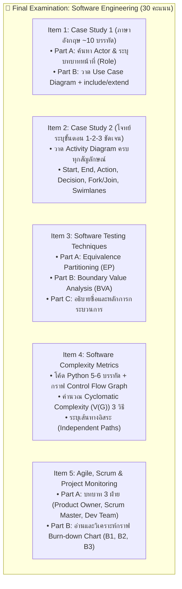
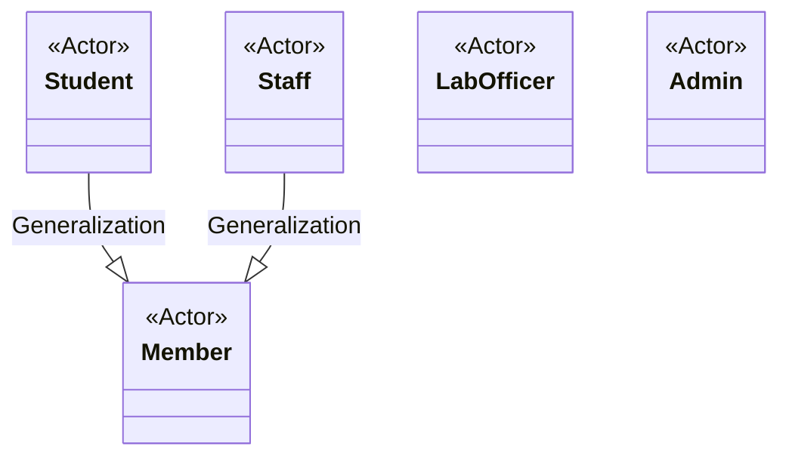

# 🎙️ บทวิเคราะห์เจาะลึกเสียงบรรยาย: แนวข้อสอบปลายภาควิชาวิศวกรรมซอฟต์แวร์ 5 ข้อใหญ่ (Final Exam Leaks & Comprehensive Guide)

**รหัสไฟล์เสียง:** `20261006_094018.aac`  
**วันที่บันทึก:** วันอังคารที่ 6 ตุลาคม 2569 เวลา 09:40:18 น. (ความยาว 45 นาที 59 วินาที)  
**วิชา:** วิศวกรรมซอฟต์แวร์ (Software Engineering)  
**ผู้สอน:** อาจารย์ผู้บรรยายประจำวิชา  
**สถานะ:** ประมวลผลและถอดความสมบูรณ์ 100% (Verbatim & Strategic Analysis)

---

## 📌 สรุปสาระสำคัญของผู้บรรยาย (Executive Summary)

ในการบรรยายครั้งนี้ อาจารย์ผู้สอนได้ทำการ **"ชี้แจงแนวข้อสอบปลายภาค (Final Exam Briefing & Leaks)" แบบเจาะลึก 100% ครบทั้ง 5 ข้อใหญ่** พร้อมทั้งเฉลยการบ้านและอธิบายหลักการออกแบบ Use Case Diagram ของระบบยืมคืนอุปกรณ์ห้องปฏิบัติการ (Lab Equipment Borrowing System) โดยมีประเด็นหัวใจสำคัญดังนี้:

1. **ลักษณะการสอบปลายภาค (Exam Format & Rules):**
   - **Open Book:** เปิดตำราและเอกสารเข้าห้องสอบได้เต็มที่ทุกรูปแบบ
   - **พจนานุกรม (Dictionary):** สามารถนำพจนานุกรมเข้าไปเปิดแปลศัพท์ภาษาอังกฤษได้
   - **ข้อสอบภาษาอังกฤษเสริมทักษะ:** ข้อสอบเขียนด้วยภาษาอังกฤษประโยคพื้นฐาน ไม่ซับซ้อน (Simple sentences)
   - **โครงสร้างข้อสอบ:** มีทั้งหมด **5 ข้อใหญ่ (5 Items)** มีข้อย่อย (A, B, C, D) รวมคะแนน **30 คะแนนเต็ม** (จากคะแนนรวมทั้งเทอม 100 คะแนน)
   - **ขอบเขตการตอบแบบ Scope-Locked:** ล็อกช่องคำตอบไว้ชัดเจน เช่น มี 4 ช่องตอบ แปลว่ามี Actor 4 ตัว ห้ามตอบขาด ห้ามตอบเกิน
2. **การคิดคะแนนรวมและการตัดเกรด (Grading Scheme):**
   - คะแนนเก็บรวม 100 คะแนน: สอบกลางภาค (Midterm) 20 คะแนน, สอบปลายภาค (Final) 30 คะแนน, การเช็คชื่อและการมีส่วนร่วมในห้องเรียน 20 คะแนน, การบ้านและการส่งงาน (Homework) 30 คะแนน
   - **การตัดเกรดเป็นแบบอิงเกณฑ์ (Criterion-Referenced):**
     - $A \ge 80$, $B+ = 75-79$, $B = 70-74$, $C+ = 65-69$, $C = 60-64$, $D+ = 55-59$, $D = 50-54$, $F < 50$
3. **เฉลยการบ้านระบบยืมคืนอุปกรณ์แล็บ (Lab Equipment Workshop Solution):**
   - ชี้จุดตายของความสัมพันธ์ `<<include>>` (เรียกใช้เสมอ ขาดไม่ได้ ลูกศรพุ่งจาก Use Case หลักไปหา Use Case รอง) และ `<<extend>>` (เงื่อนไขพิเศษ เช่น ยืมของมูลค่าสูง ลูกศรพุ่งจากส่วนขยายกลับมาหา Use Case หลัก)
   - ความสัมพันธ์แบบ Generalization ระหว่าง Member กับ Student / Staff

---

## 🔥 เจาะลึกโครงสร้างข้อสอบปลายภาค 5 ข้อใหญ่ (Detailed 5 Exam Items Breakdown)

---

### ข้อที่ 1: Case Study การวิเคราะห์ Actor และสร้าง Use Case Diagram
* **ลักษณะโจทย์:** เป็น Case Study สั้นๆ ประมาณ 10 บรรทัด ภาษาอังกฤษ เป็นเรื่องระบบสารสนเทศใหม่ (คนละเรื่องกับการบ้าน)
* **Part A (ระบุ Actor และ Role):**
  - มีช่องว่างให้กรอกพอดีจำนวน Actor (เช่น 4 หรือ 5 ช่อง)
  - **ห้ามตอบขาดและห้ามตอบเกิน** จำนวนช่องที่กำหนด
  - ให้ระบุชื่อ Actor พร้อมอธิบายบทบาทหน้าที่ (Role Description) สามารถลอกประโยคภาษาอังกฤษจากโจทย์มาตอบได้โดยตรง
* **Part B (วาด Use Case Diagram):**
  - นำ Actor จาก Part A มาร้อยเรียงกับ Use Cases ในพื้นที่ว่าง
  - ระบุความสัมพันธ์:
    - **Actor กับ Use Case:** เส้นตรงทึบ (Association)
    - **`<<include>>`:** สำหรับขั้นตอนบังคับที่ต้องทำเสมอ (เช่น จองต้อง `<<include>>` ตรวจสอบสิทธิ์ Verify Member) หัวลูกศรพุ่งออกจาก Base ไปหา Inclusion
    - **`<<extend>>`:** สำหรับเงื่อนไขทางเลือก/เคสพิเศษ (เช่น ยืมของมูลค่าสูงต้องขออนุมัติ Request Approval) หัวลูกศรพุ่งจาก Extension กลับเข้าหา Base
    - **Generalization:** ลูกศรสามเหลี่ยมโปร่ง (เช่น User $\leftarrow$ Member, Staff $\leftarrow$ Student)

---

### ข้อที่ 2: Case Study การเขียน Activity Diagram จากลำดับขั้นตอน
* **ลักษณะโจทย์:** เป็น Case Study อีกเรื่องหนึ่งที่เขียนแจกแจงเป็น Step ชัดเจน (เช่น 1. ผู้ใช้สอดบัตร, 2. ใส่รหัสผ่าน, 3. เลือกรหัสและรายการ, 4. ระบบตรวจสอบความถูกต้อง...)
* **เป้าหมาย:** วัดความเข้าใจในการแปลงขั้นตอนเชิงข้อความเป็นแผนภาพพฤติกรรม (Activity Diagram)
* **เกณฑ์สัญลักษณ์ที่ต้องใช้ให้ถูกต้อง:**
  1. **Initial Node (Start):** จุดวงกลมทึบสีดำ $\bullet$
  2. **Activity / Action State:** สี่เหลี่ยมมุมมน
  3. **Decision Node & Merge Node:** รูปสี่เหลี่ยมข้าวหลามตัด ($\diamond$) มี Guard Condition กักกำกับในวงเล็บ `[ ]` เช่น `[รหัสผ่านถูกต้อง]`, `[รหัสผ่านไม่ถูกต้อง]`
  4. **Fork Node & Join Node (Synchronization Bar):** แถบเส้นทึบหนา สำหรับงานที่ทำงานขนานกัน (Parallel Processing)
  5. **Swimlanes (Partition):** แบ่งเลนตาม Actor หรือ System Component (เช่น Customer, ATM Machine, Bank Server)
  6. **Final Node (End):** วงกลมทึบที่มีวงแหวนล้อมรอบ ($\odot$)

---

### ข้อที่ 3: เทคนิคการออกแบบชุดทดสอบซอฟต์แวร์ (Software Testing - EP & BVA)
เน้นการทดสอบแบบ Black-Box Testing สำหรับตรวจสอบค่าของ Input Domain

#### 1. Equivalence Partitioning (EP)
* หลักการคือการแบ่งโดเมนของข้อมูลนำเข้าออกเป็นกลุ่มสมมูล (Equivalence Classes) ทั้ง Valid Classes (ข้อมูลที่ถูกต้องตามเกณฑ์) และ Invalid Classes (ข้อมูลที่ผิดเกณฑ์)
* **ตัวอย่างโจทย์ในห้องเรียน:** การโอนเงินผ่านระบบธนาคาร กำหนดขั้นต่ำ 100 บาท และสูงสุดไม่เกิน 500 บาท ($100 \le Amount \le 500$)
  - **Invalid Class 1:** Amount $< 100$ (เช่น ค่าทดสอบ: 50 บาท, 99 บาท)
  - **Valid Class:** $100 \le Amount \le 500$ (เช่น ค่าทดสอบ: 250 บาท, 300 บาท)
  - **Invalid Class 2:** Amount $> 500$ (เช่น ค่าทดสอบ: 501 บาท, 800 บาท)

#### 2. Boundary Value Analysis (BVA)
* หลักการคือการเลือกค่าที่อยู่บริเวณรอยต่อ (ขอบเขต) ของแต่ละ Partition เพราะข้อผิดพลาดในการเขียนโปรแกรม (Off-by-one errors เช่น ใช้ `<` แทนที่จะเป็น `<=`) มักเกิดขึ้นที่ขอบเขต
* สำหรับช่วง $[100, 500]$ ค่าทดสอบที่ขอบเขตประกอบด้วย:
  - ขอบล่าง (Lower Boundary): Min-1 ($99$), Min ($100$), Min+1 ($101$)
  - ขอบบน (Upper Boundary): Max-1 ($499$), Max ($500$), Max+1 ($501$)

---

### ข้อที่ 4: การวัดความซับซ้อนของซอฟต์แวร์ (Cyclomatic Complexity & Testing Paths)
* **ลักษณะโจทย์:** มีโค้ดภาษา Python สั้นๆ 5-6 บรรทัด พร้อม **Control Flow Graph (CFG) วาดมาให้เรียบร้อยแล้ว** (นักศึกษาไม่ต้องวาดกราฟเอง)
* **สูตรการคำนวณ Cyclomatic Complexity ($V(G)$) ทั้ง 3 วิธี:**
  1. **วิธีที่ 1 (Edges & Nodes Formula):**
     $$V(G) = E - N + 2P$$
     *(เมื่อ $E$ = จำนวนเส้นเชื่อม (Edges), $N$ = จำนวนโหนด (Nodes), $P$ = จำนวนโปรแกรมเดี่ยว = 1 ดังนั้น $V(G) = E - N + 2$)*
  2. **วิธีที่ 2 (Bounded Regions):**
     $$V(G) = \text{จำนวนพื้นที่ปิด (Enclosed Regions)} + 1 \text{ (พื้นที่เปิดภายนอก)}$$
  3. **วิธีที่ 3 (Predicate Nodes):**
     $$V(G) = P_{\text{nodes}} + 1$$
     *(เมื่อ $P_{\text{nodes}}$ = จำนวนโหนดที่มีเงื่อนไขตัดสินใจแตกกิ่ง เช่น `if`, `while`, `for`)*
* **Independent Paths (เส้นทางอิสระ):**
  - จำนวนเส้นทางอิสระจะเท่ากับค่า $V(G)$ เสมอ
  - ให้นักศึกษาแจกแจงเส้นทางตั้งแต่โหนดเริ่มต้นจนถึงโหนดสิ้นสุด เช่น Path 1: 1 $\rightarrow$ 2 $\rightarrow$ 5, Path 2: 1 $\rightarrow$ 2 $\rightarrow$ 3 $\rightarrow$ 4 $\rightarrow$ 5...

---

### ข้อที่ 5: การบริหารโครงการแบบ Agile / Scrum และกราฟ Burn-down Chart
* **Part A (บทบาทใน Scrum Framework - 3 Roles):**
  1. **Product Owner (PO):** ผู้รับผิดชอบความคุ้มค่าทางธุรกิจ (Business Value), เป็นเจ้าของและจัดลำดับความสำคัญของ Product Backlog, สื่อสารกับ Stakeholders
  2. **Scrum Master (SM):** ผู้นำเชิงรับใช้ (Servant Leader), ขจัดอุปสรรคกีดขวาง (Impediments), ดูแลให้ทีมปฏิบัติตามแนวคิดและพิธีกรรมของ Scrum
  3. **Development Team:** ทีมผู้พัฒนาที่บริหารจัดการตนเอง (Self-organizing) และข้ามสายงาน (Cross-functional), สร้างชิ้นงานที่เสร็จสมบูรณ์ (Increment) ในแต่ละ Sprint
* **Part B (การวิเคราะห์กราฟ Burn-down Chart):**
  - มีกราฟและตารางข้อมูลเปรียบเทียบระหว่าง **Ideal Effort Line** (เส้นในอุดมคติที่ลดลงสม่ำเสมอเป็นเส้นตรงจากซ้ายบนลงขวาล่าง) กับ **Actual Effort Line** (เส้นที่เกิดขึ้นจริง)
  - **การตีความกราฟ:**
    - หาก Actual Line อยู่ **เหนือ** Ideal Line $\rightarrow$ งานล่าช้ากว่าแผน (Behind Schedule) มีงานค้างเหลือมากกว่าที่ควรจะเป็น
    - หาก Actual Line อยู่ **ใต้** Ideal Line $\rightarrow$ งานเร็วกว่าแผน (Ahead of Schedule)
    - วันที่เส้นกราฟพุ่งขึ้นหรือคงที่ $\rightarrow$ มีการเพิ่ม Scope งานเข้ามาระหว่าง Sprint หรือเกิดปัญหาคอขวด (Bottleneck / Blockers)

---

## 🏛️ เฉลยแบบฝึกหัดการบ้าน: Use Case Diagram ระบบยืม-คืนอุปกรณ์ห้องปฏิบัติการ

### สรุปความสัมพันธ์ในระบบยืมคืนอุปกรณ์:
1. **Actors:**
   - **Member:** ผู้ใช้งานทั่วไป (แบ่งเป็น **Student** และ **Staff** โดยใช้ Generalization)
   - **Lab Officer:** เจ้าหน้าที่ห้องแล็บ รับผิดชอบการอนุมัติ ส่งมอบ ตรวจรับอุปกรณ์ และจัดการคลังอุปกรณ์
   - **Admin:** ผู้ดูแลระบบ จัดการบัญชีผู้ใช้งานและสิทธิ์การเข้าถึง (User Management & Permissions)
2. **Use Cases & Relations:**
   - **Login:** แยกเป็น 2 ประเภทย่อย (SSO และ Username/Password)
   - **Reserve Equipment (การจองอุปกรณ์):**
     - `<<include>>` $\rightarrow$ **Verify Member Eligibility** (ตรวจสอบสิทธิ์ว่าถูกแบนหรือค้างส่งหรือไม่)
     - `<<include>>` $\rightarrow$ **Check Equipment Availability** (ตรวจสอบว่าอุปกรณ์ว่างหรือไม่)
     - `<<extend>>` $\leftarrow$ **Request Approval** (เฉพาะกรณีอุปกรณ์มูลค่าสูง ต้องเสนอขอนายช่าง/หัวหน้าอนุมัติ)
   - **Borrow Equipment (การยืมของ):** เจ้าหน้าที่ตรวจยืนยันการจอง และบันทึกประวัติ Transaction
   - **Return Equipment (การคืนของ):** เจ้าหน้าที่ตรวจสภาพอุปกรณ์ และคิดค่าปรับ (Calculate Penalty Fee) หากชำรุดหรือส่งช้า

---

## 📅 กำหนดการและปฏิทินที่สำคัญ (Deadlines & Schedule)

| กิจกรรม / เหตุการณ์ | วันที่ / เวลา | รายละเอียดและข้อกำหนด |
| :--- | :--- | :--- |
| **วันสอบปลายภาค (Final Exam)** | **อังคารที่ 13 ต.ค. 2569** (ตามตาราง) | สอบในห้องเรียน 3 ชั่วโมง (คาดว่าใช้จริง 1.5 - 2 ชม.), Open Book, เตรียม Dictionary และเครื่องเขียน |
| **ส่งงานการบ้านย้อนหลัง** | ก่อนวันสอบปลายภาค | ส่งแบบฝึกหัดและการบ้านทุกชิ้นใน Classroom เพื่อเก็บคะแนนส่วน 30 คะแนนให้ครบ |
| **การเช็คชื่อและการมีส่วนร่วม** | บันทึกย้อนหลัง | นับจากการเช็คชื่อในชั้นเรียน (คิดเป็น 20 คะแนนเต็ม) |
| **การตัดเกรด** | หลังตรวจข้อสอบเสร็จสิ้น | ตัดเกรดอิงเกณฑ์ (80=A, 75=B+, 70=B, 65=C+, 60=C, 55=D+, 50=D, <50=F) |

---
*เอกสารนี้ถูกจัดทำขึ้นจากไฟล์เสียงการบรรยายจริงเพื่อใช้เป็นฐานข้อมูลความรู้และแนวข้อสอบปลายภาคอย่างเป็นทางการ*
