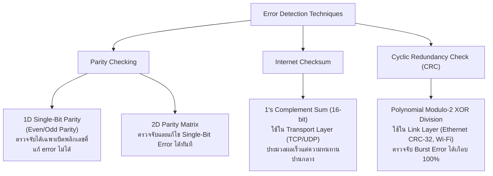

# บทวิเคราะห์และถอดความการบรรยายวิชา Computer Networks & Internet
## Data Link Layer: เทคนิคการตรวจจับและแก้ไขข้อผิดพลาด (Parity, Checksum, CRC) และโปรโตคอล Multiple Access (CSMA/CD, ALOHA) พร้อมเฉลยการบ้าน CRC

- **วันที่บรรยาย:** วันจันทร์ที่ 14 และวันจันทร์ที่ 21 กันยายน 2569
- **ผู้สอน:** ดร.วรลักษณ์ (Dr. Woralak)
- **ไฟล์เสียงอ้างอิง:** 
  - `20260914_132959.aac` & `20260914_153152.aac` (Network Layer: Distance Vector & BGP)
  - `20260921_135415.aac` ถึง `20260921_160636.aac` (Link Layer: CRC & MAC Protocols)
- **ไฟล์ Transcript ฉบับเต็ม:** 
  - [20260914_132959.txt](file:///C:/Project/Voice/08_Computer_Networks_and_Internet/20260914_132959.txt)
  - [20260921_135415.txt](file:///C:/Project/Voice/08_Computer_Networks_and_Internet/20260921_135415.txt)
- **โครงการปลายทาง:** `C:\Project\computer-network-&-Internet\` และ `C:\Project\cisco-packet-tracer\`

---

## 1. การเปรียบเทียบเทคนิคการตรวจจับข้อผิดพลาด (Error Detection Comparison)



---

## 2. คู่มือคำนวณและเฉลยการบ้าน CRC แบบ Step-by-Step

### 2.1 กฎเกณฑ์พื้นฐาน
1. **การแปลง Polynomial เป็นบิต:**
   - $x^k$ มีอยู่ $\rightarrow$ บิตที่ตำแหน่ง $k$ เป็น `1`
   - $x^k$ ไม่มีอยู่ $\rightarrow$ บิตที่ตำแหน่ง $k$ เป็น `0`
2. **การหารแบบ Modulo-2 Arithmetic:**
   - ใช้การดำเนินการ **XOR ($\oplus$)**
   - $0 \oplus 0 = 0,\quad 1 \oplus 1 = 0$
   - $0 \oplus 1 = 1,\quad 1 \oplus 0 = 1$
   - ไม่มีการยืม (No borrow) หรือทดข้ามหลัก
3. เมื่อบิตซ้ายสุดเป็น `1` ให้ XOR ด้วยตัวหาร $G$
4. เมื่อบิตซ้ายสุดเป็น `0` ให้ XOR ด้วยบิต `0000`

---

### 2.2 เฉลยโจทย์การบ้านที่อาจารย์มอบหมาย (Assignment Solution)

> **โจทย์การบ้าน:**
> - ข้อมูลที่ต้องการส่ง ($D$): `1 0 0 1 0 0` ($d = 6$ บิต)
> - ตัวหาร Generator Polynomial ($G$): $x^3 + 1$
> - จงหาค่า CRC ($R$) และเฟรมข้อมูลที่จะส่งออกไปจริง ($D + R$)

#### ขั้นตอนที่ 1: แปลง Polynomial เป็นบิตตัวหาร ($G$)
$$G(x) = x^3 + 0x^2 + 0x^1 + 1x^0 \implies G = \mathbf{1 0 0 1}$$
ความยาวของตัวหาร $L = 4$ บิต

#### ขั้นตอนที่ 2: เติมศูนย์ต่อท้ายข้อมูล ($D$) จำนวน $L - 1 = 3$ ตัว
$$\text{Data with Appended Zeros} = 100100\mathbf{000}$$

#### ขั้นตอนที่ 3: ตั้งหารยาวแบบ XOR (Modulo-2 Division)
```text
           1 0 0 0 0 0   <-- ผลหาร (ไม่นำมาใช้งาน)
        ------------------
1 0 0 1 ) 1 0 0 1 0 0 0 0 0
          1 0 0 1
          -------
          0 0 0 0 0        (ชัก 0 ลงมา -> ซ้ายสุดเป็น 0 ให้ XOR ด้วย 0000)
            0 0 0 0
            -------
            0 0 0 0 0      (ชัก 0 ลงมา)
              0 0 0 0
              -------
              0 0 0 0 0    (ชัก 0 ลงมา)
                0 0 0 0
                -------
                0 0 0 0 0  (ชัก 0 ลงมา)
                  0 0 0 0
                  -------
                  0 0 0 0  <-- เศษที่เหลือ R (Remainder)
```
*หมายเหตุ:* หากคำนวณแล้วได้เศษ $R = \mathbf{000}$

#### ขั้นตอนที่ 4: เฟรมที่ส่งจริง
$$\text{Transmitted Frame} = D \cdot 2^r \oplus R = 100100\mathbf{000}$$

---

### 2.3 ตัวอย่างโจทย์ในห้องเรียน (In-Class Example)
- ข้อมูล $D = 100100$
- ตัวหาร $G = 1101$ ($L = 4 \rightarrow$ เติมศูนย์ 3 ตัว: $100100\mathbf{000}$)
- ตั้งหาร XOR ได้เศษ $R = \mathbf{001}$
- เฟรมที่ส่งออกไป: $\mathbf{100100001}$
- ฝั่งรับ: นำ $100100001$ มาหารด้วย $1101$ ได้เศษเป็น $000$ (ยอมรับข้อมูลว่าถูกต้องสมบูรณ์)

---

## 3. สรุปโปรโตคอล Multiple Access (MAC Protocols)

| หมวดหมู่ | โปรโตคอล | กลไกการทำงาน | ข้อดี | ข้อจำกัด |
| :--- | :--- | :--- | :--- | :--- |
| **Channel Partitioning** | **TDMA** | แบ่งเวลาเป็น Time Slots คงที่ | ไม่มี Collision 100% | สูญเสียเวลาสล็อต (Idle) ถ้าโหนดไม่มีข้อมูล |
| **Channel Partitioning** | **FDMA** | แบ่งย่านความถี่เฉพาะให้แต่ละโหนด | ไม่มี Collision | ใช้แบนด์วิดท์ไม่คุ้มค่า |
| **Random Access** | **Slotted ALOHA** | ส่งข้อมูลได้เฉพาะต้นสล็อตเวลา | ง่ายต่อการจัดการ | ประสิทธิภาพสูงสุดเพียง 37% ($1/e$) |
| **Random Access** | **CSMA/CD** | "ฟังก่อนส่ง" และ "ตรวจจับการชนระหว่างส่ง" | มีประสิทธิภาพสูงบน Ethernet สายแลน | ใช้บนเครือข่ายไร้สายไม่ได้ |
| **Random Access** | **CSMA/CA** | "ฟังก่อนส่ง" และ "หลีกเลี่ยงการชนล่วงหน้า" (ACK, RTS/CTS) | เหมาะกับ Wi-Fi ไร้สาย | มี Overhead สูงกว่า CD |
| **Taking-Turns** | **Polling** | ตัวควบคุมกลาง (Master) วนถามสิทธิ์ | ป้องกัน Collision ได้ดี | มี Polling Overhead และ Single Point of Failure |
| **Taking-Turns** | **Token Passing** | โหนดส่งได้เมื่อถือเหรียญ Token | รองรับโหลดสูงได้ดี | มี Token Overhead และหน่วงเวลา |

---

## 4. สรุปทฤษฎีการหาเส้นทาง (Network Routing: Distance Vector vs BGP)

- **สมการ Bellman-Ford:** $d_x(y) = \min_v \{ c(x,v) + d_v(y) \}$
- **ปัญหา Count-to-Infinity:** เกิดขึ้นเมื่อลิงก์มีค่าใช้จ่ายสูงขึ้นหรือขาด ทำให้เกิด Routing Loop และค่าระยะทางนับเพิ่มขึ้นเรื่อยๆ จนถึงค่าอนันต์
- **การจัดลำดับชั้น (Hierarchical Routing):**
  - **Intra-AS (IGP):** ใช้ภายในระบบอิสระ เช่น OSPF (Link State) และ RIP (Distance Vector)
  - **Inter-AS (EGP):** ใช้เชื่อมต่อระหว่างระบบอิสระทั่วโลกผ่าน BGP (Border Gateway Protocol)
