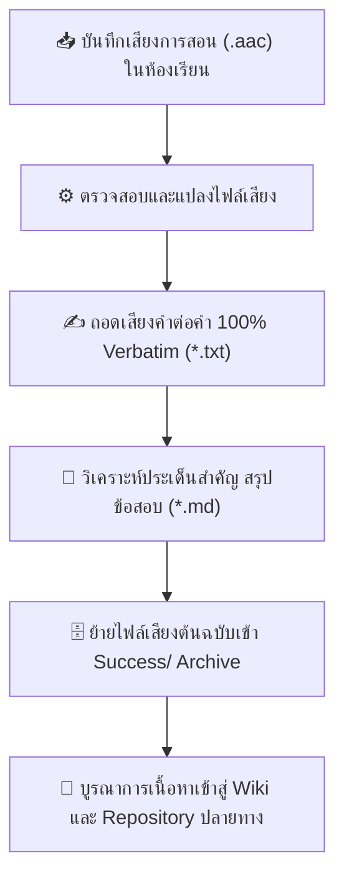

# 🎙️ Master Voice-to-Text & Lecture Intelligence Hub

[](https://github.com/kanomoo/voice-text)
[](00_MASTER_INDEX.md)
[](Success/)
[](LICENSE)

ระบบจัดเก็บ บันทึกเสียงการบรรยายในห้องเรียน (Classroom Lecture Audio Archive) พร้อมระบบถอดเสียงคำต่อคำแบบสมบูรณ์ 100% (Verbatim Transcription) และการสังเคราะห์บทเรียนเชิงลึก เชื่อมโยงข้ามโปรเจกต์การศึกษา 8 สาขาวิชา

---

## 🌟 วัตถุประสงค์และภาพรวม (Core Mission & Architecture)

โปรเจกต์นี้ทำหน้าที่เป็น **Central Ingestion & Master Knowledge Archive** สำหรับไฟล์เสียงการบรรยายทั้งหมด โดยเปลี่ยนเสียงพูดและภาพถ่ายหน้ากระดานในห้องเรียน ให้กลายเป็น:
1. **Verbatim Text Files (`.txt`):** บทถอดเสียงทุกคำพูด ครบถ้วน ไม่ตัดทอน
2. **Deep-Dive Transcripts (`.md`):** บทวิเคราะห์เนื้อหาเชิงลึก สรุปทฤษฎี ข้อสอบรั่ว (Exam Leaks) ตาราง Tracing และภาพประกอบ
3. **Cross-Project Knowledge Integration:** ซิงก์เนื้อหาการเรียนรู้ไปยังคลังความรู้ (Wiki) และเว็บแอปพลิเคชันของแต่ละวิชาโดยตรง

---

## 📁 โครงสร้างโปรเจกต์ (Repository Directory Layout)

```text
voice-text/
├── 00_MASTER_INDEX.md              # 📑 ดัชนีสารบัญรวมและรายงานวิเคราะห์เสียงทุกหมวดหมู่วิชา
├── main.md                         # 🤖 AI Workflow & คู่มือกระบวนการถอดความอัตโนมัติ
│
├── 01_Innovative_Technopreneurs/   # 💡 วิชาผู้ประกอบการนวัตกรรม (BMC, Customer Discovery, รายงาน Final)
├── 02_Database_System/             # 🗄️ วิชาระบบฐานข้อมูล (ACID, Concurrency, NoSQL, MariaDB DDL/DML)
├── 03_Data_Structures_and_Algorithms/ # 🌳 วิชาโครงสร้างข้อมูลและอัลกอริทึม (Heap, Graph, Hashing, ข้อสอบ)
├── 04_Computer_Graphics_Design/    # 🎨 วิชาคอมพิวเตอร์กราฟิกส์ (เกณฑ์ข้อสอบปฏิบัติ Adobe Illustrator)
├── 05_Technical_English/           # 🗣️ วิชาภาษาอังกฤษเทคนิค (บทนำเสนอเดี่ยว Presentation Scripts)
├── 06_Personal_Financial_Trading/  # 📈 การเงินส่วนบุคคลและเทรดดิ้ง (คู่มือ MT5 EA, การบริหารพอร์ต)
├── 07_Software_Engineering/        # ⚙️ วิชาวิศวกรรมซอฟต์แวร์ (Use Case Diagram, Agile/Scrum, Week 9-10)
├── 08_Computer_Networks_and_Internet/ # 🌐 วิชาเน็ตเวิร์ก (Link Layer, CRC, MAC, Packet Flow)
│
├── DSA-pic/                        # 📸 คลังภาพถ่ายหน้ากระดานและสไลด์วิชา Data Structures รวมกว่า 100+ ภาพ
└── Success/                        # 🗄️ คลังเก็บไฟล์เสียงต้นฉบับ (.aac) ที่ผ่านการถอดความสมบูรณ์แล้ว
```

---

## 🗺️ แผนผังการเชื่อมโยงสู่โปรเจกต์ภายนอก (Subject-to-Project Mapping)

| หมวดวิชา | โปรเจกต์ปลายทาง | รูปแบบเนื้อหาที่ถูกส่งต่อไปยังปลายทาง |
| :--- | :--- | :--- |
| **01 Innovative Technopreneurs** | [`innovative-technopreneurs`](https://github.com/kanomoo/innovative-technopreneurs) | รายงาน Final 10 หัวข้อ, บทสัมภาษณ์ลูกค้า, กลยุทธ์ BMC |
| **02 Database System** | [`database-system`](https://github.com/kanomoo/database-system) | โน้ตสรุป Wiki, ปัญหา Error 1074, แล็บ DDL/DML, Concurrency |
| **03 Data Structures & Algorithms** | [`python-data-structures-and-algorithms`](https://github.com/kanomoo/python-data-structures-and-algorithms)<br>[`wiki-data-structure`](https://github.com/kanomoo/wiki-data-structure) | เฉลยข้อสอบ Graph/Heap, โค้ดไพธอน, Tracing Table |
| **07 Software Engineering** | [`software-engineering`](https://github.com/kanomoo/software-engineering) | คลัง Use Case Diagram Workshop, Include/Extend, Scrum notes |
| **08 Computer Networks** | [`computer-network-and-Internet`](https://github.com/kanomoo/computer-network-and-Internet) | บทเรียน Link Layer, CRC Calculation, สไลด์บรรยาย |

---

## 🔄 กระบวนการทำงาน (Workflow)



---

## 👨‍💻 ผู้จัดทำ (Author)

* **kanomoo** ([GitHub Profile](https://github.com/kanomoo))
* สร้างขึ้นเพื่อใช้จัดระเบียบคลังเสียงการสอนและสร้างฐานข้อมูลความรู้อัตโนมัติ
