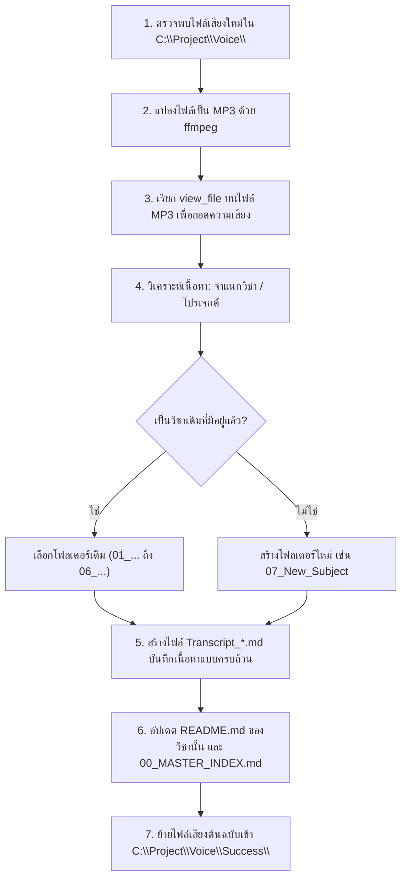

# AI Workflow & Operating Guide: การประมวลผลและจัดการไฟล์เสียง (Voice Intelligence System)

> **คำชี้แจงสำหรับ AI ในครั้งถัดไป:**  
> เอกสารฉบับนี้จัดทำขึ้นเพื่อให้ AI ผู้ช่วยพัฒนาในรอบถัดไปเข้าใจสถาปัตยกรรม ขั้นตอนการทำงาน และกฎเกณฑ์ในการประมวลผลไฟล์เสียงภายในไดเรกทอรี `C:\Project\Voice\` อย่างถูกต้อง สม่ำเสมอ และมีประสิทธิภาพสูงสุด

---

## 🏛️ สถาปัตยกรรมและโครงสร้างโฟลเดอร์ (Folder Architecture)

1. **`C:\Project\Voice\` (Inbox / แหล่งรับไฟล์ใหม่):**
   - ไฟล์เสียงใหม่ที่ยังไม่ได้รับการถอดความจะถูกวางไว้ที่รูทของโฟลเดอร์นี้
2. **โฟลเดอร์หมวดหมู่วิชาและโปรเจกต์ (`01_...`, `02_...`, ฯลฯ):**
   - ใช้เก็บไฟล์เอกสารสรุป (`README.md`) และไฟล์ถอดความเนื้อหา (`Transcript_*.md`) ของแต่ละวิชา
   - **กฎเหล็ก:** ห้ามย้ายไฟล์เสียงออกไปยังโฟลเดอร์โปรเจกต์ภายนอก (เช่น `C:\Project\database-system`) จนกว่าผู้ใช้จะสั่งอย่างชัดเจน ให้สร้างและจัดเก็บโฟลเดอร์ไว้ภายใน `C:\Project\Voice\` นี้เท่านั้น
3. **`C:\Project\Voice\Success\` (Archive / แหล่งเก็บไฟล์เสียงที่แปลเสร็จแล้ว):**
   - เมื่อไฟล์เสียงใดถูกถอดความ วิเคราะห์จุดสำคัญ และสร้างไฟล์ `.md` ครบถ้วนแล้ว **ให้ย้ายไฟล์เสียงต้นฉบับนั้นเข้ามาเก็บในโฟลเดอร์ `Success/` ทันที**

---

## 🔄 ลำดับขั้นตอนการทำงานของ AI เมื่อมีไฟล์เสียงเข้ามาใหม่ (Step-by-Step AI Workflow)



### ขั้นตอนที่ 1: ค้นหาไฟล์เสียงที่ยังไม่ประมวลผล (Scan New Audio)
ตรวจสอบไฟล์เสียงนามสกุล `.aac`, `.mp3`, `.m4a`, `.wav` ที่อยู่ ณ รูทของ `C:\Project\Voice\` (ไม่รวมใน `Success/` และโฟลเดอร์ย่อย)

### ขั้นตอนที่ 2: แปลงไฟล์เสียงเพื่อเตรียมถอดความ (Audio Conversion)
หากไฟล์เป็น `.aac` ที่ไม่รองรับโดยตรง ให้แปลงเป็น `.mp3` บิตเรต 64 kbps โดยใช้คำสั่ง ffmpeg:
```powershell
ffmpeg -y -i "C:\Project\Voice\input_file.aac" -b:a 64k "C:\Users\PC\.gemini\antigravity-cli\brain\<conv-id>\scratch\temp.mp3"
```

### ขั้นตอนที่ 3: ถอดความเสียงด้วย Multimodal Agent (Audio Transcription)
เรียกเครื่องมือ `view_file` บนไฟล์ `.mp3` ที่แปลงแล้ว ระบบจะทำการถอดเสียงคำพูดออกมาทั้งหมดเป็นข้อความ

### ขั้นตอนที่ 4: จำแนกหมวดหมู่วิชาและโปรเจกต์ (Classification)
เปรียบเทียบเนื้อหาและคำสำคัญกับ 6 หมวดหมู่หลักที่สร้างไว้แล้ว:
- **`01_Innovative_Technopreneurs`:** คำว่า BMC, Business Model Canvas, 3 ขนาด, ลดฝุ่น, Smart Green Wall, กลยุทธ์ 4Ps, Positioning, ความเสี่ยงร้านกาแฟ
- **`02_Database_System`:** คำว่า Transaction, ACID, Commit, Rollback, Lock Matrix, S Lock, X Lock, 2PL, Log File, Redo, Undo, Normalization
- **`03_Data_Structures_and_Algorithms`:** คำว่า Hashing, Separate Chaining, Open Addressing, Linear/Quadratic Probing, Double Hashing, Priority Queue, Binary Heap, Complete Binary Tree, 1024/2047 โหนด, Array Representation, `deleteMin`, `insert`, Percolate Up/Down
- **`04_Computer_Graphics_Design`:** คำว่า Illustrator, 3D Effect, Revolve, Extrude & Bevel, Offset Path, Pathfinder, รถ Tesla สีแดง, Pen Tool, ดราฟท์การ์ตูน
- **`05_Technical_English`:** ภาษาอังกฤษ, Customizing PC, Assembling PC, Playing Guitar, Relieve stress, Satisfaction, Piece
- **`06_Personal_Financial_Trading`:** คำว่า โบรกเกอร์, MT4, MT5, MetaTrader, Expert Advisor, EA, เปิด 5 ออเดอร์, ถอนกำไร
*(หากพบวิชาใหม่ที่ไม่อยู่ใน 6 หมวดนี้ ให้สร้างโฟลเดอร์ใหม่เรียงตามลำดับ เช่น `07_New_Subject`)*

### ขั้นตอนที่ 5: สร้างไฟล์ Markdown ถอดความและวิเคราะห์ (`Transcript_*.md`)
สร้างไฟล์ Markdown ไว้ในโฟลเดอร์ของวิชานั้นๆ โดยต้องประกอบด้วย 5 องค์ประกอบบังคับตามเทมเพลตมาตรฐาน:

```markdown
# ถอดความและสรุปบทเรียน: [ชื่อหัวข้อ]
**ไฟล์เสียงต้นฉบับ:** `[ชื่อไฟล์เสียง.aac]`  
**วิชา:** [ชื่อวิชา]  
**วันที่บันทึก:** [วัน/เดือน/ปี เวลา]  
**ผู้บรรยาย / ผู้พูด:** [อาจารย์ / นักศึกษา / วิทยากร]  

---

## 1. คำถอดความแบบละเอียดทุกคำพูด (Verbatim Transcript)
[ใส่คำพูดทุกคำพูดอย่างละเอียด ห้ามตัดทอนประโยคสำคัญ หรือจุดที่อาจารย์พูดเล่นแต่แฝงข้อสอบ]

---

## 2. สรุปสาระสำคัญ (Executive Summary)
[สรุปสาระเชิงวิชาการ แนวคิด และทฤษฎีหลัก]

---

## 3. จุดสำคัญที่อาจารย์เน้นย้ำ (Key Highlights)
[สิ่งที่ผู้สอนย้ำเป็นพิเศษ กฎเกณฑ์ ข้อควรระวัง]

---

## 4. วัน-เวลา และกำหนดการส่งงาน (Deadlines & Schedule)
[ระบุวัน เวลา ช่องทางการส่งงาน เงื่อนไขการส่ง หากไม่มีให้ระบุว่าไม่มี]

---

## 5. จุดที่แง้มว่าจะออกสอบ / แนวข้อสอบ (Exam Hints & Secrets)
[ระบุคำพูดที่อาจารย์บอกว่า "ออกสอบแน่นอน", "จำสูตรนี้ไปสอบ", "ในข้อสอบจะมี...", ทรงข้อสอบ และเกณฑ์การให้คะแนน]
```

### ขั้นตอนที่ 6: อัปเดตดัชนีและเอกสารภาพรวม (Update Indices)
1. อัปเดตไฟล์ `README.md` ประจำโฟลเดอร์วิชานั้น (เพิ่มตารางไฟล์เสียง, สรุป และเดดไลน์)
2. อัปเดตไฟล์ [**`00_MASTER_INDEX.md`**](file:///C:/Project/Voice/00_MASTER_INDEX.md) ที่รูทของโฟลเดอร์ `Voice/`

### ขั้นตอนที่ 7: ย้ายไฟล์เสียงที่เสร็จแล้วเข้าโฟลเดอร์ `Success/` (Archive Completed Audio)
**กฎสำคัญ:** เมื่อประมวลผลไฟล์เสียงและบันทึกไฟล์ `.md` เสร็จสมบูรณ์แล้ว ให้ย้ายไฟล์เสียงต้นฉบับจาก `C:\Project\Voice\` ไปยัง `C:\Project\Voice\Success\` ทันที
```powershell
Move-Item -Path "C:\Project\Voice\completed_file.aac" -Destination "C:\Project\Voice\Success\" -Force
```

---

## 🎯 กฎเหล็กในการวิเคราะห์เนื้อหา (Strict Quality Standards)

1. **ห้ามเดาหรือข้ามจุดออกสอบ:** หากอาจารย์พูดคำว่า "ออกสอบ", "ข้อสอบทรงนี้", "ห้ามตอบแบบนี้", "กี่คะแนน" ต้องดึงออกมาเน้นย้ำในหัวข้อ **Exam Hints** เสมอ
2. **คำนวณตัวเลขให้เสร็จสรรพ:** เช่น สูตร $2^{10}$ ต้องคำนวณออกมาเป็นตัวเลขจริง $1,024$ โหนด พร้อมอธิบายเหตุผลว่าทำไมถึงห้ามตอบติดเลขยกกำลัง
3. **ตรวจสอบความสอดคล้องของวันที่:** วันที่ในชื่อไฟล์ (เช่น `20260902` คือ 2 ก.ย. 2569) ให้เชื่อมโยงกับวันในสัปดาห์และคาบเรียนเพื่อหาความต่อเนื่องของบทเรียน
4. **ความสมบูรณ์ของโฟลเดอร์ `Success`:** ทุกไฟล์เสียงที่ผ่านการแปลแล้ว ต้องอยู่ใน `Success/` เพื่อไม่ให้เกิดการประมวลผลซ้ำในอนาคต
