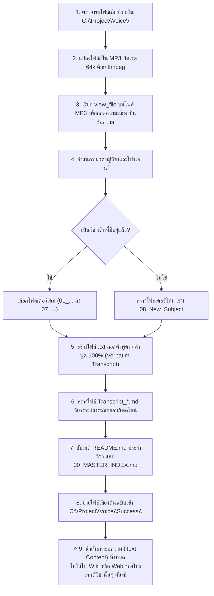

# AI Workflow & Operating Guide: การประมวลผลและจัดการไฟล์เสียง (Voice Intelligence System)

> **คำชี้แจงสำหรับ AI ในครั้งถัดไป:**  
> เอกสารฉบับนี้จัดทำขึ้นเพื่อให้ AI ผู้ช่วยพัฒนาเข้าใจสถาปัตยกรรม ขั้นตอนการทำงาน และกฎเกณฑ์ในการประมวลผลไฟล์เสียงภายในไดเรกทอรี `C:\Project\Voice\` อย่างถูกต้อง สม่ำเสมอ และมีประสิทธิภาพสูงสุด
> 
> ⚠️ **ปรัชญาและหน้าที่หลักของ AI (Core Mission & User Mandate):**  
> **"ไม่มีใครมานั่งเปิดฟังไฟล์เสียง หน้าที่ของ AI คือการแปลงไฟล์เสียงและไฟล์ภาพทุกไฟล์ให้เป็นข้อความ (Text) และภาพประกอบที่สมบูรณ์ โดยทุกครั้งที่มีรูปหรือเสียงใหม่เข้ามา ให้สรุปไฟล์ `.txt` ถอดความคำต่อคำ 100% (Verbatim) และไฟล์ `.md` สรุปวิเคราะห์เชิงลึกเข้าโฟลเดอร์ใน `C:\Project\Voice\` นี้ก่อนเสมอ! จากนั้นวิเคราะห์ดูแต่ละโปรเจกต์ว่าสามารถสรุปเนื้อหาเข้าอะไรได้บ้าง เช่น Wiki หรือ Web แล้วนำเนื้อหาทั้งหมด (ทฤษฎี, ตาราง Tracing, ข้อสอบ, เฉลย, โค้ด, เวิร์กช็อป, และภาพประกอบ) ไปบูรณาการใส่ใน Wiki หรือ Web ของโปรเจกต์นั้นๆ ทันที! และการสรุป ห้ามสรุปสั้นเกินไปเด็ดขาด ต้องละเอียดมากที่สุดเท่าที่เป็นไปได้ จับจุดการพูดของผู้บรรยาย เน้นย้ำจุดที่ผู้สอนเน้นย้ำ ใส่ภาพ ตาราง สูตร และลิงก์ให้เรียบร้อยสมบูรณ์!"**

---

## 🏛️ สถาปัตยกรรมและโครงสร้างโฟลเดอร์ (Folder Architecture)

1. **`C:\Project\Voice\` (Inbox / แหล่งรับไฟล์ใหม่):**
   - ไฟล์เสียงใหม่ที่ยังไม่ได้รับการถอดความจะถูกวางไว้ที่รูทของโฟลเดอร์นี้
2. **โฟลเดอร์หมวดหมู่วิชาและโปรเจกต์ภายใน Voice (`01_...`, `02_...`, ฯลฯ):**
   - ใช้เก็บไฟล์เอกสารสรุป (`README.md`), ไฟล์ถอดความต้นฉบับ (`*.txt`), และไฟล์วิเคราะห์เนื้อหา (`Transcript_*.md`) ของแต่ละวิชา เพื่อเป็นคลังข้อมูลหลัก (Master Central Archive)
3. **`C:\Project\Voice\Success\` (Archive / แหล่งเก็บไฟล์เสียงที่แปลเสร็จแล้ว):**
   - เมื่อไฟล์เสียงใดถูกถอดความ วิเคราะห์จุดสำคัญ และสร้างไฟล์ `.txt` และ `.md` ครบถ้วนแล้ว **ให้ย้ายไฟล์เสียงต้นฉบับนั้นเข้ามาเก็บในโฟลเดอร์ `Success/` ทันที**
   - **กฎเหล็กเรื่องไฟล์เสียง:** ห้ามคัดลอกหรือย้ายไฟล์เสียงออกไปยังโฟลเดอร์โปรเจกต์ภายนอก เพราะกินพื้นที่และไม่มีใครเปิดฟัง ไฟล์เสียงต้นฉบับต้องอยู่ใน `Voice\Success\` เท่านั้น
4. **โฟลเดอร์โปรเจกต์ภายนอก (`C:\Project\<project_name>\`):**
   - เป็นปลายทางที่ AI ต้องนำ **"เนื้อหาข้อความ (Text Content)"** ทั้งหมด ทั้งบทเรียน Wiki, เอกสารแนวข้อสอบ, ตารางสรุป และโค้ด ไปบรรจุไว้ในโฟลเดอร์ `Wiki/` และคอมไพล์เข้าสู่หน้าเว็บ (Web Application) ของโปรเจกต์นั้นๆ เสมอ

---

## 🗺️ แผนผังการเชื่อมโยงวิชาสู่โปรเจกต์ปลายทาง (Subject-to-Project Mapping)

| หมวดหมู่ใน Voice | วิชาที่เกี่ยวข้อง | ไดเรกทอรีโปรเจกต์ปลายทาง (`C:\Project\...`) | ตำแหน่งที่ต้องนำข้อความไปใส่ในโปรเจกต์ |
| :--- | :--- | :--- | :--- |
| **`01_Innovative_Technopreneurs`** | ผู้ประกอบการนวัตกรรม | `innovative-technopreneurs` | `Wiki/`, `Lectures/` (รายงาน Final, BMC, Customer Discovery) |
| **`02_Database_System`** | ระบบฐานข้อมูล | `database-system` | `Wiki/` (สร้างบทเรียน Markdown, อัปเดต `build-wiki.js`, และรันคอมไพล์เว็บ `wiki-data.js`) |
| **`03_Data_Structures_and_Algorithms`** | โครงสร้างข้อมูลและอัลกอริทึม | `wiki-data-structure`<br>`python-data-structures-and-algorithms` | `wiki/sources/`, `wiki/` (เฉลยข้อสอบ, โค้ด Python Heap/Hashing, ข้อสอบ DeleteMin 3 รอบ) |
| **`04_Computer_Graphics_Design`** | คอมพิวเตอร์กราฟิกส์ | `card` / โฟลเดอร์งานกราฟิก | ข้อสอบปฏิบัติ 4 ข้อ 300 คะแนน (Illustrator) |
| **`05_Technical_English`** | ภาษาอังกฤษเทคนิค | โปรเจกต์วิชาภาษาอังกฤษ | บทพูดพรีเซนต์เดี่ยว Custom PC และดนตรี |
| **`06_Personal_Financial_Trading`** | การเงินส่วนบุคคล/เทรดดิ้ง | โปรเจกต์ที่เกี่ยวข้อง | คู่มือการถอนกำไร โบรกเกอร์ MT5 / EA |
| **`07_Software_Engineering`** | วิศวกรรมซอฟต์แวร์ | `software-engineering` | `Wiki/01_New_Wiki_68/Lessons/`, `04_Work_and_Homework/` (Use Case Diagram, include/extend, Case Study) |
| *(วิชาใหม่เพิ่มเติม)* | ตามชื่อวิชา | โฟลเดอร์โปรเจกต์ของวิชานั้น | โฟลเดอร์ `Wiki/` หรือเว็บของวิชานั้นๆ |

---

## 🔄 ลำดับขั้นตอนการทำงานของ AI เมื่อมีไฟล์เสียงเข้ามาใหม่ (Step-by-Step AI Workflow)



---

### รายละเอียดขั้นตอนการปฏิบัติการ

#### ขั้นตอนที่ 1: ค้นหาไฟล์เสียงที่ยังไม่ประมวลผล (Scan New Audio)
ตรวจสอบไฟล์เสียงนามสกุล `.aac`, `.mp3`, `.m4a`, `.wav` ที่อยู่ ณ รูทของ `C:\Project\Voice\`

#### ขั้นตอนที่ 2: แปลงไฟล์เสียงเพื่อเตรียมถอดความ (Audio Conversion)
แปลงไฟล์เสียงเป็น `.mp3` บิตเรต 64 kbps เพื่อความรวดเร็วและรองรับ Multimodal Analysis:
```powershell
ffmpeg -y -i "C:\Project\Voice\input_file.aac" -b:a 64k "C:\Users\PC\.gemini\antigravity-cli\brain\<conv-id>\scratch\temp.mp3"
```

#### ขั้นตอนที่ 3: ถอดความเสียงด้วย Multimodal Agent (Audio Transcription)
เรียกเครื่องมือ `view_file` บนไฟล์ `.mp3` เพื่อถอดเสียงคำพูดออกมาทั้งหมดเป็นข้อความภาษาไทยและอังกฤษ

#### ขั้นตอนที่ 4: จำแนกหมวดหมู่วิชาและโปรเจกต์ (Classification)
เปรียบเทียบเนื้อหาและคำสำคัญกับกลุ่มวิชาที่มีอยู่ หากเป็นวิชาใหม่ให้สร้างโฟลเดอร์เรียงลำดับ เช่น `08_...`

#### ขั้นตอนที่ 5: บันทึกไฟล์ข้อความถอดเสียงต้นฉบับแบบละเอียดทุกคำพูด (`.txt`)
**กฎเหล็ก:** ต้องสร้างไฟล์ `.txt` ที่มีชื่อเดียวกับไฟล์เสียง (เช่น `20260915_130022.txt`) บันทึกคำพูดคำต่อคำ (Verbatim 100%) ห้ามตัดทอน ห้ามสรุปย่อ เพื่อเป็นหลักฐานคำพูดจริงของผู้บรรยาย

#### ขั้นตอนที่ 6: สร้างไฟล์ Markdown ถอดความและวิเคราะห์เชิงลึก (`Transcript_*.md`)
สร้างไฟล์ Markdown ไว้ในโฟลเดอร์ของวิชานั้นๆ ประกอบด้วย 5 องค์ประกอบบังคับ:
1. คำถอดความแบบละเอียดทุกคำพูด (Verbatim Transcript)
2. สรุปสาระสำคัญ (Executive Summary)
3. จุดสำคัญที่อาจารย์เน้นย้ำ (Key Highlights)
4. วัน-เวลา และกำหนดการส่งงาน (Deadlines & Schedule)
5. จุดที่แง้มว่าจะออกสอบ / แนวข้อสอบ (Exam Hints & Secrets)

#### ขั้นตอนที่ 7: อัปเดตดัชนีและเอกสารภาพรวม (Update Indices)
1. อัปเดตไฟล์ `README.md` ประจำโฟลเดอร์วิชาใน Voice
2. อัปเดตไฟล์ [**`00_MASTER_INDEX.md`**](file:///C:/Project/Voice/00_MASTER_INDEX.md) ที่รูทของ `Voice/`

#### ขั้นตอนที่ 8: ย้ายไฟล์เสียงต้นฉบับเข้าคลัง `Success/` (Archive Completed Audio)
```powershell
Move-Item -Path "C:\Project\Voice\completed_file.aac" -Destination "C:\Project\Voice\Success\" -Force
```

#### ⭐ ขั้นตอนที่ 9: นำเนื้อหาข้อความไปใส่ใน Wiki และ Web ของโปรเจกต์ปลายทาง (Deploy Text to Project Wikis & Web Apps)
> [!IMPORTANT] **กฎเหล็กตามคำสั่งผู้ใช้งาน (Mandatory Deployment Step):**
> **ห้ามหยุดแค่ในโฟลเดอร์ `Voice/`!** ต้องนำเนื้อหาข้อความทั้งหมดไปอัปเดตใส่โปรเจกต์วิชานั้นๆ ทันที:
> 1. **คัดลอกไฟล์ข้อความถอดความ (`.txt`) และบทวิเคราะห์ (`.md`):** นำไปบรรจุไว้ในโฟลเดอร์ `Wiki/`, `Lessons/`, หรือ `Lectures/` ของโปรเจกต์ภายนอก
> 2. **บูรณาการเข้ากับบทเรียนหลัก:** อัปเดตสไลด์สรุป, เพิ่มลิงก์ใน Master Index ของวิชานั้น, และติ๊กความก้าวหน้าใน `Progress Checklist.md`
> 3. **คอมไพล์เว็บแอปพลิเคชัน (หากมี):**
>    - เช่นในโปรเจกต์ `database-system` ต้องอัปเดตไฟล์ `build-wiki.js` แล้วสั่งรัน `node build-wiki.js` เพื่อคอมไพล์ข้อมูลเข้าสู่ `wiki-data.js` สำหรับเปิดอ่านบนหน้าเว็บ `index.html` ทันที
>    - ในโปรเจกต์ `software-engineering` ต้องนำแนวคิดและเฉลยโจทย์ไปใส่ในโฟลเดอร์ `04_Work_and_Homework/` และเว็บ Exam Hub
>    - ในโปรเจกต์ `wiki-data-structure` ต้องนำโค้ดและแนวคิดไปใส่ใน `wiki/sources/`

---

## 🎯 กฎเหล็กในการปฏิบัติงาน (Strict Operating Standards)

1. **ส่งมอบเป็นข้อความ (Text Only to External Projects):** ไม่มีใครเปิดฟังไฟล์เสียง ทุกความรู้ต้องถูกแปลงเป็น Text, Tables, Code, และ Mermaid Diagrams นำไปใส่ใน Wiki/Web ปลายทางทันที
2. **ห้ามเดาหรือข้ามจุดออกสอบ:** หากอาจารย์พูดคำว่า "ออกสอบ", "ข้อสอบทรงนี้", "ห้ามตอบแบบนี้", "กี่คะแนน" ต้องดึงออกมาเน้นย้ำในหัวข้อ **Exam Hints** และนำไปใส่ในส่วนข้อสอบของ Wiki ปลายทางเสมอ
3. **คำนวณตัวเลขให้เสร็จสรรพ:** เช่น สูตร $2^{10}$ ต้องคำนวณออกมาเป็นตัวเลขจริง $1,024$ โหนด พร้อมอธิบายเหตุผลว่าทำไมถึงห้ามตอบติดเลขยกกำลัง
4. **ความสมบูรณ์ของโฟลเดอร์ `Success`:** ทุกไฟล์เสียงที่ผ่านการแปลแล้ว ต้องอยู่ใน `Success/` เพื่อไม่ให้เกิดการประมวลผลซ้ำในอนาคต
5. **การสรุปห้ามสรุปสั้นเกินไป (Exhaustive & Nuanced Summaries):** ผู้ใช้งานต้องการเนื้อหาที่ละเอียดมากที่สุดเท่าที่เป็นไปได้ บันทึกทุกบริบท ตัวอย่างการเปรียบเทียบในชีวิตจริง คำเตือนจุดที่ได้คะแนน 0 และจุดที่ผู้สอนเน้นย้ำในห้องเรียน
6. **การจัดการรูปภาพประกอบและการบูรณาการข้ามโปรเจกต์ (Image & Multi-Project Integration):** เมื่อมีรูปภาพใหม่เข้ามา ให้ย้ายเข้าโฟลเดอร์ภาพ (`DSA-pic/` หรือ assets ของวิชานั้น) และคัดลอกไปยังโฟลเดอร์ assets ของโปรเจกต์ภายนอก นำภาพไปแทรกประกอบตาราง Tracing และคำอธิบายใน Markdown ให้สวยงาม และวิเคราะห์โปรเจกต์ปลายทางทุกโปรเจกต์ว่าสามารถนำความรู้ไปใส่ในส่วนใดได้บ้าง (Wiki, Lessons, Labs, หรือ Web Apps) เสมอ
